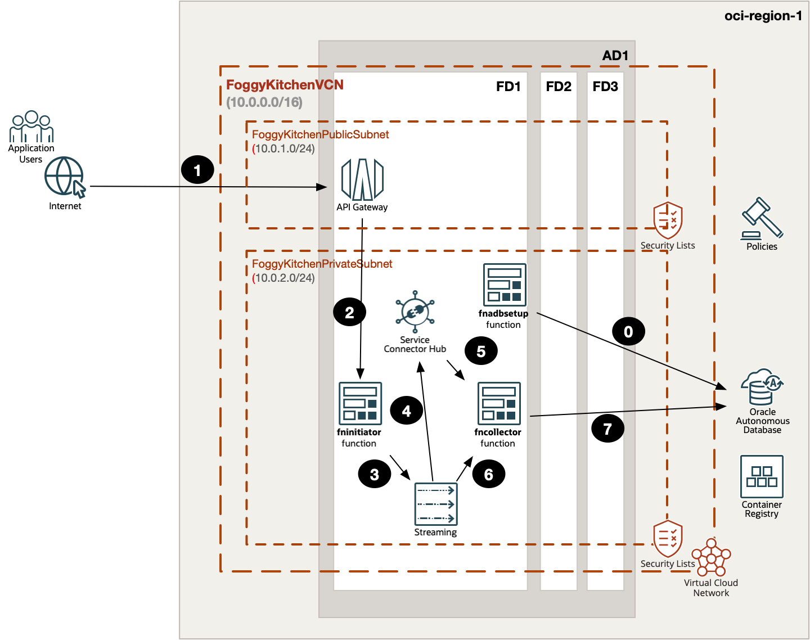

# OCI Functions Training

This training track shows how to build OCI Functions scenarios progressively with Terraform / OpenTofu, starting from a single hello-world function and moving toward API Gateway, Notifications, Streaming, Service Connector Hub, JWT validation, Object Storage events, and database-backed workflows.



## Example Overview

| Lesson | Scenario | Focus |
|---|---|---|
| 01 | [**Hello World Function**](lesson1_hello_world_function/) | Minimal OCI Functions deployment |
| 02 | [**Custom Function**](lesson2_custom_function/) | Injecting custom function source files |
| 03 | [**Two Functions Under One Application**](lesson3_two_functions_under_one_app/) | Shared Functions application and shared networking |
| 04 | [**Two Functions and API Gateway**](lesson4_two_functions_api_gateway/) | Private functions exposed through API Gateway |
| 05 | [**Two Functions, API Gateway and ONS**](lesson5_two_functions_api_gateway_ons/) | Notifications-driven function chaining |
| 06 | [**Three Functions, API Gateway, ONS, Streaming and ADB-S**](lesson6_three_functions_api_gateway_ons_streaming_adb/) | Streaming plus Autonomous Database ingestion |
| 07 | [**Three Functions, API Gateway, Service Connector Hub, Streaming and ADB-S**](lesson7_three_functions_api_gateway_sch_stream_adb/) | Service Connector Hub replacing ONS |
| 08 | [**Four Functions, API Gateway with JWT Token Auth, Service Connector Hub, Streaming and ADB-S**](lesson8_four_functions_api_gateway_jwt_sch_stream_adb/) | JWT validation in front of the workflow |
| 09 | [**Five Functions, API Gateway with JWT Token Auth, Service Connector Hub, Streaming, ADB-S, Bucket and Events**](lesson9_five_functions_api_gateway_jwt_sch_stream_adb_bucket_event/) | Bucket-driven bulk load and event services |

## How To Use

Clone the repository and start from the first lesson:

```bash
git clone https://github.com/mlinxfeld/terraform-oci-fk-function.git
cd terraform-oci-fk-function/training/lesson1_hello_world_function
```

Each lesson is designed to be runnable on its own, but the training path is intentionally progressive. The later lessons reuse patterns established earlier:

- lesson1-2 focus on the function module itself
- lesson3-4 add shared app and API exposure patterns
- lesson5-7 evolve the architecture into event-driven OCI integrations
- lesson8-9 introduce JWT validation, bucket events, and more complete ingestion workflows

## Design Principles

- Start simple and add one integration layer at a time
- Keep OCI service composition explicit in the lesson code
- Use the root function module as the base building block, then extend the scenario with additional services
- Treat lessons as runnable architecture examples, not just isolated code fragments

## Contributing

This project is open source. Contributions are welcome through pull requests.

## License

Licensed under the **Universal Permissive License (UPL), Version 1.0**.
See [LICENSE](../LICENSE) for details.

---

© 2026 [FoggyKitchen.com](https://foggykitchen.com) - Cloud. Code. Clarity.
