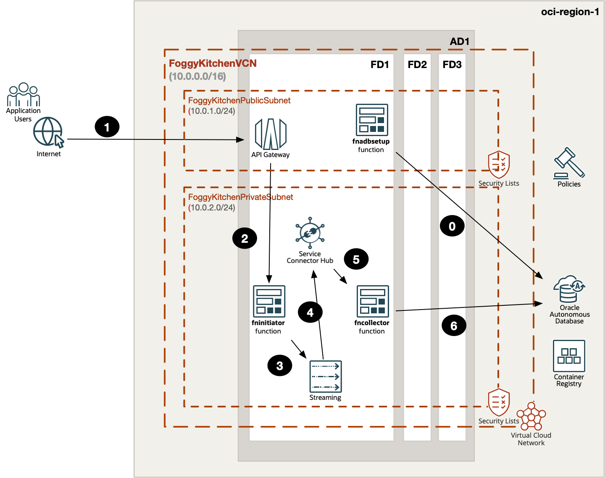

# FoggyKitchen OCI Functions with Terraform 

## Course description

The **OCI Functions with Terraform** course is designed to provide comprehensive training on deploying and managing Oracle Cloud Infrastructure (OCI) Functions using Terraform. This course is tailored for cloud engineers, DevOps professionals, and developers who want to automate the deployment of serverless functions on OCI with the powerful infrastructure-as-code tool, Terraform.

[Lesson 1: Creating Hello World Function](lesson1_hello_world_function)

This lesson guides you through creating a "Hello World" function named `fkfn`. The Terraform code in this lesson utilizes the `terraform-oci-fk-module`, which includes an embedded function example. This module sets up the necessary networking components, including a VCN, public subnet, internet gateway, security list, and route table. The function will be deployed under the OCI Application, which will be connected to the network.

Before deploying the application and function, the function code will be built (dockerized) and published in the OCI Container Registry. From there, the function will be deployed. Ultimately, the module will automatically invoke the function using the `oci raw-request --http-method POST` command, and we will see the "Hello World" response from the function. 

[Lesson 2: Creating Custom Function](lesson2_custom_function)

In this second lesson, we will create a custom function named `fncustom`. We will again use the `terraform-oci-fk-module`, but this time we will inject four crucial files for the function build:

1. `Dockerfile` - Lists all necessary commands to dockerize the function.
2. `func.py` - Contains the Python code for the function.
3. `func.yaml` - The manifest file for the function.
4. `requirements.txt` - Lists all necessary libraries for the `pip3` utility.

Additionally, we will inject a custom message that the function will respond with when invoked at the end of the Terraform deployment.

[Lesson 3: Two Functions under one Application](lesson3_two_functions_under_one_app)

In this third lesson, we will create two functions, `fncustom1` and `fncustom2`, both placed under a single application umbrella. These functions will use the same public subnet. While most of the function code will be identical, each function will have a different `FN_CUSTOM_MESSAGE` value to generate unique content.

Since the application is shared, we will need to manually create the network elements and inject them into both modules (fncustom1 and fncustom2). The first invocation of the module for fncustom1 will generate the application itself, so we will need to retrieve the application OCID from the first module's output and inject it into the second module for fncustom2. This allows the application to be shared between the functions.

Additionally, both functions will be invoked by Terraform code, ensuring automated and consistent deployment of the functions within the shared application environment.

[Lesson 4: Two Functions and API Gateway](lesson4_two_functions_api_gateway)

In this fourth lesson, we will create two functions, `fncustom1` and `fncustom2`, both residing in a private subnet. These functions will be exposed to the public Internet through an API Gateway endpoint. The API Gateway service plays a critical role in securing and unifying access to functions within a microservices architecture, providing a robust layer of security and management.

To facilitate this setup, we will implement an IAM policy that grants the necessary permissions for the API Gateway to access and invoke the functions. This ensures that only authorized requests can reach the functions, enhancing the overall security posture of our deployment. By the end of this lesson, you will have a secure, efficient means of exposing private functions to the public Internet using the API Gateway.

[Lesson 5: Two Functions, API Gateway and ONS](lesson5_two_functions_api_gateway_ons)

In this fifth lesson, we will delve into creating an advanced event-driven architecture with two functions, `fninititor` and `fncollector`, both residing in a private subnet. This architecture demonstrates how to efficiently manage asynchronous processes and enhance scalability.

The first function, `fninititor`, will be exposed to the public Internet via an API Gateway. This means you will invoke `fninititor` using an endpoint provided by the API Gateway, ensuring secure and controlled access. Each invocation of `fninititor` will send a message to the OCI Notification Service (ONS), leveraging the capabilities of ONS to handle notifications efficiently.

The second function, `fncollector`, will be subscribed to a topic within ONS. This setup ensures that whenever `fninititor` posts a message to ONS, it automatically triggers the execution of `fncollector`. This decoupling of functions allows `fninititor` to handle requests quickly and offload processing tasks to `fncollector`, which will process the message asynchronously.

We will utilize OCI logging to track and visualize this workflow, providing clear insights into the sequence of events and the interaction between the functions. This event-driven architecture offers several key benefits:
1. **Decoupling**: Functions operate independently, making the system more modular and easier to manage.
2. **Scalability**: The asynchronous processing allows the system to handle a high volume of requests without performance degradation.
3. **Efficiency**: `fninititor` can quickly respond to incoming requests, while `fncollector` handles processing in the background, improving overall responsiveness.

This architecture lays a strong foundation for more complex workflows and integrations, which will be explored in further lessons. By the end of this lesson, you will have a robust understanding of building scalable, event-driven systems using OCI services.

[Lesson 6: Three Functions, API Gateway, ONS, Streaming and ADB-S](lesson6_three_functions_api_gateway_ons_streaming_adb)

In this sixth lesson, we will enhance our event-driven architecture by incorporating additional components, such as the Streaming Service. The `fninitiator` function will continue to call the OCI Notification Service (ONS) with a message, and the subscription to the topic by the `fncollector` function will trigger its execution. Additionally, `fninitiator` will publish messages to the stream, which `fncollector` will consume. 
Subsequently, `fncollector` will interact with the Autonomous Database Serverless FreeTier (ADB-S), where IoT records will be saved in an `IOT_TABLE` table. In addition to the two functions you are already familiar with, we will introduce a helper function named `fnadbsetup`, which will be invoked by Terraform code. This helper function will create an `APPUSER` in ADB-S and populate the `IOT_TABLE` with initial data.

This lesson will provide a comprehensive understanding of integrating the Streaming Service and Autonomous Database with your event-driven architecture, further expanding your ability to manage and process data efficiently in a serverless environment.

[Lesson 7: Three Functions, API Gateway, Service Connector Hub, Streaming and ADB-S](lesson7_three_functions_api_gateway_sch_stream_adb)

In this seventh lesson, we will enhance our event-driven architecture by replacing the OCI Notification Service (ONS) mechanism with the OCI Service Connector Hub. This advanced setup will designate the Streaming Service as the source and the `fncollector` function as the target.

By using the Service Connector Hub, we can significantly simplify the `fncollector` function, as the hub will manage the data flow from the stream to the function. This modification not only streamlines the function but also enhances the overall reliability and efficiency of the system. The Service Connector Hub provides a more robust and scalable solution, ensuring that our architecture is better equipped to handle increased loads and complex workflows.

This lesson will give you a deeper understanding of how to leverage OCI's advanced services to build a more efficient and resilient event-driven architecture, improving both performance and maintainability.
