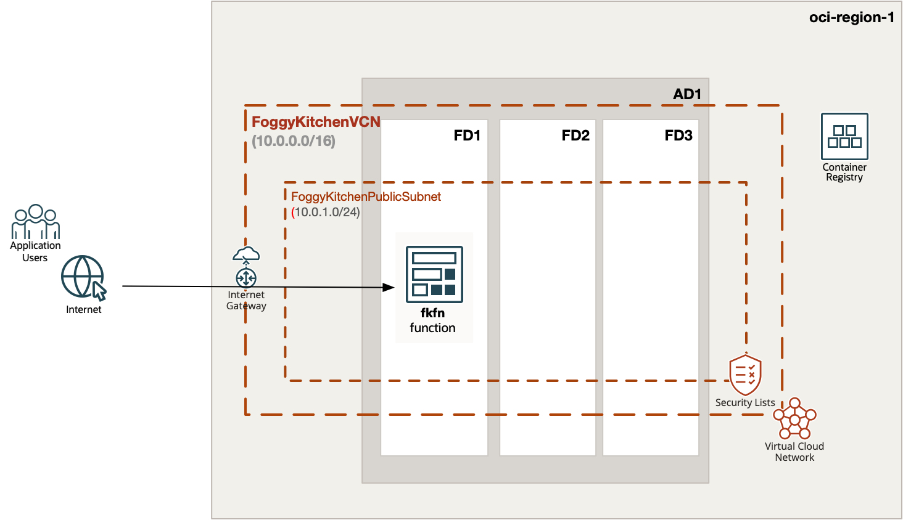
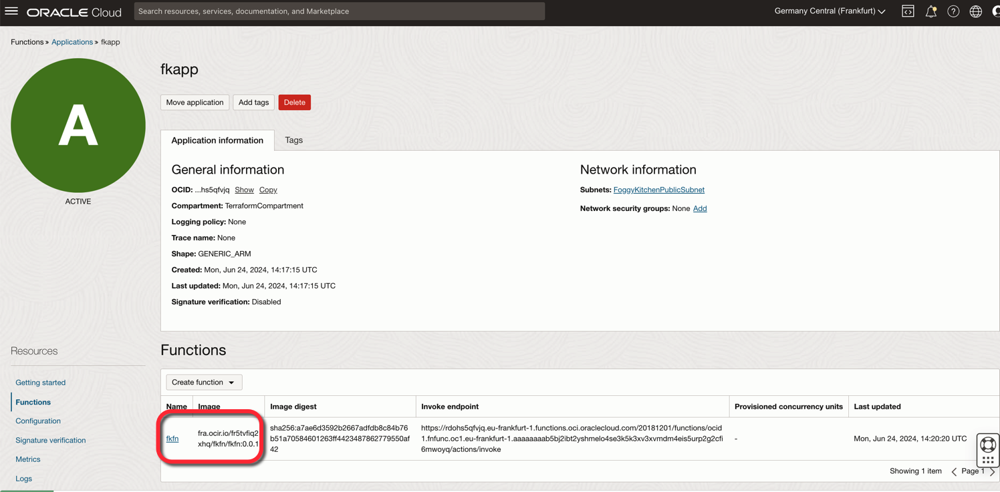
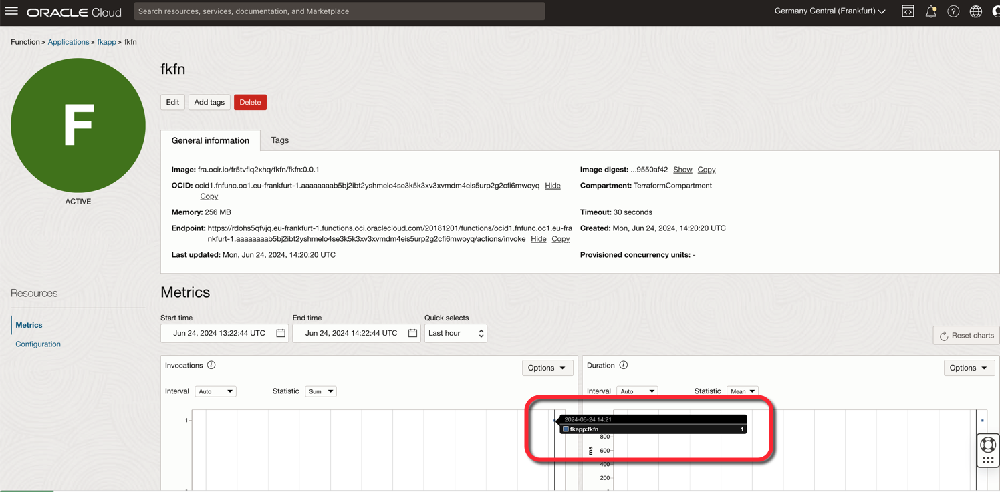
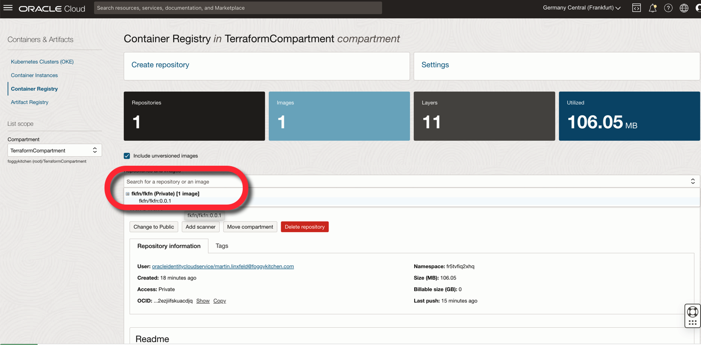

# FoggyKitchen OCI Function with Terraform 

## LESSON 1 - Creating Hello World Function

This lesson guides you through creating a "Hello World" function named `fkfn`. The Terraform code in this lesson utilizes the `terraform-oci-fk-module`, which includes an embedded function example. This module sets up the necessary networking components, including a VCN, public subnet, internet gateway, security list, and route table. The function will be deployed under the OCI Application, which will be connected to the network.

Before deploying the application and function, the function code will be built (dockerized) and published in the OCI Container Registry. From there, the function will be deployed. Ultimately, the module will automatically invoke the function using the `oci raw-request --http-method POST` command, and we will see the "Hello World" response from the function.



## Deploy Using Oracle Resource Manager

1. Click [](https://cloud.oracle.com/resourcemanager/stacks/create?region=home&zipUrl=https://github.com/mlinxfeld/terraform-oci-fk-function/releases/latest/download/terraform-oci-fk-function-lesson1.zip)

    If you aren't already signed in, when prompted, enter the tenancy and user credentials.

2. Review and accept the terms and conditions.

3. Select the region where you want to deploy the stack.

4. Follow the on-screen prompts and instructions to create the stack.

5. After creating the stack, click **Terraform Actions**, and select **Plan**.

6. Wait for the job to be completed, and review the plan.

    To make any changes, return to the Stack Details page, click **Edit Stack**, and make the required changes. Then, run the **Plan** action again.

7. If no further changes are necessary, return to the Stack Details page, click **Terraform Actions**, and select **Apply**. 

## Deploy Using the Terraform CLI in Cloud Shell

### Clone of the repo into OCI Cloud Shell

Now, you'll want a local copy of this repo. You can make that with the commands:
Clone the repo from github by executing the command as follows and then go to proper subdirectory:

```
martin_lin@codeeditor:~ (eu-frankfurt-1)$ git clone https://github.com/mlinxfeld/terraform-oci-fk-function.git

martin_lin@codeeditor:~ (eu-frankfurt-1)$ cd terraform-oci-fk-function

martin_lin@codeeditor:terraform-oci-fk-adb (eu-frankfurt-1)$ cd training/lesson1_hello_world_function/
```

### Prerequisites
Create environment file with terraform.tfvars file starting with example file:

```
martin_lin@codeeditor:lesson1_hello_world_function (eu-frankfurt-1)$ cp terraform.tfvars.example terraform.tfvars

martin_lin@codeeditor:lesson1_hello_world_function (eu-frankfurt-1)$ vi terraform.tfvars

tenancy_ocid       = "ocid1.tenancy.oc1..<your_tenancy_ocid>"
compartment_ocid   = "ocid1.compartment.oc1..<your_comparment_ocid>"
region             = "<oci_region>"
ocir_user_name     = "<user_name>"
ocir_user_password = "<user_auth_token>"
```

### Initialize Terraform

Run the following command to initialize Terraform environment:

```
martin_lin@codeeditor:lesson1_hello_world_function (eu-frankfurt-1)$ terraform init 

Initializing the backend...
Upgrading modules...
Downloading git::https://github.com/mlinxfeld/terraform-oci-fk-function.git for oci-fk-hello-world-function...
- oci-fk-hello-world-function in .terraform/modules/oci-fk-hello-world-function

Initializing provider plugins...
- Finding latest version of hashicorp/local...
- Finding latest version of hashicorp/null...
- Finding latest version of hashicorp/oci...
- Using previously-installed hashicorp/local v2.5.1
- Using previously-installed hashicorp/null v3.2.2
- Installing hashicorp/oci v5.46.0...
- Installed hashicorp/oci v5.46.0 (unauthenticated)

Terraform has made some changes to the provider dependency selections recorded
in the .terraform.lock.hcl file. Review those changes and commit them to your
version control system if they represent changes you intended to make.

Terraform has been successfully initialized!

You may now begin working with Terraform. Try running "terraform plan" to see
any changes that are required for your infrastructure. All Terraform commands
should now work.

If you ever set or change modules or backend configuration for Terraform,
rerun this command to reinitialize your working directory. If you forget, other
commands will detect it and remind you to do so if necessary.
```

### Apply the changes 

Run the following command for applying changes with the proposed plan:

```
martin_lin@codeeditor:lesson1_hello_world_function (eu-frankfurt-1)$ terraform apply
module.oci-fk-hello-world-function.data.oci_objectstorage_namespace.os_namespace: Reading...
module.oci-fk-hello-world-function.data.oci_identity_regions.oci_regions: Reading...
module.oci-fk-hello-world-function.data.oci_objectstorage_namespace.os_namespace: Read complete after 0s [id=ObjectStorageNamespaceDataSource-3596290162]
module.oci-fk-hello-world-function.data.oci_identity_regions.oci_regions: Read complete after 0s [id=IdentityRegionsDataSource-0]

Terraform used the selected providers to generate the following execution plan. Resource actions are indicated with the following symbols:
  + create

Terraform will perform the following actions:

  # module.oci-fk-hello-world-function.null_resource.FoggyKitchenFnInvoke[0] will be created
  + resource "null_resource" "FoggyKitchenFnInvoke" {
      + id = (known after apply)
    }

  # module.oci-fk-hello-world-function.null_resource.FoggyKitchenFnSetup[0] will be created
  + resource "null_resource" "FoggyKitchenFnSetup" {
      + id = (known after apply)
    }

  # module.oci-fk-hello-world-function.oci_artifacts_container_repository.FoggyKitchenOCIR will be created
  + resource "oci_artifacts_container_repository" "FoggyKitchenOCIR" {
      + billable_size_in_gbs = (known after apply)
      + compartment_id       = "ocid1.compartment.oc1..aaaaaaaaiyy4srmrb32v5rlniicwmpxsytywiucgbcp5ext6e4ahjfuloewa"
      + created_by           = (known after apply)
      + defined_tags         = (known after apply)
      + display_name         = "fkfn/fkfn"
      + freeform_tags        = (known after apply)
      + id                   = (known after apply)
      + image_count          = (known after apply)
      + is_immutable         = (known after apply)
      + is_public            = false
      + layer_count          = (known after apply)
      + layers_size_in_bytes = (known after apply)
      + namespace            = (known after apply)
      + state                = (known after apply)
      + system_tags          = (known after apply)
      + time_created         = (known after apply)
      + time_last_pushed     = (known after apply)
    }

  # module.oci-fk-hello-world-function.oci_core_dhcp_options.FoggyKitchenDhcpOptions1[0] will be created
  + resource "oci_core_dhcp_options" "FoggyKitchenDhcpOptions1" {
      + compartment_id   = "ocid1.compartment.oc1..aaaaaaaaiyy4srmrb32v5rlniicwmpxsytywiucgbcp5ext6e4ahjfuloewa"
      + defined_tags     = (known after apply)
      + display_name     = "FoggyKitchenDHCPOptions1"
      + domain_name_type = (known after apply)
      + freeform_tags    = (known after apply)
      + id               = (known after apply)
      + state            = (known after apply)
      + time_created     = (known after apply)
      + vcn_id           = (known after apply)

      + options {
          + custom_dns_servers  = []
          + search_domain_names = (known after apply)
          + server_type         = "VcnLocalPlusInternet"
          + type                = "DomainNameServer"
        }
      + options {
          + custom_dns_servers  = []
          + search_domain_names = [
              + "foggykitchen.com",
            ]
          + server_type         = (known after apply)
          + type                = "SearchDomain"
        }
    }

  # module.oci-fk-hello-world-function.oci_core_internet_gateway.FoggyKitchenInternetGateway[0] will be created
  + resource "oci_core_internet_gateway" "FoggyKitchenInternetGateway" {
      + compartment_id = "ocid1.compartment.oc1..aaaaaaaaiyy4srmrb32v5rlniicwmpxsytywiucgbcp5ext6e4ahjfuloewa"
      + defined_tags   = (known after apply)
      + display_name   = "FoggyKitchenInternetGateway"
      + enabled        = true
      + freeform_tags  = (known after apply)
      + id             = (known after apply)
      + route_table_id = (known after apply)
      + state          = (known after apply)
      + time_created   = (known after apply)
      + vcn_id         = (known after apply)
    }

  # module.oci-fk-hello-world-function.oci_core_route_table.FoggyKitchenRouteTableViaIGW[0] will be created
  + resource "oci_core_route_table" "FoggyKitchenRouteTableViaIGW" {
      + compartment_id = "ocid1.compartment.oc1..aaaaaaaaiyy4srmrb32v5rlniicwmpxsytywiucgbcp5ext6e4ahjfuloewa"
      + defined_tags   = (known after apply)
      + display_name   = "FoggyKitchenRouteTableViaIGW"
      + freeform_tags  = (known after apply)
      + id             = (known after apply)
      + state          = (known after apply)
      + time_created   = (known after apply)
      + vcn_id         = (known after apply)

      + route_rules {
          + cidr_block        = (known after apply)
          + description       = (known after apply)
          + destination       = "0.0.0.0/0"
          + destination_type  = "CIDR_BLOCK"
          + network_entity_id = (known after apply)
          + route_type        = (known after apply)
        }
    }

  # module.oci-fk-hello-world-function.oci_core_subnet.FoggyKitchenPublicSubnet[0] will be created
  + resource "oci_core_subnet" "FoggyKitchenPublicSubnet" {
      + availability_domain        = (known after apply)
      + cidr_block                 = "10.0.1.0/24"
      + compartment_id             = "ocid1.compartment.oc1..aaaaaaaaiyy4srmrb32v5rlniicwmpxsytywiucgbcp5ext6e4ahjfuloewa"
      + defined_tags               = (known after apply)
      + dhcp_options_id            = (known after apply)
      + display_name               = "FoggyKitchenPublicSubnet"
      + dns_label                  = "FoggyKitchenN1"
      + freeform_tags              = (known after apply)
      + id                         = (known after apply)
      + ipv6cidr_block             = (known after apply)
      + ipv6cidr_blocks            = (known after apply)
      + ipv6virtual_router_ip      = (known after apply)
      + prohibit_internet_ingress  = (known after apply)
      + prohibit_public_ip_on_vnic = (known after apply)
      + route_table_id             = (known after apply)
      + security_list_ids          = (known after apply)
      + state                      = (known after apply)
      + subnet_domain_name         = (known after apply)
      + time_created               = (known after apply)
      + vcn_id                     = (known after apply)
      + virtual_router_ip          = (known after apply)
      + virtual_router_mac         = (known after apply)
    }

  # module.oci-fk-hello-world-function.oci_core_virtual_network.FoggyKitchenVCN[0] will be created
  + resource "oci_core_virtual_network" "FoggyKitchenVCN" {
      + byoipv6cidr_blocks               = (known after apply)
      + cidr_block                       = "10.0.0.0/16"
      + cidr_blocks                      = (known after apply)
      + compartment_id                   = "ocid1.compartment.oc1..aaaaaaaaiyy4srmrb32v5rlniicwmpxsytywiucgbcp5ext6e4ahjfuloewa"
      + default_dhcp_options_id          = (known after apply)
      + default_route_table_id           = (known after apply)
      + default_security_list_id         = (known after apply)
      + defined_tags                     = (known after apply)
      + display_name                     = "FoggyKitchenVCN"
      + dns_label                        = "FoggyKitchenVCN"
      + freeform_tags                    = (known after apply)
      + id                               = (known after apply)
      + ipv6cidr_blocks                  = (known after apply)
      + ipv6private_cidr_blocks          = (known after apply)
      + is_ipv6enabled                   = (known after apply)
      + is_oracle_gua_allocation_enabled = (known after apply)
      + state                            = (known after apply)
      + time_created                     = (known after apply)
      + vcn_domain_name                  = (known after apply)
    }

  # module.oci-fk-hello-world-function.oci_functions_application.FoggyKitchenFnApp[0] will be created
  + resource "oci_functions_application" "FoggyKitchenFnApp" {
      + compartment_id             = "ocid1.compartment.oc1..aaaaaaaaiyy4srmrb32v5rlniicwmpxsytywiucgbcp5ext6e4ahjfuloewa"
      + config                     = (known after apply)
      + defined_tags               = (known after apply)
      + display_name               = "fkapp"
      + freeform_tags              = (known after apply)
      + id                         = (known after apply)
      + network_security_group_ids = (known after apply)
      + shape                      = "GENERIC_ARM"
      + state                      = (known after apply)
      + subnet_ids                 = (known after apply)
      + syslog_url                 = (known after apply)
      + time_created               = (known after apply)
      + time_updated               = (known after apply)
    }

  # module.oci-fk-hello-world-function.oci_functions_function.FoggyKitchenFn will be created
  + resource "oci_functions_function" "FoggyKitchenFn" {
      + application_id     = (known after apply)
      + compartment_id     = (known after apply)
      + config             = (known after apply)
      + defined_tags       = (known after apply)
      + display_name       = "fkfn"
      + freeform_tags      = (known after apply)
      + id                 = (known after apply)
      + image              = "fra.ocir.io/fr5tvfiq2xhq/fkfn/fkfn:0.0.1"
      + image_digest       = (known after apply)
      + invoke_endpoint    = (known after apply)
      + memory_in_mbs      = "256"
      + shape              = (known after apply)
      + state              = (known after apply)
      + time_created       = (known after apply)
      + time_updated       = (known after apply)
      + timeout_in_seconds = 30
    }

Plan: 10 to add, 0 to change, 0 to destroy.

Do you want to perform these actions?
  Terraform will perform the actions described above.
  Only 'yes' will be accepted to approve.

  Enter a value: yes

module.oci-fk-hello-world-function.oci_artifacts_container_repository.FoggyKitchenOCIR: Creating...
module.oci-fk-hello-world-function.oci_core_virtual_network.FoggyKitchenVCN[0]: Creating...
module.oci-fk-hello-world-function.oci_artifacts_container_repository.FoggyKitchenOCIR: Creation complete after 1s [id=ocid1.containerrepo.oc1.eu-frankfurt-1.0.fr5tvfiq2xhq.aaaaaaaafzxocrg7lzuijdny6fvqvrl4lnr7erbm2lgrh2ezjiifskuacdjq]
module.oci-fk-hello-world-function.oci_core_virtual_network.FoggyKitchenVCN[0]: Creation complete after 1s [id=ocid1.vcn.oc1.eu-frankfurt-1.amaaaaaadngk4giazjrfq6pqm3mqzsi7rmnhj4p6ni55yyran7s5zc62v4la]
module.oci-fk-hello-world-function.oci_core_internet_gateway.FoggyKitchenInternetGateway[0]: Creating...
module.oci-fk-hello-world-function.oci_core_dhcp_options.FoggyKitchenDhcpOptions1[0]: Creating...
module.oci-fk-hello-world-function.oci_core_internet_gateway.FoggyKitchenInternetGateway[0]: Creation complete after 0s [id=ocid1.internetgateway.oc1.eu-frankfurt-1.aaaaaaaa6zj34p424q7z5k7kbc6m65ynyg5qp7z6sqghfdnokcvnamez3fpq]
module.oci-fk-hello-world-function.oci_core_route_table.FoggyKitchenRouteTableViaIGW[0]: Creating...
module.oci-fk-hello-world-function.oci_core_dhcp_options.FoggyKitchenDhcpOptions1[0]: Creation complete after 0s [id=ocid1.dhcpoptions.oc1.eu-frankfurt-1.aaaaaaaamf5terq6kaodl57pn7ekd3u7yumbil6ehxd4xfuyqom73juqkfcq]
module.oci-fk-hello-world-function.oci_core_route_table.FoggyKitchenRouteTableViaIGW[0]: Creation complete after 1s [id=ocid1.routetable.oc1.eu-frankfurt-1.aaaaaaaaavytzfye7bo5uxauvrqafuwxrt7ahuzoshhiey5u5joykkblcfoq]
module.oci-fk-hello-world-function.oci_core_subnet.FoggyKitchenPublicSubnet[0]: Creating...
module.oci-fk-hello-world-function.oci_core_subnet.FoggyKitchenPublicSubnet[0]: Creation complete after 2s [id=ocid1.subnet.oc1.eu-frankfurt-1.aaaaaaaaaznz5bm67bn6klpqomvrqewoomb2errlyeaqbpx5vue6jklakp4a]
module.oci-fk-hello-world-function.oci_functions_application.FoggyKitchenFnApp[0]: Creating...
module.oci-fk-hello-world-function.oci_functions_application.FoggyKitchenFnApp[0]: Creation complete after 1s [id=ocid1.fnapp.oc1.eu-frankfurt-1.aaaaaaaa3hyd4pvb67l74rnotiqek32fubofzfunne3fm5obwrdohs5qfvjq]
module.oci-fk-hello-world-function.null_resource.FoggyKitchenFnSetup[0]: Creating...
module.oci-fk-hello-world-function.null_resource.FoggyKitchenFnSetup[0]: Provisioning with 'local-exec'...
module.oci-fk-hello-world-function.null_resource.FoggyKitchenFnSetup[0] (local-exec): Executing: ["/bin/sh" "-c" "echo '*************************' |  docker login fra.ocir.io --username fr5tvfiq2xhq/oracleidentitycloudservice/martin.linxfeld@foggykitchen.com --password-stdin"]
module.oci-fk-hello-world-function.null_resource.FoggyKitchenFnSetup[0] (local-exec): WARNING! Your password will be stored unencrypted in /home/martin_lin/.docker/config.json.
module.oci-fk-hello-world-function.null_resource.FoggyKitchenFnSetup[0] (local-exec): Configure a credential helper to remove this warning. See
module.oci-fk-hello-world-function.null_resource.FoggyKitchenFnSetup[0] (local-exec): https://docs.docker.com/engine/reference/commandline/login/#credentials-store

module.oci-fk-hello-world-function.null_resource.FoggyKitchenFnSetup[0] (local-exec): Login Succeeded
module.oci-fk-hello-world-function.null_resource.FoggyKitchenFnSetup[0]: Provisioning with 'local-exec'...
module.oci-fk-hello-world-function.null_resource.FoggyKitchenFnSetup[0] (local-exec): Executing: ["/bin/sh" "-c" "image=$(docker images | grep fra.ocir.io/fr5tvfiq2xhq/fkfn/fkfn | awk -F ' ' '{print $3}') && if [ -n \"$image\" ]; then docker rmi \"$image\" -f; fi"]
module.oci-fk-hello-world-function.null_resource.FoggyKitchenFnSetup[0]: Provisioning with 'local-exec'...
module.oci-fk-hello-world-function.null_resource.FoggyKitchenFnSetup[0] (local-exec): Executing: ["/bin/sh" "-c" "fn build"]
module.oci-fk-hello-world-function.null_resource.FoggyKitchenFnSetup[0] (local-exec): Using Container engine docker
module.oci-fk-hello-world-function.null_resource.FoggyKitchenFnSetup[0] (local-exec): Building image fkfn:0.0.1
module.oci-fk-hello-world-function.null_resource.FoggyKitchenFnSetup[0] (local-exec): .
module.oci-fk-hello-world-function.null_resource.FoggyKitchenFnSetup[0] (local-exec): .
module.oci-fk-hello-world-function.null_resource.FoggyKitchenFnSetup[0] (local-exec): .
module.oci-fk-hello-world-function.null_resource.FoggyKitchenFnSetup[0] (local-exec): .
module.oci-fk-hello-world-function.null_resource.FoggyKitchenFnSetup[0] (local-exec): .
module.oci-fk-hello-world-function.null_resource.FoggyKitchenFnSetup[0] (local-exec): .
module.oci-fk-hello-world-function.null_resource.FoggyKitchenFnSetup[0] (local-exec): .
module.oci-fk-hello-world-function.null_resource.FoggyKitchenFnSetup[0] (local-exec): .
module.oci-fk-hello-world-function.null_resource.FoggyKitchenFnSetup[0] (local-exec): .
module.oci-fk-hello-world-function.null_resource.FoggyKitchenFnSetup[0]: Still creating... [10s elapsed]
module.oci-fk-hello-world-function.null_resource.FoggyKitchenFnSetup[0] (local-exec): .
module.oci-fk-hello-world-function.null_resource.FoggyKitchenFnSetup[0] (local-exec): .

(...)

module.oci-fk-hello-world-function.null_resource.FoggyKitchenFnSetup[0] (local-exec): Function fkfn:0.0.1 built successfully.
module.oci-fk-hello-world-function.null_resource.FoggyKitchenFnSetup[0]: Provisioning with 'local-exec'...
module.oci-fk-hello-world-function.null_resource.FoggyKitchenFnSetup[0] (local-exec): Executing: ["/bin/sh" "-c" "image=$(docker images | grep fkfn | awk -F ' ' '{print $3}') ; docker tag $image fra.ocir.io/fr5tvfiq2xhq/fkfn/fkfn:0.0.1"]
module.oci-fk-hello-world-function.null_resource.FoggyKitchenFnSetup[0]: Provisioning with 'local-exec'...
module.oci-fk-hello-world-function.null_resource.FoggyKitchenFnSetup[0] (local-exec): Executing: ["/bin/sh" "-c" "docker push fra.ocir.io/fr5tvfiq2xhq/fkfn/fkfn:0.0.1"]
module.oci-fk-hello-world-function.null_resource.FoggyKitchenFnSetup[0] (local-exec): The push refers to repository [fra.ocir.io/fr5tvfiq2xhq/fkfn/fkfn]
module.oci-fk-hello-world-function.null_resource.FoggyKitchenFnSetup[0] (local-exec): 37eb1370a562: Preparing
module.oci-fk-hello-world-function.null_resource.FoggyKitchenFnSetup[0] (local-exec): cf4a51798fa6: Preparing
module.oci-fk-hello-world-function.null_resource.FoggyKitchenFnSetup[0] (local-exec): 93621bd20a35: Preparing
module.oci-fk-hello-world-function.null_resource.FoggyKitchenFnSetup[0] (local-exec): 4652f1ecdb19: Preparing
module.oci-fk-hello-world-function.null_resource.FoggyKitchenFnSetup[0] (local-exec): c9236a9b8b93: Preparing
module.oci-fk-hello-world-function.null_resource.FoggyKitchenFnSetup[0] (local-exec): 1986fa667ad1: Preparing
module.oci-fk-hello-world-function.null_resource.FoggyKitchenFnSetup[0] (local-exec): 47da4524d17f: Preparing
module.oci-fk-hello-world-function.null_resource.FoggyKitchenFnSetup[0] (local-exec): a8ba81d08a13: Preparing
module.oci-fk-hello-world-function.null_resource.FoggyKitchenFnSetup[0] (local-exec): bd0287fb57f4: Preparing
module.oci-fk-hello-world-function.null_resource.FoggyKitchenFnSetup[0] (local-exec): e829239188f8: Preparing
module.oci-fk-hello-world-function.null_resource.FoggyKitchenFnSetup[0] (local-exec): 1986fa667ad1: Waiting
module.oci-fk-hello-world-function.null_resource.FoggyKitchenFnSetup[0] (local-exec): 47da4524d17f: Waiting
module.oci-fk-hello-world-function.null_resource.FoggyKitchenFnSetup[0] (local-exec): a8ba81d08a13: Waiting
module.oci-fk-hello-world-function.null_resource.FoggyKitchenFnSetup[0] (local-exec): bd0287fb57f4: Waiting
module.oci-fk-hello-world-function.null_resource.FoggyKitchenFnSetup[0] (local-exec): e829239188f8: Waiting
module.oci-fk-hello-world-function.null_resource.FoggyKitchenFnSetup[0]: Still creating... [2m50s elapsed]
module.oci-fk-hello-world-function.null_resource.FoggyKitchenFnSetup[0] (local-exec): 4652f1ecdb19: Pushed
module.oci-fk-hello-world-function.null_resource.FoggyKitchenFnSetup[0] (local-exec): cf4a51798fa6: Pushed
module.oci-fk-hello-world-function.null_resource.FoggyKitchenFnSetup[0] (local-exec): 93621bd20a35: Pushed
module.oci-fk-hello-world-function.null_resource.FoggyKitchenFnSetup[0] (local-exec): 47da4524d17f: Pushed
module.oci-fk-hello-world-function.null_resource.FoggyKitchenFnSetup[0] (local-exec): bd0287fb57f4: Pushed
module.oci-fk-hello-world-function.null_resource.FoggyKitchenFnSetup[0] (local-exec): 1986fa667ad1: Pushed
module.oci-fk-hello-world-function.null_resource.FoggyKitchenFnSetup[0] (local-exec): a8ba81d08a13: Pushed
module.oci-fk-hello-world-function.null_resource.FoggyKitchenFnSetup[0] (local-exec): c9236a9b8b93: Pushed
module.oci-fk-hello-world-function.null_resource.FoggyKitchenFnSetup[0]: Still creating... [3m0s elapsed]
module.oci-fk-hello-world-function.null_resource.FoggyKitchenFnSetup[0] (local-exec): e829239188f8: Pushed
module.oci-fk-hello-world-function.null_resource.FoggyKitchenFnSetup[0] (local-exec): 37eb1370a562: Pushed
module.oci-fk-hello-world-function.null_resource.FoggyKitchenFnSetup[0] (local-exec): 0.0.1: digest: sha256:a7ae6d3592b2667adfdb8c84b76b51a70584601263ff4423487862779550af42 size: 2415
module.oci-fk-hello-world-function.null_resource.FoggyKitchenFnSetup[0]: Creation complete after 3m4s [id=1239065912045301207]
module.oci-fk-hello-world-function.oci_functions_function.FoggyKitchenFn: Creating...
module.oci-fk-hello-world-function.oci_functions_function.FoggyKitchenFn: Creation complete after 1s [id=ocid1.fnfunc.oc1.eu-frankfurt-1.aaaaaaaab5bj2ibt2yshmelo4se3k5k3xv3xvmdm4eis5urp2g2cfi6mwoyq]
module.oci-fk-hello-world-function.null_resource.FoggyKitchenFnInvoke[0]: Creating...
module.oci-fk-hello-world-function.null_resource.FoggyKitchenFnInvoke[0]: Provisioning with 'local-exec'...
module.oci-fk-hello-world-function.null_resource.FoggyKitchenFnInvoke[0] (local-exec): Executing: ["/bin/sh" "-c" "sleep 30"]
module.oci-fk-hello-world-function.null_resource.FoggyKitchenFnInvoke[0]: Still creating... [10s elapsed]
module.oci-fk-hello-world-function.null_resource.FoggyKitchenFnInvoke[0]: Still creating... [20s elapsed]
module.oci-fk-hello-world-function.null_resource.FoggyKitchenFnInvoke[0]: Still creating... [30s elapsed]
module.oci-fk-hello-world-function.null_resource.FoggyKitchenFnInvoke[0]: Provisioning with 'local-exec'...
module.oci-fk-hello-world-function.null_resource.FoggyKitchenFnInvoke[0] (local-exec): Executing: ["/bin/sh" "-c" "oci raw-request --http-method POST --target-uri https://rdohs5qfvjq.eu-frankfurt-1.functions.oci.oraclecloud.com/20181201/functions/ocid1.fnfunc.oc1.eu-frankfurt-1.aaaaaaaab5bj2ibt2yshmelo4se3k5k3xv3xvmdm4eis5urp2g2cfi6mwoyq/actions/invoke --request-body '' "]
module.oci-fk-hello-world-function.null_resource.FoggyKitchenFnInvoke[0]: Still creating... [40s elapsed]
module.oci-fk-hello-world-function.null_resource.FoggyKitchenFnInvoke[0]: Still creating... [50s elapsed]
module.oci-fk-hello-world-function.null_resource.FoggyKitchenFnInvoke[0] (local-exec): {
module.oci-fk-hello-world-function.null_resource.FoggyKitchenFnInvoke[0] (local-exec):   "data": {
module.oci-fk-hello-world-function.null_resource.FoggyKitchenFnInvoke[0] (local-exec):     "message": "Hello World!"
module.oci-fk-hello-world-function.null_resource.FoggyKitchenFnInvoke[0] (local-exec):   },
module.oci-fk-hello-world-function.null_resource.FoggyKitchenFnInvoke[0] (local-exec):   "headers": {
module.oci-fk-hello-world-function.null_resource.FoggyKitchenFnInvoke[0] (local-exec):     "Content-Length": "27",
module.oci-fk-hello-world-function.null_resource.FoggyKitchenFnInvoke[0] (local-exec):     "Content-Type": "application/json",
module.oci-fk-hello-world-function.null_resource.FoggyKitchenFnInvoke[0] (local-exec):     "Date": "Mon, 24 Jun 2024 14:21:16 GMT",
module.oci-fk-hello-world-function.null_resource.FoggyKitchenFnInvoke[0] (local-exec):     "Fn-Call-Id": "01J159Y0BS1BT0MY0ZJ01CCQE3",
module.oci-fk-hello-world-function.null_resource.FoggyKitchenFnInvoke[0] (local-exec):     "Fn-Fdk-Runtime": "python/3.8.5 final",
module.oci-fk-hello-world-function.null_resource.FoggyKitchenFnInvoke[0] (local-exec):     "Fn-Fdk-Version": "fdk-python/0.1.73",
module.oci-fk-hello-world-function.null_resource.FoggyKitchenFnInvoke[0] (local-exec):     "Opc-Request-Id": "F62AF7E987EB47ACA58E8826A2CD8E32/01J159Y09X00000000002MVD1S/01J159Y09X00000000002MVD1T"
module.oci-fk-hello-world-function.null_resource.FoggyKitchenFnInvoke[0] (local-exec):   },
module.oci-fk-hello-world-function.null_resource.FoggyKitchenFnInvoke[0] (local-exec):   "status": "200 OK"
module.oci-fk-hello-world-function.null_resource.FoggyKitchenFnInvoke[0] (local-exec): }
module.oci-fk-hello-world-function.null_resource.FoggyKitchenFnInvoke[0]: Creation complete after 55s [id=8205380620072996168]

Apply complete! Resources: 10 added, 0 changed, 0 destroyed.

```
### Validate the deployment

1. From the hamburger menu in the top left corner, navigate to Developer Services, and then select Applications:


2. Verify the existence of the fkapp application and the `fkfn` function:



3. Confirm that `fkfn` has been invoked by checking the metrics section:



4. Continue navigating into Developer Services and select Container Registry:


5. Confirm the existence of the Docker registry containing the `fkfn` Docker image:



### Destroy the changes 

Run the following command for destroying all resources:

```
martin_lin@codeeditor:lesson1_hello_world_function (eu-frankfurt-1)$ terraform destroy 

module.oci-fk-hello-world-function.data.oci_identity_regions.oci_regions: Reading...
module.oci-fk-hello-world-function.data.oci_objectstorage_namespace.os_namespace: Reading...
module.oci-fk-hello-world-function.oci_core_virtual_network.FoggyKitchenVCN[0]: Refreshing state... [id=ocid1.vcn.oc1.eu-frankfurt-1.amaaaaaadngk4giazjrfq6pqm3mqzsi7rmnhj4p6ni55yyran7s5zc62v4la]
module.oci-fk-hello-world-function.oci_artifacts_container_repository.FoggyKitchenOCIR: Refreshing state... [id=ocid1.containerrepo.oc1.eu-frankfurt-1.0.fr5tvfiq2xhq.aaaaaaaafzxocrg7lzuijdny6fvqvrl4lnr7erbm2lgrh2ezjiifskuacdjq]
module.oci-fk-hello-world-function.data.oci_objectstorage_namespace.os_namespace: Read complete after 0s [id=ObjectStorageNamespaceDataSource-3596290162]
module.oci-fk-hello-world-function.data.oci_identity_regions.oci_regions: Read complete after 0s [id=IdentityRegionsDataSource-0]
module.oci-fk-hello-world-function.oci_core_internet_gateway.FoggyKitchenInternetGateway[0]: Refreshing state... [id=ocid1.internetgateway.oc1.eu-frankfurt-1.aaaaaaaa6zj34p424q7z5k7kbc6m65ynyg5qp7z6sqghfdnokcvnamez3fpq]
module.oci-fk-hello-world-function.oci_core_dhcp_options.FoggyKitchenDhcpOptions1[0]: Refreshing state... [id=ocid1.dhcpoptions.oc1.eu-frankfurt-1.aaaaaaaamf5terq6kaodl57pn7ekd3u7yumbil6ehxd4xfuyqom73juqkfcq]
module.oci-fk-hello-world-function.oci_core_route_table.FoggyKitchenRouteTableViaIGW[0]: Refreshing state... [id=ocid1.routetable.oc1.eu-frankfurt-1.aaaaaaaaavytzfye7bo5uxauvrqafuwxrt7ahuzoshhiey5u5joykkblcfoq]
module.oci-fk-hello-world-function.oci_core_subnet.FoggyKitchenPublicSubnet[0]: Refreshing state... [id=ocid1.subnet.oc1.eu-frankfurt-1.aaaaaaaaaznz5bm67bn6klpqomvrqewoomb2errlyeaqbpx5vue6jklakp4a]
module.oci-fk-hello-world-function.oci_functions_application.FoggyKitchenFnApp[0]: Refreshing state... [id=ocid1.fnapp.oc1.eu-frankfurt-1.aaaaaaaa3hyd4pvb67l74rnotiqek32fubofzfunne3fm5obwrdohs5qfvjq]
module.oci-fk-hello-world-function.null_resource.FoggyKitchenFnSetup[0]: Refreshing state... [id=1239065912045301207]
module.oci-fk-hello-world-function.oci_functions_function.FoggyKitchenFn: Refreshing state... [id=ocid1.fnfunc.oc1.eu-frankfurt-1.aaaaaaaab5bj2ibt2yshmelo4se3k5k3xv3xvmdm4eis5urp2g2cfi6mwoyq]
module.oci-fk-hello-world-function.null_resource.FoggyKitchenFnInvoke[0]: Refreshing state... [id=8205380620072996168]

Terraform used the selected providers to generate the following execution plan. Resource actions are indicated with the following symbols:
  - destroy

Terraform will perform the following actions:

  # module.oci-fk-hello-world-function.null_resource.FoggyKitchenFnInvoke[0] will be destroyed
  - resource "null_resource" "FoggyKitchenFnInvoke" {
      - id = "8205380620072996168" -> null
    }

  # module.oci-fk-hello-world-function.null_resource.FoggyKitchenFnSetup[0] will be destroyed
  - resource "null_resource" "FoggyKitchenFnSetup" {
      - id = "1239065912045301207" -> null
    }

  # module.oci-fk-hello-world-function.oci_artifacts_container_repository.FoggyKitchenOCIR will be destroyed
  - resource "oci_artifacts_container_repository" "FoggyKitchenOCIR" {
      - billable_size_in_gbs = "0" -> null
      - compartment_id       = "ocid1.compartment.oc1..aaaaaaaaiyy4srmrb32v5rlniicwmpxsytywiucgbcp5ext6e4ahjfuloewa" -> null
      - created_by           = "ocid1.user.oc1..aaaaaaaahm27xm4lh7nnboyqkt7fxfo7yja5iqb6qpvqvq5eus22ogparkaa" -> null
      - defined_tags         = {} -> null
      - display_name         = "fkfn/fkfn" -> null
      - freeform_tags        = {} -> null
      - id                   = "ocid1.containerrepo.oc1.eu-frankfurt-1.0.fr5tvfiq2xhq.aaaaaaaafzxocrg7lzuijdny6fvqvrl4lnr7erbm2lgrh2ezjiifskuacdjq" -> null
      - image_count          = 1 -> null
      - is_immutable         = false -> null
      - is_public            = false -> null
      - layer_count          = 11 -> null
      - layers_size_in_bytes = "111196661" -> null
      - namespace            = "fr5tvfiq2xhq" -> null
      - state                = "AVAILABLE" -> null
      - system_tags          = {} -> null
      - time_created         = "2024-06-24 14:17:11.394 +0000 UTC" -> null
      - time_last_pushed     = "2024-06-24 14:20:19.806 +0000 UTC" -> null
    }

  # module.oci-fk-hello-world-function.oci_core_dhcp_options.FoggyKitchenDhcpOptions1[0] will be destroyed
  - resource "oci_core_dhcp_options" "FoggyKitchenDhcpOptions1" {
      - compartment_id   = "ocid1.compartment.oc1..aaaaaaaaiyy4srmrb32v5rlniicwmpxsytywiucgbcp5ext6e4ahjfuloewa" -> null
      - defined_tags     = {} -> null
      - display_name     = "FoggyKitchenDHCPOptions1" -> null
      - domain_name_type = "CUSTOM_DOMAIN" -> null
      - freeform_tags    = {} -> null
      - id               = "ocid1.dhcpoptions.oc1.eu-frankfurt-1.aaaaaaaamf5terq6kaodl57pn7ekd3u7yumbil6ehxd4xfuyqom73juqkfcq" -> null
      - state            = "AVAILABLE" -> null
      - time_created     = "2024-06-24 14:17:11.984 +0000 UTC" -> null
      - vcn_id           = "ocid1.vcn.oc1.eu-frankfurt-1.amaaaaaadngk4giazjrfq6pqm3mqzsi7rmnhj4p6ni55yyran7s5zc62v4la" -> null

      - options {
          - custom_dns_servers  = [] -> null
          - search_domain_names = [
              - "foggykitchen.com",
            ] -> null
          - type                = "SearchDomain" -> null
        }
      - options {
          - custom_dns_servers  = [] -> null
          - search_domain_names = [] -> null
          - server_type         = "VcnLocalPlusInternet" -> null
          - type                = "DomainNameServer" -> null
        }
    }

  # module.oci-fk-hello-world-function.oci_core_internet_gateway.FoggyKitchenInternetGateway[0] will be destroyed
  - resource "oci_core_internet_gateway" "FoggyKitchenInternetGateway" {
      - compartment_id = "ocid1.compartment.oc1..aaaaaaaaiyy4srmrb32v5rlniicwmpxsytywiucgbcp5ext6e4ahjfuloewa" -> null
      - defined_tags   = {} -> null
      - display_name   = "FoggyKitchenInternetGateway" -> null
      - enabled        = true -> null
      - freeform_tags  = {} -> null
      - id             = "ocid1.internetgateway.oc1.eu-frankfurt-1.aaaaaaaa6zj34p424q7z5k7kbc6m65ynyg5qp7z6sqghfdnokcvnamez3fpq" -> null
      - state          = "AVAILABLE" -> null
      - time_created   = "2024-06-24 14:17:11.951 +0000 UTC" -> null
      - vcn_id         = "ocid1.vcn.oc1.eu-frankfurt-1.amaaaaaadngk4giazjrfq6pqm3mqzsi7rmnhj4p6ni55yyran7s5zc62v4la" -> null
    }

  # module.oci-fk-hello-world-function.oci_core_route_table.FoggyKitchenRouteTableViaIGW[0] will be destroyed
  - resource "oci_core_route_table" "FoggyKitchenRouteTableViaIGW" {
      - compartment_id = "ocid1.compartment.oc1..aaaaaaaaiyy4srmrb32v5rlniicwmpxsytywiucgbcp5ext6e4ahjfuloewa" -> null
      - defined_tags   = {} -> null
      - display_name   = "FoggyKitchenRouteTableViaIGW" -> null
      - freeform_tags  = {} -> null
      - id             = "ocid1.routetable.oc1.eu-frankfurt-1.aaaaaaaaavytzfye7bo5uxauvrqafuwxrt7ahuzoshhiey5u5joykkblcfoq" -> null
      - state          = "AVAILABLE" -> null
      - time_created   = "2024-06-24 14:17:12.297 +0000 UTC" -> null
      - vcn_id         = "ocid1.vcn.oc1.eu-frankfurt-1.amaaaaaadngk4giazjrfq6pqm3mqzsi7rmnhj4p6ni55yyran7s5zc62v4la" -> null

      - route_rules {
          - destination       = "0.0.0.0/0" -> null
          - destination_type  = "CIDR_BLOCK" -> null
          - network_entity_id = "ocid1.internetgateway.oc1.eu-frankfurt-1.aaaaaaaa6zj34p424q7z5k7kbc6m65ynyg5qp7z6sqghfdnokcvnamez3fpq" -> null
        }
    }

  # module.oci-fk-hello-world-function.oci_core_subnet.FoggyKitchenPublicSubnet[0] will be destroyed
  - resource "oci_core_subnet" "FoggyKitchenPublicSubnet" {
      - cidr_block                 = "10.0.1.0/24" -> null
      - compartment_id             = "ocid1.compartment.oc1..aaaaaaaaiyy4srmrb32v5rlniicwmpxsytywiucgbcp5ext6e4ahjfuloewa" -> null
      - defined_tags               = {} -> null
      - dhcp_options_id            = "ocid1.dhcpoptions.oc1.eu-frankfurt-1.aaaaaaaamf5terq6kaodl57pn7ekd3u7yumbil6ehxd4xfuyqom73juqkfcq" -> null
      - display_name               = "FoggyKitchenPublicSubnet" -> null
      - dns_label                  = "foggykitchenn1" -> null
      - freeform_tags              = {} -> null
      - id                         = "ocid1.subnet.oc1.eu-frankfurt-1.aaaaaaaaaznz5bm67bn6klpqomvrqewoomb2errlyeaqbpx5vue6jklakp4a" -> null
      - ipv6cidr_blocks            = [] -> null
      - prohibit_internet_ingress  = false -> null
      - prohibit_public_ip_on_vnic = false -> null
      - route_table_id             = "ocid1.routetable.oc1.eu-frankfurt-1.aaaaaaaaavytzfye7bo5uxauvrqafuwxrt7ahuzoshhiey5u5joykkblcfoq" -> null
      - security_list_ids          = [
          - "ocid1.securitylist.oc1.eu-frankfurt-1.aaaaaaaajxq3iwaxfa326g3fi5h4e25cxq5b3clczta3xd4zpj7yypoqmnza",
        ] -> null
      - state                      = "AVAILABLE" -> null
      - subnet_domain_name         = "foggykitchenn1.foggykitchenvcn.oraclevcn.com" -> null
      - time_created               = "2024-06-24 14:17:12.688 +0000 UTC" -> null
      - vcn_id                     = "ocid1.vcn.oc1.eu-frankfurt-1.amaaaaaadngk4giazjrfq6pqm3mqzsi7rmnhj4p6ni55yyran7s5zc62v4la" -> null
      - virtual_router_ip          = "10.0.1.1" -> null
      - virtual_router_mac         = "00:00:17:62:E4:BD" -> null
    }

  # module.oci-fk-hello-world-function.oci_core_virtual_network.FoggyKitchenVCN[0] will be destroyed
  - resource "oci_core_virtual_network" "FoggyKitchenVCN" {
      - byoipv6cidr_blocks       = [] -> null
      - cidr_block               = "10.0.0.0/16" -> null
      - cidr_blocks              = [
          - "10.0.0.0/16",
        ] -> null
      - compartment_id           = "ocid1.compartment.oc1..aaaaaaaaiyy4srmrb32v5rlniicwmpxsytywiucgbcp5ext6e4ahjfuloewa" -> null
      - default_dhcp_options_id  = "ocid1.dhcpoptions.oc1.eu-frankfurt-1.aaaaaaaajz23i2yjlenls3afdpl26r3zgqisocjevsmu3u2ckxrmjocvo4wq" -> null
      - default_route_table_id   = "ocid1.routetable.oc1.eu-frankfurt-1.aaaaaaaaagxa33rxvwqrlrr4d3tme3qexexlcq4ef7w7wwc4po56fywplxsa" -> null
      - default_security_list_id = "ocid1.securitylist.oc1.eu-frankfurt-1.aaaaaaaajxq3iwaxfa326g3fi5h4e25cxq5b3clczta3xd4zpj7yypoqmnza" -> null
      - defined_tags             = {} -> null
      - display_name             = "FoggyKitchenVCN" -> null
      - dns_label                = "foggykitchenvcn" -> null
      - freeform_tags            = {} -> null
      - id                       = "ocid1.vcn.oc1.eu-frankfurt-1.amaaaaaadngk4giazjrfq6pqm3mqzsi7rmnhj4p6ni55yyran7s5zc62v4la" -> null
      - ipv6cidr_blocks          = [] -> null
      - ipv6private_cidr_blocks  = [] -> null
      - is_ipv6enabled           = false -> null
      - state                    = "AVAILABLE" -> null
      - time_created             = "2024-06-24 14:17:11.366 +0000 UTC" -> null
      - vcn_domain_name          = "foggykitchenvcn.oraclevcn.com" -> null
    }

  # module.oci-fk-hello-world-function.oci_functions_application.FoggyKitchenFnApp[0] will be destroyed
  - resource "oci_functions_application" "FoggyKitchenFnApp" {
      - compartment_id             = "ocid1.compartment.oc1..aaaaaaaaiyy4srmrb32v5rlniicwmpxsytywiucgbcp5ext6e4ahjfuloewa" -> null
      - config                     = {} -> null
      - defined_tags               = {} -> null
      - display_name               = "fkapp" -> null
      - freeform_tags              = {} -> null
      - id                         = "ocid1.fnapp.oc1.eu-frankfurt-1.aaaaaaaa3hyd4pvb67l74rnotiqek32fubofzfunne3fm5obwrdohs5qfvjq" -> null
      - network_security_group_ids = [] -> null
      - shape                      = "GENERIC_ARM" -> null
      - state                      = "ACTIVE" -> null
      - subnet_ids                 = [
          - "ocid1.subnet.oc1.eu-frankfurt-1.aaaaaaaaaznz5bm67bn6klpqomvrqewoomb2errlyeaqbpx5vue6jklakp4a",
        ] -> null
      - time_created               = "2024-06-24 14:17:15.255 +0000 UTC" -> null
      - time_updated               = "2024-06-24 14:17:15.255 +0000 UTC" -> null

      - trace_config {
          - is_enabled = false -> null
        }
    }

  # module.oci-fk-hello-world-function.oci_functions_function.FoggyKitchenFn will be destroyed
  - resource "oci_functions_function" "FoggyKitchenFn" {
      - application_id     = "ocid1.fnapp.oc1.eu-frankfurt-1.aaaaaaaa3hyd4pvb67l74rnotiqek32fubofzfunne3fm5obwrdohs5qfvjq" -> null
      - compartment_id     = "ocid1.compartment.oc1..aaaaaaaaiyy4srmrb32v5rlniicwmpxsytywiucgbcp5ext6e4ahjfuloewa" -> null
      - config             = {} -> null
      - defined_tags       = {} -> null
      - display_name       = "fkfn" -> null
      - freeform_tags      = {} -> null
      - id                 = "ocid1.fnfunc.oc1.eu-frankfurt-1.aaaaaaaab5bj2ibt2yshmelo4se3k5k3xv3xvmdm4eis5urp2g2cfi6mwoyq" -> null
      - image              = "fra.ocir.io/fr5tvfiq2xhq/fkfn/fkfn:0.0.1" -> null
      - image_digest       = "sha256:a7ae6d3592b2667adfdb8c84b76b51a70584601263ff4423487862779550af42" -> null
      - invoke_endpoint    = "https://rdohs5qfvjq.eu-frankfurt-1.functions.oci.oraclecloud.com" -> null
      - memory_in_mbs      = "256" -> null
      - shape              = "GENERIC_ARM" -> null
      - state              = "ACTIVE" -> null
      - time_created       = "2024-06-24 14:20:20.662 +0000 UTC" -> null
      - time_updated       = "2024-06-24 14:20:20.662 +0000 UTC" -> null
      - timeout_in_seconds = 30 -> null

      - trace_config {
          - is_enabled = false -> null
        }
    }

Plan: 0 to add, 0 to change, 10 to destroy.

Do you really want to destroy all resources?
  Terraform will destroy all your managed infrastructure, as shown above.
  There is no undo. Only 'yes' will be accepted to confirm.

  Enter a value: yes

module.oci-fk-hello-world-function.null_resource.FoggyKitchenFnInvoke[0]: Destroying... [id=8205380620072996168]
module.oci-fk-hello-world-function.null_resource.FoggyKitchenFnInvoke[0]: Destruction complete after 0s
module.oci-fk-hello-world-function.oci_functions_function.FoggyKitchenFn: Destroying... [id=ocid1.fnfunc.oc1.eu-frankfurt-1.aaaaaaaab5bj2ibt2yshmelo4se3k5k3xv3xvmdm4eis5urp2g2cfi6mwoyq]
module.oci-fk-hello-world-function.oci_functions_function.FoggyKitchenFn: Destruction complete after 0s
module.oci-fk-hello-world-function.null_resource.FoggyKitchenFnSetup[0]: Destroying... [id=1239065912045301207]
module.oci-fk-hello-world-function.null_resource.FoggyKitchenFnSetup[0]: Destruction complete after 1s
module.oci-fk-hello-world-function.oci_functions_application.FoggyKitchenFnApp[0]: Destroying... [id=ocid1.fnapp.oc1.eu-frankfurt-1.aaaaaaaa3hyd4pvb67l74rnotiqek32fubofzfunne3fm5obwrdohs5qfvjq]
module.oci-fk-hello-world-function.oci_artifacts_container_repository.FoggyKitchenOCIR: Destroying... [id=ocid1.containerrepo.oc1.eu-frankfurt-1.0.fr5tvfiq2xhq.aaaaaaaafzxocrg7lzuijdny6fvqvrl4lnr7erbm2lgrh2ezjiifskuacdjq]
module.oci-fk-hello-world-function.oci_artifacts_container_repository.FoggyKitchenOCIR: Destruction complete after 0s

(...)

module.oci-fk-hello-world-function.oci_functions_application.FoggyKitchenFnApp[0]: Still destroying... [id=ocid1.fnapp.oc1.eu-frankfurt-1.aaaaaaaa...notiqek32fubofzfunne3fm5obwrdohs5qfvjq, 4m50s elapsed]
module.oci-fk-hello-world-function.oci_functions_application.FoggyKitchenFnApp[0]: Still destroying... [id=ocid1.fnapp.oc1.eu-frankfurt-1.aaaaaaaa...notiqek32fubofzfunne3fm5obwrdohs5qfvjq, 5m0s elapsed]
module.oci-fk-hello-world-function.oci_functions_application.FoggyKitchenFnApp[0]: Destruction complete after 5m0s
module.oci-fk-hello-world-function.oci_core_subnet.FoggyKitchenPublicSubnet[0]: Destroying... [id=ocid1.subnet.oc1.eu-frankfurt-1.aaaaaaaaaznz5bm67bn6klpqomvrqewoomb2errlyeaqbpx5vue6jklakp4a]
module.oci-fk-hello-world-function.oci_core_subnet.FoggyKitchenPublicSubnet[0]: Destruction complete after 1s
module.oci-fk-hello-world-function.oci_core_dhcp_options.FoggyKitchenDhcpOptions1[0]: Destroying... [id=ocid1.dhcpoptions.oc1.eu-frankfurt-1.aaaaaaaamf5terq6kaodl57pn7ekd3u7yumbil6ehxd4xfuyqom73juqkfcq]
module.oci-fk-hello-world-function.oci_core_route_table.FoggyKitchenRouteTableViaIGW[0]: Destroying... [id=ocid1.routetable.oc1.eu-frankfurt-1.aaaaaaaaavytzfye7bo5uxauvrqafuwxrt7ahuzoshhiey5u5joykkblcfoq]
module.oci-fk-hello-world-function.oci_core_dhcp_options.FoggyKitchenDhcpOptions1[0]: Destruction complete after 0s
module.oci-fk-hello-world-function.oci_core_route_table.FoggyKitchenRouteTableViaIGW[0]: Destruction complete after 0s
module.oci-fk-hello-world-function.oci_core_internet_gateway.FoggyKitchenInternetGateway[0]: Destroying... [id=ocid1.internetgateway.oc1.eu-frankfurt-1.aaaaaaaa6zj34p424q7z5k7kbc6m65ynyg5qp7z6sqghfdnokcvnamez3fpq]
module.oci-fk-hello-world-function.oci_core_internet_gateway.FoggyKitchenInternetGateway[0]: Destruction complete after 0s
module.oci-fk-hello-world-function.oci_core_virtual_network.FoggyKitchenVCN[0]: Destroying... [id=ocid1.vcn.oc1.eu-frankfurt-1.amaaaaaadngk4giazjrfq6pqm3mqzsi7rmnhj4p6ni55yyran7s5zc62v4la]
module.oci-fk-hello-world-function.oci_core_virtual_network.FoggyKitchenVCN[0]: Destruction complete after 1s

Destroy complete! Resources: 10 destroyed.

```
