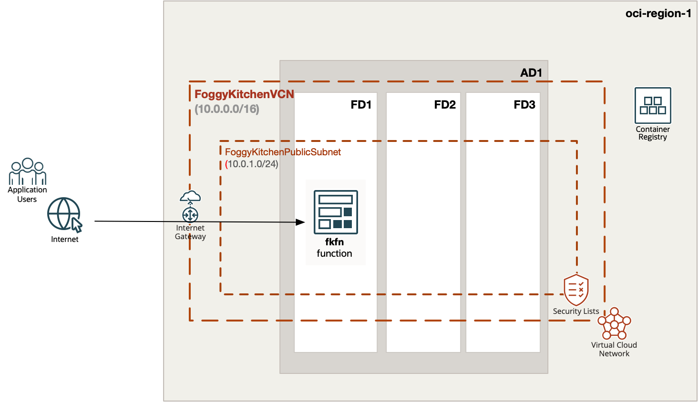

# Lesson 1: Hello World Function

This lesson introduces the smallest runnable OCI Functions scenario in the repository. It uses the local `terraform-oci-fk-function` module to create a Functions application, build and push the embedded hello-world function image to OCIR, deploy the function, and invoke it automatically.



## What This Lesson Shows

- A minimal OCI Functions deployment
- The local `terraform-oci-fk-function` module consumed through `../..`
- Explicit VCN and subnet composition through `terraform-oci-fk-vcn`
- Function image build and push through the module
- Automatic function invocation after deployment

This lesson is intentionally simple. It establishes the root function module behavior before later lessons start composing external files, shared applications, API Gateway, and event-driven OCI services.

## Architecture Notes

This lesson uses:

- the local function module via `../..`
- `terraform-oci-fk-vcn` for the VCN, subnet, and Internet Gateway path
- module-managed OCI Container Registry repository creation
- the embedded `functions/fkFn` scaffold in the root module
- automatic invocation through `invoke_fn = true`

The networking composition lives in [networking.tf](/Users/mlinxfeld/codes/github/terraform-oci-fk-function/training/lesson1_hello_world_function/networking.tf), the function deployment configuration lives in [functions.tf](/Users/mlinxfeld/codes/github/terraform-oci-fk-function/training/lesson1_hello_world_function/functions.tf), and OCI provider authentication is configured in [provider.tf](/Users/mlinxfeld/codes/github/terraform-oci-fk-function/training/lesson1_hello_world_function/provider.tf).

## Deploy Using Terraform CLI

### Clone The Repository

```bash
git clone https://github.com/mlinxfeld/terraform-oci-fk-function.git
cd terraform-oci-fk-function/training/lesson1_hello_world_function
```

### Create `terraform.tfvars`

Start from the example file:

```bash
cp terraform.tfvars.example terraform.tfvars
```

Minimum required values:

```hcl
tenancy_ocid       = "ocid1.tenancy.oc1..<your_tenancy_ocid>"
user_ocid          = "ocid1.user.oc1..<your_user_ocid>"
compartment_ocid   = "ocid1.compartment.oc1..<your_compartment_ocid>"
region             = "<oci_region>"
fingerprint        = "<fingerprint>"
private_key_path   = "<private_key_path>"
ocir_user_name     = "<user_name>"
ocir_user_password = "<user_auth_token>"
```

### Initialize Terraform

```bash
terraform init
```

Expected module sources:

- local `../..` for the function module
- `terraform-oci-fk-vcn` for networking

### Apply

```bash
terraform apply
```

With the current defaults, this lesson creates:

- one OCI Functions application
- one OCI Function
- one OCI Container Registry repository
- one VCN
- one subnet
- one route table
- one internet gateway
- one optional function invocation step

## Key Configuration

Current lesson settings:

- `use_my_fn = false`
- `use_my_fn_network = true`
- `my_fn_subnet_ocid = module.fk_vcn.subnet_ids["functions_public"]`
- `invoke_fn = true`
- `fk_app_name = "fkapp"` from the root module default
- `fk_fn_name = "fkfn"` from the root module default
- `ocir_repo_name = "fkfn"` from the root module default
- external networking injected from `terraform-oci-fk-vcn`

The important behavioral point is that lesson1 now follows the 2026 composition pattern from the very beginning: networking is explicit and injected into the function module, instead of being hidden inside a self-contained function module.

## Outputs

This lesson exposes the root module output, including:

- Functions application OCID
- Function OCID
- Subnet OCID associated with the function application

## Destroy

To remove all resources created by this lesson:

```bash
terraform destroy
```

## Contributing

This project is open source. Contributions are welcome through pull requests.

## License

Licensed under the **Universal Permissive License (UPL), Version 1.0**.
See [LICENSE](../../LICENSE) for details.

---

© 2026 [FoggyKitchen.com](https://foggykitchen.com) - Cloud. Code. Clarity.
