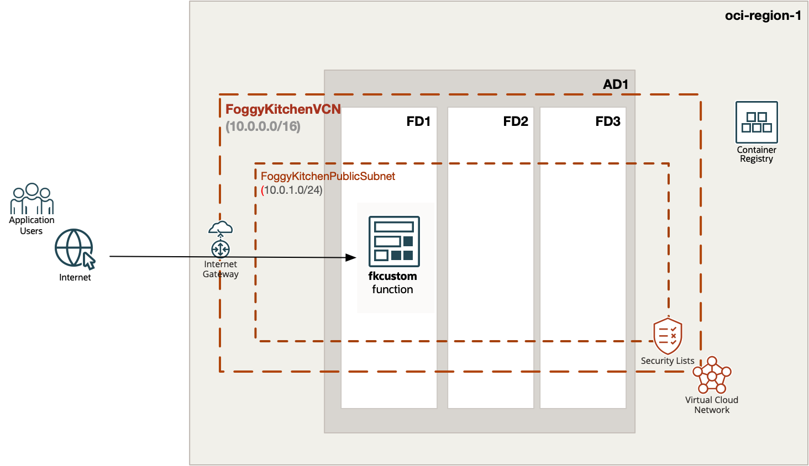

# Lesson 2: Custom Function

This lesson builds on [lesson1](../lesson1_hello_world_function/) by replacing the embedded hello-world function content with a custom function source tree. It uses the local `terraform-oci-fk-function` module together with explicit VCN and subnet composition, while injecting the custom `Dockerfile`, `func.py`, `func.yaml`, and `requirements.txt` content into the root function scaffold before the image build.



## What This Lesson Shows

- A custom OCI Function deployment instead of the embedded hello-world function
- The local `terraform-oci-fk-function` module consumed through `../..`
- Explicit VCN and subnet composition through `terraform-oci-fk-vcn`
- Function source injection through local file datasources
- OCI Logging enabled for the Functions application
- Automatic function invocation after deployment

This lesson is the first place in the training track where the root function module is used as a build wrapper for externally supplied function source files.

## Architecture Notes

This lesson uses:

- the local function module via `../..`
- `terraform-oci-fk-vcn` for the VCN, subnet, and Internet Gateway path
- module-managed OCI Container Registry repository creation
- local file datasources for the custom function source files in `functions/fncustom`
- OCI Logging enabled through the root module
- automatic invocation through `invoke_fn = true`

The networking composition lives in [networking.tf](/Users/mlinxfeld/codes/github/terraform-oci-fk-function/training/lesson2_custom_function/networking.tf), the function deployment configuration lives in [functions_UPDATED.tf](/Users/mlinxfeld/codes/github/terraform-oci-fk-function/training/lesson2_custom_function/functions_UPDATED.tf), the injected source file datasources live in [local_files_NEW.tf](/Users/mlinxfeld/codes/github/terraform-oci-fk-function/training/lesson2_custom_function/local_files_NEW.tf), and OCI provider authentication is configured in [provider.tf](/Users/mlinxfeld/codes/github/terraform-oci-fk-function/training/lesson2_custom_function/provider.tf).

## Deploy Using Terraform CLI

### Clone The Repository

```bash
git clone https://github.com/mlinxfeld/terraform-oci-fk-function.git
cd terraform-oci-fk-function/training/lesson2_custom_function
```

### Create `terraform.tfvars`

Start from the example file:

```bash
cp terraform.tfvars.example terraform.tfvars
```

Minimum required values:

```hcl
tenancy_ocid       = "ocid1.tenancy.oc1..<your_tenancy_ocid>"
user_ocid          = "ocid1.user.oc1..<your_user_ocid>"
compartment_ocid   = "ocid1.compartment.oc1..<your_compartment_ocid>"
region             = "<oci_region>"
fingerprint        = "<fingerprint>"
private_key_path   = "<private_key_path>"
ocir_user_name     = "<user_name>"
ocir_user_password = "<user_auth_token>"
```

### Initialize Terraform

```bash
terraform init
```

Expected module sources:

- local `../..` for the function module
- `terraform-oci-fk-vcn` for networking

### Apply

```bash
terraform apply
```

With the current defaults, this lesson creates:

- one OCI Functions application
- one custom OCI Function
- one OCI Container Registry repository
- one OCI Logging log group
- one OCI Logging service log
- one VCN
- one subnet
- one route table
- one internet gateway
- one optional function invocation step

## Key Configuration

Current lesson settings:

- `use_my_fn = true`
- `use_my_fn_network = true`
- `my_fn_subnet_ocid = module.fk_vcn.subnet_ids["functions_public"]`
- `use_oci_logging = true`
- `invoke_fn = true`
- `fk_fn_name = "fncustom"`
- `fn_config = { FN_CUSTOM_MESSAGE = var.fn_custom_message }`

The important behavioral point is that lesson2 keeps the same 2026 explicit networking pattern as [lesson1](../lesson1_hello_world_function/), but swaps the function body for user-supplied files and enables application-level logging.

## Outputs

This lesson exposes the root module output, including:

- Functions application OCID
- Function OCID
- Subnet OCID associated with the function application

## Destroy

To remove all resources created by this lesson:

```bash
terraform destroy
```

## Contributing

This project is open source. Contributions are welcome through pull requests.

## License

Licensed under the **Universal Permissive License (UPL), Version 1.0**.
See [LICENSE](../../LICENSE) for details.

---

© 2026 [FoggyKitchen.com](https://foggykitchen.com) - Cloud. Code. Clarity.
