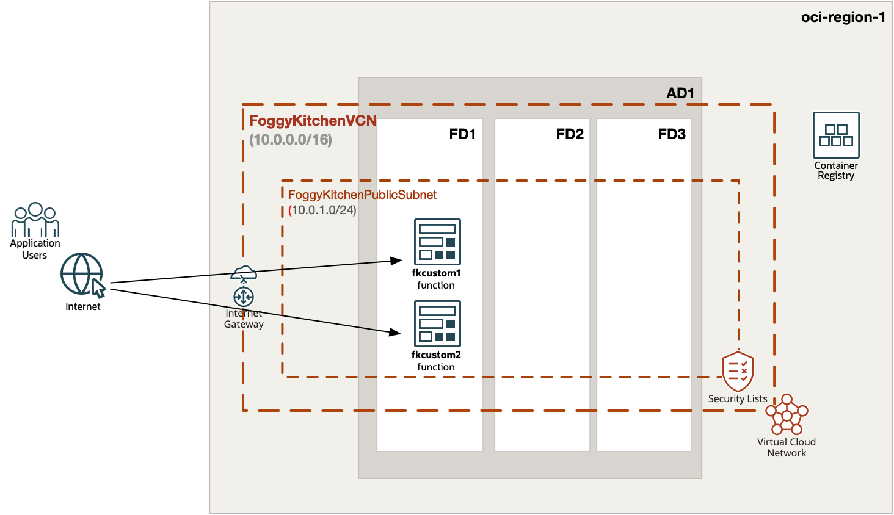
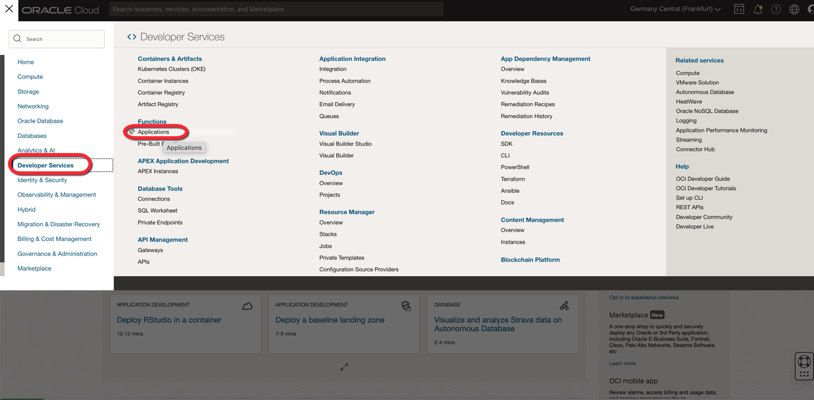
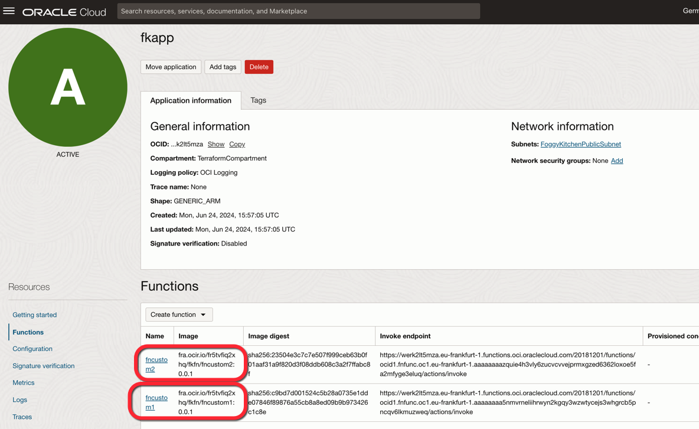
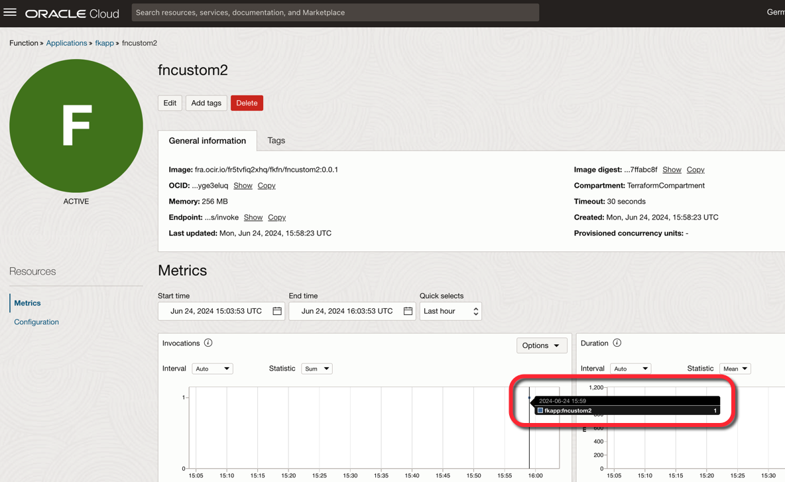
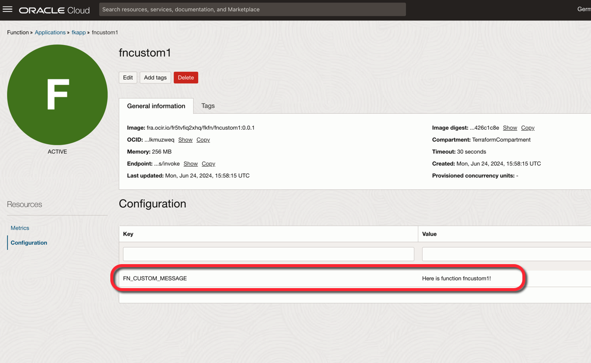
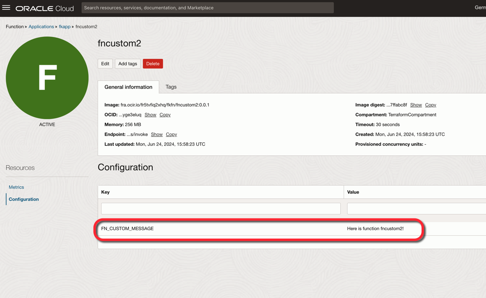

# FoggyKitchen OCI Function with Terraform 

## LESSON 3 - Two Functions under one Application

In this third lesson, we will create two functions, `fncustom1` and `fncustom2`, both placed under a single application umbrella. These functions will use the same public subnet. While most of the function code will be identical, each function will have a different `FN_CUSTOM_MESSAGE` value to generate unique content.

Since the application is shared, we will need to manually create the network elements and inject them into the module. The first invocation of the module will generate the application itself, so we will need to retrieve the application OCID from the first module's output and inject it into the second module. This allows the application to be shared between the functions.



## Deploy Using Oracle Resource Manager

1. Click [](https://cloud.oracle.com/resourcemanager/stacks/create?region=home&zipUrl=https://github.com/mlinxfeld/terraform-oci-fk-function/releases/latest/download/terraform-oci-fk-function-lesson3.zip)

    If you aren't already signed in, when prompted, enter the tenancy and user credentials.

2. Review and accept the terms and conditions.

3. Select the region where you want to deploy the stack.

4. Follow the on-screen prompts and instructions to create the stack.

5. After creating the stack, click **Terraform Actions**, and select **Plan**.

6. Wait for the job to be completed, and review the plan.

    To make any changes, return to the Stack Details page, click **Edit Stack**, and make the required changes. Then, run the **Plan** action again.

7. If no further changes are necessary, return to the Stack Details page, click **Terraform Actions**, and select **Apply**. 

## Deploy Using the Terraform CLI in Cloud Shell

### Clone of the repo into OCI Cloud Shell

Now, you'll want a local copy of this repo. You can make that with the commands:
Clone the repo from github by executing the command as follows and then go to proper subdirectory:

```
martin_lin@codeeditor:~ (eu-frankfurt-1)$ git clone https://github.com/mlinxfeld/terraform-oci-fk-function.git

martin_lin@codeeditor:~ (eu-frankfurt-1)$ cd terraform-oci-fk-function

martin_lin@codeeditor:terraform-oci-fk-adb (eu-frankfurt-1)$ cd training/lesson3_two_functions_under_one_app/
```

### Prerequisites
Create environment file with terraform.tfvars file starting with example file:

```
martin_lin@codeeditor:lesson3_two_functions_under_one_app (eu-frankfurt-1)$ cp terraform.tfvars.example terraform.tfvars

martin_lin@codeeditor:lesson3_two_functions_under_one_app (eu-frankfurt-1)$ vi terraform.tfvars

tenancy_ocid       = "ocid1.tenancy.oc1..<your_tenancy_ocid>"
compartment_ocid   = "ocid1.compartment.oc1..<your_comparment_ocid>"
region             = "<oci_region>"
ocir_user_name     = "<user_name>"
ocir_user_password = "<user_auth_token>"
```

### Initialize Terraform

Run the following command to initialize Terraform environment:

```
martin_lin@codeeditor:lesson3_two_functions_under_one_app (eu-frankfurt-1)$ terraform init 

Initializing the backend...
Upgrading modules...
Downloading git::https://github.com/mlinxfeld/terraform-oci-fk-function.git for oci-fk-custom-function-1...
- oci-fk-custom-function-1 in .terraform/modules/oci-fk-custom-function-1
Downloading git::https://github.com/mlinxfeld/terraform-oci-fk-function.git for oci-fk-custom-function-2...
- oci-fk-custom-function-2 in .terraform/modules/oci-fk-custom-function-2

Initializing provider plugins...
- Finding latest version of hashicorp/local...
- Finding latest version of hashicorp/null...
- Finding latest version of hashicorp/oci...
- Using previously-installed hashicorp/local v2.5.1
- Using previously-installed hashicorp/null v3.2.2
- Installing hashicorp/oci v5.46.0...
- Installed hashicorp/oci v5.46.0 (unauthenticated)

Terraform has made some changes to the provider dependency selections recorded
in the .terraform.lock.hcl file. Review those changes and commit them to your
version control system if they represent changes you intended to make.

Terraform has been successfully initialized!

You may now begin working with Terraform. Try running "terraform plan" to see
any changes that are required for your infrastructure. All Terraform commands
should now work.

If you ever set or change modules or backend configuration for Terraform,
rerun this command to reinitialize your working directory. If you forget, other
commands will detect it and remind you to do so if necessary.
```

### Apply the changes 

Run the following command for applying changes with the proposed plan:

```
martin_lin@codeeditor:lesson3_two_functions_under_one_app (eu-frankfurt-1)$ terraform apply 

data.local_file.fncustom1_dockerfile: Reading...
data.local_file.fncustom2_dockerfile: Reading...
data.local_file.fncustom2_func_yaml: Reading...
data.local_file.fncustom1_requirements_txt: Reading...
data.local_file.fncustom2_requirements_txt: Reading...
data.local_file.fncustom2_func_py: Reading...
data.local_file.fncustom1_func_py: Reading...
data.local_file.fncustom1_func_yaml: Reading...
data.local_file.fncustom1_requirements_txt: Read complete after 0s [id=91bd32a35ac20833294303bda57f32b4c1692a09]
data.local_file.fncustom1_dockerfile: Read complete after 0s [id=aa3833301ffe31669490f8269952e79a0989b142]
data.local_file.fncustom2_func_py: Read complete after 0s [id=871fae224158a4fdc178b10d9f52b88d58c484c1]
data.local_file.fncustom2_requirements_txt: Read complete after 0s [id=91bd32a35ac20833294303bda57f32b4c1692a09]
data.local_file.fncustom1_func_yaml: Read complete after 0s [id=360abaa9f473ff6ecdc46f1cceaf66184973b64a]
data.local_file.fncustom2_dockerfile: Read complete after 0s [id=aa3833301ffe31669490f8269952e79a0989b142]
data.local_file.fncustom1_func_py: Read complete after 0s [id=871fae224158a4fdc178b10d9f52b88d58c484c1]
data.local_file.fncustom2_func_yaml: Read complete after 0s [id=375ee6f450294c4ef621a197720a907bcbcd7fa6]
module.oci-fk-custom-function-1.data.oci_identity_regions.oci_regions: Reading...
module.oci-fk-custom-function-1.data.oci_objectstorage_namespace.os_namespace: Reading...
module.oci-fk-custom-function-2.data.oci_objectstorage_namespace.os_namespace: Reading...
module.oci-fk-custom-function-2.data.oci_identity_regions.oci_regions: Reading...
module.oci-fk-custom-function-2.data.oci_objectstorage_namespace.os_namespace: Read complete after 0s [id=ObjectStorageNamespaceDataSource-3596290162]
module.oci-fk-custom-function-1.data.oci_objectstorage_namespace.os_namespace: Read complete after 0s [id=ObjectStorageNamespaceDataSource-3596290162]
module.oci-fk-custom-function-1.data.oci_identity_regions.oci_regions: Read complete after 0s [id=IdentityRegionsDataSource-0]
module.oci-fk-custom-function-2.data.oci_identity_regions.oci_regions: Read complete after 0s [id=IdentityRegionsDataSource-0]

Terraform used the selected providers to generate the following execution plan. Resource actions are indicated with the following symbols:
  + create

Terraform will perform the following actions:

  # oci_core_dhcp_options.FoggyKitchenDhcpOptions1 will be created
  + resource "oci_core_dhcp_options" "FoggyKitchenDhcpOptions1" {
      + compartment_id   = "ocid1.compartment.oc1..aaaaaaaaiyy4srmrb32v5rlniicwmpxsytywiucgbcp5ext6e4ahjfuloewa"
      + defined_tags     = (known after apply)
      + display_name     = "FoggyKitchenDHCPOptions1"
      + domain_name_type = (known after apply)
      + freeform_tags    = (known after apply)
      + id               = (known after apply)
      + state            = (known after apply)
      + time_created     = (known after apply)
      + vcn_id           = (known after apply)

      + options {
          + custom_dns_servers  = []
          + search_domain_names = (known after apply)
          + server_type         = "VcnLocalPlusInternet"
          + type                = "DomainNameServer"
        }
      + options {
          + custom_dns_servers  = []
          + search_domain_names = [
              + "foggykitchen.com",
            ]
          + server_type         = (known after apply)
          + type                = "SearchDomain"
        }
    }

  # oci_core_internet_gateway.FoggyKitchenInternetGateway will be created
  + resource "oci_core_internet_gateway" "FoggyKitchenInternetGateway" {
      + compartment_id = "ocid1.compartment.oc1..aaaaaaaaiyy4srmrb32v5rlniicwmpxsytywiucgbcp5ext6e4ahjfuloewa"
      + defined_tags   = (known after apply)
      + display_name   = "FoggyKitchenInternetGateway"
      + enabled        = true
      + freeform_tags  = (known after apply)
      + id             = (known after apply)
      + route_table_id = (known after apply)
      + state          = (known after apply)
      + time_created   = (known after apply)
      + vcn_id         = (known after apply)
    }

  # oci_core_route_table.FoggyKitchenRouteTableViaIGW will be created
  + resource "oci_core_route_table" "FoggyKitchenRouteTableViaIGW" {
      + compartment_id = "ocid1.compartment.oc1..aaaaaaaaiyy4srmrb32v5rlniicwmpxsytywiucgbcp5ext6e4ahjfuloewa"
      + defined_tags   = (known after apply)
      + display_name   = "FoggyKitchenRouteTableViaIGW"
      + freeform_tags  = (known after apply)
      + id             = (known after apply)
      + state          = (known after apply)
      + time_created   = (known after apply)
      + vcn_id         = (known after apply)

      + route_rules {
          + cidr_block        = (known after apply)
          + description       = (known after apply)
          + destination       = "0.0.0.0/0"
          + destination_type  = "CIDR_BLOCK"
          + network_entity_id = (known after apply)
          + route_type        = (known after apply)
        }
    }

  # oci_core_subnet.FoggyKitchenPublicSubnet will be created
  + resource "oci_core_subnet" "FoggyKitchenPublicSubnet" {
      + availability_domain        = (known after apply)
      + cidr_block                 = "10.0.0.0/24"
      + compartment_id             = "ocid1.compartment.oc1..aaaaaaaaiyy4srmrb32v5rlniicwmpxsytywiucgbcp5ext6e4ahjfuloewa"
      + defined_tags               = (known after apply)
      + dhcp_options_id            = (known after apply)
      + display_name               = "FoggyKitchenPublicSubnet"
      + dns_label                  = "FoggyKitchenN1"
      + freeform_tags              = (known after apply)
      + id                         = (known after apply)
      + ipv6cidr_block             = (known after apply)
      + ipv6cidr_blocks            = (known after apply)
      + ipv6virtual_router_ip      = (known after apply)
      + prohibit_internet_ingress  = (known after apply)
      + prohibit_public_ip_on_vnic = (known after apply)
      + route_table_id             = (known after apply)
      + security_list_ids          = (known after apply)
      + state                      = (known after apply)
      + subnet_domain_name         = (known after apply)
      + time_created               = (known after apply)
      + vcn_id                     = (known after apply)
      + virtual_router_ip          = (known after apply)
      + virtual_router_mac         = (known after apply)
    }

  # oci_core_virtual_network.FoggyKitchenVCN will be created
  + resource "oci_core_virtual_network" "FoggyKitchenVCN" {
      + byoipv6cidr_blocks               = (known after apply)
      + cidr_block                       = "10.0.0.0/16"
      + cidr_blocks                      = (known after apply)
      + compartment_id                   = "ocid1.compartment.oc1..aaaaaaaaiyy4srmrb32v5rlniicwmpxsytywiucgbcp5ext6e4ahjfuloewa"
      + default_dhcp_options_id          = (known after apply)
      + default_route_table_id           = (known after apply)
      + default_security_list_id         = (known after apply)
      + defined_tags                     = (known after apply)
      + display_name                     = "FoggyKitchenVCN"
      + dns_label                        = "FoggyKitchenVCN"
      + freeform_tags                    = (known after apply)
      + id                               = (known after apply)
      + ipv6cidr_blocks                  = (known after apply)
      + ipv6private_cidr_blocks          = (known after apply)
      + is_ipv6enabled                   = (known after apply)
      + is_oracle_gua_allocation_enabled = (known after apply)
      + state                            = (known after apply)
      + time_created                     = (known after apply)
      + vcn_domain_name                  = (known after apply)
    }

  # module.oci-fk-custom-function-1.local_file.dockerfile_content[0] will be created
  + resource "local_file" "dockerfile_content" {
      + content              = <<-EOT
            FROM oraclelinux:8-slim as ol8
            
            RUN microdnf install -y wget \
                tar \
                gzip \
                which 
            
            FROM fnproject/python:3.8.5-dev as build-stage
            
            WORKDIR /function
            
            ADD requirements.txt /function/
            
            RUN pip3 install --target /python/  --no-cache --no-cache-dir -r requirements.txt && \                       
                rm -fr ~/.cache/pip /tmp* requirements.txt func.yaml Dockerfile .venv
            
            ADD . /function/
            
            RUN rm -fr /function/.pip_cache
            
            FROM fnproject/python:3.8.5
            
            WORKDIR /function
            
            COPY --from=build-stage /function /function
            
            COPY --from=build-stage /python /python
            
            ENV PYTHONPATH=/python
            
            ENTRYPOINT ["/python/bin/fdk", "/function/func.py", "handler"]
        EOT
      + content_base64sha256 = (known after apply)
      + content_base64sha512 = (known after apply)
      + content_md5          = (known after apply)
      + content_sha1         = (known after apply)
      + content_sha256       = (known after apply)
      + content_sha512       = (known after apply)
      + directory_permission = "0777"
      + file_permission      = "0777"
      + filename             = ".terraform/modules/oci-fk-custom-function-1/functions/fkFn/Dockerfile"
      + id                   = (known after apply)
    }

  # module.oci-fk-custom-function-1.local_file.func_py_content[0] will be created
  + resource "local_file" "func_py_content" {
      + content              = <<-EOT
            import io
            import os
            import json
            import logging
            from fdk import response
            
            
            def handler(ctx, data: io.BytesIO=None):
            
                if os.getenv("FN_CUSTOM_MESSAGE") != None:
                    fn_custom_message = os.getenv("FN_CUSTOM_MESSAGE")
                else:
                    _='Missing configuration key FN_CUSTOM_MESSAGE'
                    logging.getLogger().error(_)
                    return None, _
            
                logging.getLogger().info(f'Starting function with message: {fn_custom_message}')
            
                return response.Response(
                    ctx, response_data=json.dumps(
                        {"message": fn_custom_message}),
                    headers={"Content-Type": "application/json"}
                )
        EOT
      + content_base64sha256 = (known after apply)
      + content_base64sha512 = (known after apply)
      + content_md5          = (known after apply)
      + content_sha1         = (known after apply)
      + content_sha256       = (known after apply)
      + content_sha512       = (known after apply)
      + directory_permission = "0777"
      + file_permission      = "0777"
      + filename             = ".terraform/modules/oci-fk-custom-function-1/functions/fkFn/func.py"
      + id                   = (known after apply)
    }

  # module.oci-fk-custom-function-1.local_file.func_yaml_content[0] will be created
  + resource "local_file" "func_yaml_content" {
      + content              = <<-EOT
            schema_version: 20180708
            name: fncustom1
            version: 0.0.1
            runtime: docker
            entrypoint: /python/bin/fdk /function/func.py handler
            memory: 256
        EOT
      + content_base64sha256 = (known after apply)
      + content_base64sha512 = (known after apply)
      + content_md5          = (known after apply)
      + content_sha1         = (known after apply)
      + content_sha256       = (known after apply)
      + content_sha512       = (known after apply)
      + directory_permission = "0777"
      + file_permission      = "0777"
      + filename             = ".terraform/modules/oci-fk-custom-function-1/functions/fkFn/func.yaml"
      + id                   = (known after apply)
    }

  # module.oci-fk-custom-function-1.local_file.requirements_txt_content[0] will be created
  + resource "local_file" "requirements_txt_content" {
      + content              = <<-EOT
            fdk
            oci
        EOT
      + content_base64sha256 = (known after apply)
      + content_base64sha512 = (known after apply)
      + content_md5          = (known after apply)
      + content_sha1         = (known after apply)
      + content_sha256       = (known after apply)
      + content_sha512       = (known after apply)
      + directory_permission = "0777"
      + file_permission      = "0777"
      + filename             = ".terraform/modules/oci-fk-custom-function-1/functions/fkFn/requirements.txt"
      + id                   = (known after apply)
    }

  # module.oci-fk-custom-function-1.null_resource.FoggyKitchenFnInvoke[0] will be created
  + resource "null_resource" "FoggyKitchenFnInvoke" {
      + id = (known after apply)
    }

  # module.oci-fk-custom-function-1.null_resource.FoggyKitchenMyFnSetup[0] will be created
  + resource "null_resource" "FoggyKitchenMyFnSetup" {
      + id = (known after apply)
    }

  # module.oci-fk-custom-function-1.oci_artifacts_container_repository.FoggyKitchenOCIR will be created
  + resource "oci_artifacts_container_repository" "FoggyKitchenOCIR" {
      + billable_size_in_gbs = (known after apply)
      + compartment_id       = "ocid1.compartment.oc1..aaaaaaaaiyy4srmrb32v5rlniicwmpxsytywiucgbcp5ext6e4ahjfuloewa"
      + created_by           = (known after apply)
      + defined_tags         = (known after apply)
      + display_name         = "fkfn/fncustom1"
      + freeform_tags        = (known after apply)
      + id                   = (known after apply)
      + image_count          = (known after apply)
      + is_immutable         = (known after apply)
      + is_public            = false
      + layer_count          = (known after apply)
      + layers_size_in_bytes = (known after apply)
      + namespace            = (known after apply)
      + state                = (known after apply)
      + system_tags          = (known after apply)
      + time_created         = (known after apply)
      + time_last_pushed     = (known after apply)
    }

  # module.oci-fk-custom-function-1.oci_functions_application.FoggyKitchenFnApp[0] will be created
  + resource "oci_functions_application" "FoggyKitchenFnApp" {
      + compartment_id             = "ocid1.compartment.oc1..aaaaaaaaiyy4srmrb32v5rlniicwmpxsytywiucgbcp5ext6e4ahjfuloewa"
      + config                     = (known after apply)
      + defined_tags               = (known after apply)
      + display_name               = "fkapp"
      + freeform_tags              = (known after apply)
      + id                         = (known after apply)
      + network_security_group_ids = (known after apply)
      + shape                      = "GENERIC_ARM"
      + state                      = (known after apply)
      + subnet_ids                 = (known after apply)
      + syslog_url                 = (known after apply)
      + time_created               = (known after apply)
      + time_updated               = (known after apply)
    }

  # module.oci-fk-custom-function-1.oci_functions_function.FoggyKitchenFn will be created
  + resource "oci_functions_function" "FoggyKitchenFn" {
      + application_id     = (known after apply)
      + compartment_id     = (known after apply)
      + config             = {
          + "FN_CUSTOM_MESSAGE" = "Here is function fncustom1!"
        }
      + defined_tags       = (known after apply)
      + display_name       = "fncustom1"
      + freeform_tags      = (known after apply)
      + id                 = (known after apply)
      + image              = "fra.ocir.io/fr5tvfiq2xhq/fkfn/fncustom1:0.0.1"
      + image_digest       = (known after apply)
      + invoke_endpoint    = (known after apply)
      + memory_in_mbs      = "256"
      + shape              = (known after apply)
      + state              = (known after apply)
      + time_created       = (known after apply)
      + time_updated       = (known after apply)
      + timeout_in_seconds = 30
    }

  # module.oci-fk-custom-function-1.oci_logging_log.FoggyKitchenFnAppInvokeLog[0] will be created
  + resource "oci_logging_log" "FoggyKitchenFnAppInvokeLog" {
      + compartment_id     = (known after apply)
      + defined_tags       = (known after apply)
      + display_name       = "FoggyKitchenFnAppInvokeLog"
      + freeform_tags      = (known after apply)
      + id                 = (known after apply)
      + is_enabled         = true
      + log_group_id       = (known after apply)
      + log_type           = "SERVICE"
      + retention_duration = (known after apply)
      + state              = (known after apply)
      + tenancy_id         = (known after apply)
      + time_created       = (known after apply)
      + time_last_modified = (known after apply)

      + configuration {
          + compartment_id = "ocid1.compartment.oc1..aaaaaaaaiyy4srmrb32v5rlniicwmpxsytywiucgbcp5ext6e4ahjfuloewa"

          + source {
              + category    = "invoke"
              + parameters  = (known after apply)
              + resource    = (known after apply)
              + service     = "functions"
              + source_type = "OCISERVICE"
            }
        }
    }

  # module.oci-fk-custom-function-1.oci_logging_log_group.FoggyKitchenFnAppLogGroup[0] will be created
  + resource "oci_logging_log_group" "FoggyKitchenFnAppLogGroup" {
      + compartment_id     = "ocid1.compartment.oc1..aaaaaaaaiyy4srmrb32v5rlniicwmpxsytywiucgbcp5ext6e4ahjfuloewa"
      + defined_tags       = (known after apply)
      + description        = "Foggy Kitchen Fn App Log Group"
      + display_name       = "FoggyKitchenFnAppLogGroup"
      + freeform_tags      = (known after apply)
      + id                 = (known after apply)
      + state              = (known after apply)
      + time_created       = (known after apply)
      + time_last_modified = (known after apply)
    }

  # module.oci-fk-custom-function-2.local_file.dockerfile_content[0] will be created
  + resource "local_file" "dockerfile_content" {
      + content              = <<-EOT
            FROM oraclelinux:8-slim as ol8
            
            RUN microdnf install -y wget \
                tar \
                gzip \
                which 
            
            FROM fnproject/python:3.8.5-dev as build-stage
            
            WORKDIR /function
            
            ADD requirements.txt /function/
            
            RUN pip3 install --target /python/  --no-cache --no-cache-dir -r requirements.txt && \                       
                rm -fr ~/.cache/pip /tmp* requirements.txt func.yaml Dockerfile .venv
            
            ADD . /function/
            
            RUN rm -fr /function/.pip_cache
            
            FROM fnproject/python:3.8.5
            
            WORKDIR /function
            
            COPY --from=build-stage /function /function
            
            COPY --from=build-stage /python /python
            
            ENV PYTHONPATH=/python
            
            ENTRYPOINT ["/python/bin/fdk", "/function/func.py", "handler"]
        EOT
      + content_base64sha256 = (known after apply)
      + content_base64sha512 = (known after apply)
      + content_md5          = (known after apply)
      + content_sha1         = (known after apply)
      + content_sha256       = (known after apply)
      + content_sha512       = (known after apply)
      + directory_permission = "0777"
      + file_permission      = "0777"
      + filename             = ".terraform/modules/oci-fk-custom-function-2/functions/fkFn/Dockerfile"
      + id                   = (known after apply)
    }

  # module.oci-fk-custom-function-2.local_file.func_py_content[0] will be created
  + resource "local_file" "func_py_content" {
      + content              = <<-EOT
            import io
            import os
            import json
            import logging
            from fdk import response
            
            
            def handler(ctx, data: io.BytesIO=None):
            
                if os.getenv("FN_CUSTOM_MESSAGE") != None:
                    fn_custom_message = os.getenv("FN_CUSTOM_MESSAGE")
                else:
                    _='Missing configuration key FN_CUSTOM_MESSAGE'
                    logging.getLogger().error(_)
                    return None, _
            
                logging.getLogger().info(f'Starting function with message: {fn_custom_message}')
            
                return response.Response(
                    ctx, response_data=json.dumps(
                        {"message": fn_custom_message}),
                    headers={"Content-Type": "application/json"}
                )
        EOT
      + content_base64sha256 = (known after apply)
      + content_base64sha512 = (known after apply)
      + content_md5          = (known after apply)
      + content_sha1         = (known after apply)
      + content_sha256       = (known after apply)
      + content_sha512       = (known after apply)
      + directory_permission = "0777"
      + file_permission      = "0777"
      + filename             = ".terraform/modules/oci-fk-custom-function-2/functions/fkFn/func.py"
      + id                   = (known after apply)
    }

  # module.oci-fk-custom-function-2.local_file.func_yaml_content[0] will be created
  + resource "local_file" "func_yaml_content" {
      + content              = <<-EOT
            schema_version: 20180708
            name: fncustom2
            version: 0.0.1
            runtime: docker
            entrypoint: /python/bin/fdk /function/func.py handler
            memory: 256
        EOT
      + content_base64sha256 = (known after apply)
      + content_base64sha512 = (known after apply)
      + content_md5          = (known after apply)
      + content_sha1         = (known after apply)
      + content_sha256       = (known after apply)
      + content_sha512       = (known after apply)
      + directory_permission = "0777"
      + file_permission      = "0777"
      + filename             = ".terraform/modules/oci-fk-custom-function-2/functions/fkFn/func.yaml"
      + id                   = (known after apply)
    }

  # module.oci-fk-custom-function-2.local_file.requirements_txt_content[0] will be created
  + resource "local_file" "requirements_txt_content" {
      + content              = <<-EOT
            fdk
            oci
        EOT
      + content_base64sha256 = (known after apply)
      + content_base64sha512 = (known after apply)
      + content_md5          = (known after apply)
      + content_sha1         = (known after apply)
      + content_sha256       = (known after apply)
      + content_sha512       = (known after apply)
      + directory_permission = "0777"
      + file_permission      = "0777"
      + filename             = ".terraform/modules/oci-fk-custom-function-2/functions/fkFn/requirements.txt"
      + id                   = (known after apply)
    }

  # module.oci-fk-custom-function-2.null_resource.FoggyKitchenFnInvoke[0] will be created
  + resource "null_resource" "FoggyKitchenFnInvoke" {
      + id = (known after apply)
    }

  # module.oci-fk-custom-function-2.null_resource.FoggyKitchenMyFnSetup[0] will be created
  + resource "null_resource" "FoggyKitchenMyFnSetup" {
      + id = (known after apply)
    }

  # module.oci-fk-custom-function-2.oci_artifacts_container_repository.FoggyKitchenOCIR will be created
  + resource "oci_artifacts_container_repository" "FoggyKitchenOCIR" {
      + billable_size_in_gbs = (known after apply)
      + compartment_id       = "ocid1.compartment.oc1..aaaaaaaaiyy4srmrb32v5rlniicwmpxsytywiucgbcp5ext6e4ahjfuloewa"
      + created_by           = (known after apply)
      + defined_tags         = (known after apply)
      + display_name         = "fkfn/fncustom2"
      + freeform_tags        = (known after apply)
      + id                   = (known after apply)
      + image_count          = (known after apply)
      + is_immutable         = (known after apply)
      + is_public            = false
      + layer_count          = (known after apply)
      + layers_size_in_bytes = (known after apply)
      + namespace            = (known after apply)
      + state                = (known after apply)
      + system_tags          = (known after apply)
      + time_created         = (known after apply)
      + time_last_pushed     = (known after apply)
    }

  # module.oci-fk-custom-function-2.oci_functions_function.FoggyKitchenFn will be created
  + resource "oci_functions_function" "FoggyKitchenFn" {
      + application_id     = (known after apply)
      + compartment_id     = (known after apply)
      + config             = {
          + "FN_CUSTOM_MESSAGE" = "Here is function fncustom2!"
        }
      + defined_tags       = (known after apply)
      + display_name       = "fncustom2"
      + freeform_tags      = (known after apply)
      + id                 = (known after apply)
      + image              = "fra.ocir.io/fr5tvfiq2xhq/fkfn/fncustom2:0.0.1"
      + image_digest       = (known after apply)
      + invoke_endpoint    = (known after apply)
      + memory_in_mbs      = "256"
      + shape              = (known after apply)
      + state              = (known after apply)
      + time_created       = (known after apply)
      + time_updated       = (known after apply)
      + timeout_in_seconds = 30
    }

Plan: 24 to add, 0 to change, 0 to destroy.

Do you want to perform these actions?
  Terraform will perform the actions described above.
  Only 'yes' will be accepted to approve.

  Enter a value: yes

(...)

module.oci-fk-custom-function-2.null_resource.FoggyKitchenFnInvoke[0]: Creating...
module.oci-fk-custom-function-2.null_resource.FoggyKitchenFnInvoke[0]: Provisioning with 'local-exec'...
module.oci-fk-custom-function-2.null_resource.FoggyKitchenFnInvoke[0] (local-exec): Executing: ["/bin/sh" "-c" "sleep 30"]
module.oci-fk-custom-function-1.null_resource.FoggyKitchenFnInvoke[0]: Still creating... [10s elapsed]
module.oci-fk-custom-function-2.null_resource.FoggyKitchenFnInvoke[0]: Still creating... [10s elapsed]
module.oci-fk-custom-function-1.null_resource.FoggyKitchenFnInvoke[0]: Still creating... [20s elapsed]
module.oci-fk-custom-function-2.null_resource.FoggyKitchenFnInvoke[0]: Still creating... [20s elapsed]
module.oci-fk-custom-function-1.null_resource.FoggyKitchenFnInvoke[0]: Still creating... [30s elapsed]
module.oci-fk-custom-function-1.null_resource.FoggyKitchenFnInvoke[0]: Provisioning with 'local-exec'...
module.oci-fk-custom-function-1.null_resource.FoggyKitchenFnInvoke[0] (local-exec): Executing: ["/bin/sh" "-c" "oci raw-request --http-method POST --target-uri https://werk2lt5mza.eu-frankfurt-1.functions.oci.oraclecloud.com/20181201/functions/ocid1.fnfunc.oc1.eu-frankfurt-1.aaaaaaaa5nmvrneliihrwyn2kgqy3wzwtycejs3whgrcb5pncqv6lkmuzweq/actions/invoke --request-body '' "]
module.oci-fk-custom-function-2.null_resource.FoggyKitchenFnInvoke[0]: Still creating... [30s elapsed]
module.oci-fk-custom-function-2.null_resource.FoggyKitchenFnInvoke[0]: Provisioning with 'local-exec'...
module.oci-fk-custom-function-2.null_resource.FoggyKitchenFnInvoke[0] (local-exec): Executing: ["/bin/sh" "-c" "oci raw-request --http-method POST --target-uri https://werk2lt5mza.eu-frankfurt-1.functions.oci.oraclecloud.com/20181201/functions/ocid1.fnfunc.oc1.eu-frankfurt-1.aaaaaaaazquie4h3vly6zucvcvvejprmxgzed6362loxoe5fa2mfyge3eluq/actions/invoke --request-body '' "]
module.oci-fk-custom-function-1.null_resource.FoggyKitchenFnInvoke[0]: Still creating... [40s elapsed]
module.oci-fk-custom-function-2.null_resource.FoggyKitchenFnInvoke[0]: Still creating... [40s elapsed]
module.oci-fk-custom-function-1.null_resource.FoggyKitchenFnInvoke[0]: Still creating... [50s elapsed]
module.oci-fk-custom-function-2.null_resource.FoggyKitchenFnInvoke[0]: Still creating... [50s elapsed]
module.oci-fk-custom-function-2.null_resource.FoggyKitchenFnInvoke[0] (local-exec): {
module.oci-fk-custom-function-2.null_resource.FoggyKitchenFnInvoke[0] (local-exec):   "data": {
module.oci-fk-custom-function-2.null_resource.FoggyKitchenFnInvoke[0] (local-exec):     "message": "Here is function fncustom2!"
module.oci-fk-custom-function-2.null_resource.FoggyKitchenFnInvoke[0] (local-exec):   },
module.oci-fk-custom-function-2.null_resource.FoggyKitchenFnInvoke[0] (local-exec):   "headers": {
module.oci-fk-custom-function-2.null_resource.FoggyKitchenFnInvoke[0] (local-exec):     "Content-Length": "42",
module.oci-fk-custom-function-2.null_resource.FoggyKitchenFnInvoke[0] (local-exec):     "Content-Type": "application/json",
module.oci-fk-custom-function-2.null_resource.FoggyKitchenFnInvoke[0] (local-exec):     "Date": "Mon, 24 Jun 2024 15:59:14 GMT",
module.oci-fk-custom-function-2.null_resource.FoggyKitchenFnInvoke[0] (local-exec):     "Fn-Call-Id": "01J15FHGKB1BT0MY0ZJ01CYF4G",
module.oci-fk-custom-function-2.null_resource.FoggyKitchenFnInvoke[0] (local-exec):     "Fn-Fdk-Runtime": "python/3.8.5 final",
module.oci-fk-custom-function-2.null_resource.FoggyKitchenFnInvoke[0] (local-exec):     "Fn-Fdk-Version": "fdk-python/0.1.73",
module.oci-fk-custom-function-2.null_resource.FoggyKitchenFnInvoke[0] (local-exec):     "Opc-Request-Id": "69D680738DFA40788D989D844D7E3C9C/01J15FHGHC00000000002NXEDY/01J15FHGHC00000000002NXEDZ"
module.oci-fk-custom-function-2.null_resource.FoggyKitchenFnInvoke[0] (local-exec):   },
module.oci-fk-custom-function-2.null_resource.FoggyKitchenFnInvoke[0] (local-exec):   "status": "200 OK"
module.oci-fk-custom-function-2.null_resource.FoggyKitchenFnInvoke[0] (local-exec): }
module.oci-fk-custom-function-1.null_resource.FoggyKitchenFnInvoke[0] (local-exec): {
module.oci-fk-custom-function-1.null_resource.FoggyKitchenFnInvoke[0] (local-exec):   "data": {
module.oci-fk-custom-function-1.null_resource.FoggyKitchenFnInvoke[0] (local-exec):     "message": "Here is function fncustom1!"
module.oci-fk-custom-function-1.null_resource.FoggyKitchenFnInvoke[0] (local-exec):   },
module.oci-fk-custom-function-1.null_resource.FoggyKitchenFnInvoke[0] (local-exec):   "headers": {
module.oci-fk-custom-function-1.null_resource.FoggyKitchenFnInvoke[0] (local-exec):     "Content-Length": "42",
module.oci-fk-custom-function-1.null_resource.FoggyKitchenFnInvoke[0] (local-exec):     "Content-Type": "application/json",
module.oci-fk-custom-function-1.null_resource.FoggyKitchenFnInvoke[0] (local-exec):     "Date": "Mon, 24 Jun 2024 15:59:14 GMT",
module.oci-fk-custom-function-1.null_resource.FoggyKitchenFnInvoke[0] (local-exec):     "Fn-Call-Id": "01J15FH93Z1BT0K48ZJ01CP1Q9",
module.oci-fk-custom-function-1.null_resource.FoggyKitchenFnInvoke[0] (local-exec):     "Fn-Fdk-Runtime": "python/3.8.5 final",
module.oci-fk-custom-function-1.null_resource.FoggyKitchenFnInvoke[0] (local-exec):     "Fn-Fdk-Version": "fdk-python/0.1.73",
module.oci-fk-custom-function-1.null_resource.FoggyKitchenFnInvoke[0] (local-exec):     "Opc-Request-Id": "15B4DAC2C3E240719879A2D8D42FC1B7/01J15FH92500000000002NCTJJ/01J15FH92500000000002NCTJK"
module.oci-fk-custom-function-1.null_resource.FoggyKitchenFnInvoke[0] (local-exec):   },
module.oci-fk-custom-function-1.null_resource.FoggyKitchenFnInvoke[0] (local-exec):   "status": "200 OK"
module.oci-fk-custom-function-1.null_resource.FoggyKitchenFnInvoke[0] (local-exec): }
module.oci-fk-custom-function-2.null_resource.FoggyKitchenFnInvoke[0]: Creation complete after 50s [id=3487679343069449311]
module.oci-fk-custom-function-1.null_resource.FoggyKitchenFnInvoke[0]: Creation complete after 58s [id=1802697844876187448]

Apply complete! Resources: 24 added, 0 changed, 0 destroyed.

```
### Check the function in OCI Console

1. From the hamburger menu in the top left corner navigate to Developer Services and then to Applications:



2. Verify existence of the fkapp application and then fkcustom1 and fkcustom2 functions:



3. Confirm that fkcustom1 has been invoked in the metrics section:


4. Confirm that fkcustom2 has been invoked in the metrics section:



5. Confirm that custom message has been injected as part of configuration to fncustom1 - environmetal variable `FN_CUSTOM_MESSAGE`:



6. Confirm that custom message has been injected as part of configuration to fncustom2 - environmetal variable `FN_CUSTOM_MESSAGE`:



### Destroy the changes 

Run the following command for destroying all resources:

```
martin_lin@codeeditor:lesson3_two_functions_under_one_app (eu-frankfurt-1)$ terraform destroy 

data.local_file.fncustom1_func_yaml: Reading...
data.local_file.fncustom2_requirements_txt: Reading...
data.local_file.fncustom1_func_py: Reading...
data.local_file.fncustom2_func_yaml: Reading...
data.local_file.fncustom1_requirements_txt: Reading...
data.local_file.fncustom1_dockerfile: Reading...
data.local_file.fncustom2_dockerfile: Reading...
data.local_file.fncustom2_func_py: Reading...
data.local_file.fncustom2_func_yaml: Read complete after 1s [id=375ee6f450294c4ef621a197720a907bcbcd7fa6]
data.local_file.fncustom1_func_yaml: Read complete after 1s [id=360abaa9f473ff6ecdc46f1cceaf66184973b64a]
data.local_file.fncustom2_func_py: Read complete after 1s [id=871fae224158a4fdc178b10d9f52b88d58c484c1]
data.local_file.fncustom2_requirements_txt: Read complete after 1s [id=91bd32a35ac20833294303bda57f32b4c1692a09]
data.local_file.fncustom1_dockerfile: Read complete after 1s [id=aa3833301ffe31669490f8269952e79a0989b142]
data.local_file.fncustom2_dockerfile: Read complete after 1s [id=aa3833301ffe31669490f8269952e79a0989b142]
data.local_file.fncustom1_func_py: Read complete after 1s [id=871fae224158a4fdc178b10d9f52b88d58c484c1]
module.oci-fk-custom-function-2.local_file.func_py_content[0]: Refreshing state... [id=871fae224158a4fdc178b10d9f52b88d58c484c1]
module.oci-fk-custom-function-2.local_file.requirements_txt_content[0]: Refreshing state... [id=91bd32a35ac20833294303bda57f32b4c1692a09]
module.oci-fk-custom-function-1.local_file.func_yaml_content[0]: Refreshing state... [id=360abaa9f473ff6ecdc46f1cceaf66184973b64a]
module.oci-fk-custom-function-2.local_file.func_yaml_content[0]: Refreshing state... [id=375ee6f450294c4ef621a197720a907bcbcd7fa6]
module.oci-fk-custom-function-1.local_file.func_py_content[0]: Refreshing state... [id=871fae224158a4fdc178b10d9f52b88d58c484c1]
module.oci-fk-custom-function-2.local_file.dockerfile_content[0]: Refreshing state... [id=aa3833301ffe31669490f8269952e79a0989b142]
module.oci-fk-custom-function-1.local_file.dockerfile_content[0]: Refreshing state... [id=aa3833301ffe31669490f8269952e79a0989b142]
data.local_file.fncustom1_requirements_txt: Read complete after 1s [id=91bd32a35ac20833294303bda57f32b4c1692a09]
module.oci-fk-custom-function-1.local_file.requirements_txt_content[0]: Refreshing state... [id=91bd32a35ac20833294303bda57f32b4c1692a09]
module.oci-fk-custom-function-1.data.oci_objectstorage_namespace.os_namespace: Reading...
module.oci-fk-custom-function-1.data.oci_identity_regions.oci_regions: Reading...
module.oci-fk-custom-function-2.data.oci_objectstorage_namespace.os_namespace: Reading...
module.oci-fk-custom-function-2.oci_artifacts_container_repository.FoggyKitchenOCIR: Refreshing state... [id=ocid1.containerrepo.oc1.eu-frankfurt-1.0.fr5tvfiq2xhq.aaaaaaaa7x6mdvf37freaeykjxbqaw72nq62myw3pxs3aztv3db56blgdppa]
module.oci-fk-custom-function-1.oci_artifacts_container_repository.FoggyKitchenOCIR: Refreshing state... [id=ocid1.containerrepo.oc1.eu-frankfurt-1.0.fr5tvfiq2xhq.aaaaaaaaebb4jf5w3dftx4kbxjblllb2apkw363grw6mtqtq7cewjzhrdjha]
module.oci-fk-custom-function-2.data.oci_identity_regions.oci_regions: Reading...
oci_core_virtual_network.FoggyKitchenVCN: Refreshing state... [id=ocid1.vcn.oc1.eu-frankfurt-1.amaaaaaadngk4gia5mg22phu5ik2iri2gfa6kw6hik5lubi2xjenqmojrg5a]
module.oci-fk-custom-function-1.oci_logging_log_group.FoggyKitchenFnAppLogGroup[0]: Refreshing state... [id=ocid1.loggroup.oc1.eu-frankfurt-1.amaaaaaadngk4giaqxbre6oxsddwnb5pnve4q34xiecqs6nhlznkmqnjnpma]

(...)

Plan: 0 to add, 0 to change, 24 to destroy.

Do you really want to destroy all resources?
  Terraform will destroy all your managed infrastructure, as shown above.
  There is no undo. Only 'yes' will be accepted to confirm.

  Enter a value: yes

Destroy complete! Resources: 16 destroyed.

module.oci-fk-custom-function-1.null_resource.FoggyKitchenFnInvoke[0]: Destroying... [id=1802697844876187448]
module.oci-fk-custom-function-2.null_resource.FoggyKitchenFnInvoke[0]: Destroying... [id=3487679343069449311]
module.oci-fk-custom-function-1.null_resource.FoggyKitchenFnInvoke[0]: Destruction complete after 0s
module.oci-fk-custom-function-2.null_resource.FoggyKitchenFnInvoke[0]: Destruction complete after 0s

(...)

module.oci-fk-custom-function-1.oci_functions_application.FoggyKitchenFnApp[0]: Still destroying... [id=ocid1.fnapp.oc1.eu-frankfurt-1.aaaaaaaa...x3vxp5i7az3gnb2x5vroetqe3hfwerk2lt5mza, 4m20s elapsed]
module.oci-fk-custom-function-1.oci_functions_application.FoggyKitchenFnApp[0]: Still destroying... [id=ocid1.fnapp.oc1.eu-frankfurt-1.aaaaaaaa...x3vxp5i7az3gnb2x5vroetqe3hfwerk2lt5mza, 4m30s elapsed]
module.oci-fk-custom-function-1.oci_functions_application.FoggyKitchenFnApp[0]: Still destroying... [id=ocid1.fnapp.oc1.eu-frankfurt-1.aaaaaaaa...x3vxp5i7az3gnb2x5vroetqe3hfwerk2lt5mza, 4m40s elapsed]
module.oci-fk-custom-function-1.oci_functions_application.FoggyKitchenFnApp[0]: Still destroying... [id=ocid1.fnapp.oc1.eu-frankfurt-1.aaaaaaaa...x3vxp5i7az3gnb2x5vroetqe3hfwerk2lt5mza, 4m50s elapsed]
module.oci-fk-custom-function-1.oci_functions_application.FoggyKitchenFnApp[0]: Still destroying... [id=ocid1.fnapp.oc1.eu-frankfurt-1.aaaaaaaa...x3vxp5i7az3gnb2x5vroetqe3hfwerk2lt5mza, 5m0s elapsed]
module.oci-fk-custom-function-1.oci_functions_application.FoggyKitchenFnApp[0]: Destruction complete after 5m0s
oci_core_subnet.FoggyKitchenPublicSubnet: Destroying... [id=ocid1.subnet.oc1.eu-frankfurt-1.aaaaaaaayzyiha4l3bq7jbl4enu5ovyegqprvniytoppn5bwrr4img5xogfq]
oci_core_subnet.FoggyKitchenPublicSubnet: Destruction complete after 1s
oci_core_route_table.FoggyKitchenRouteTableViaIGW: Destroying... [id=ocid1.routetable.oc1.eu-frankfurt-1.aaaaaaaab7fazqfbp46ve27wicmmqxx3vr2fjmzwhcfc2gfpfsqzyvecxqbq]
oci_core_dhcp_options.FoggyKitchenDhcpOptions1: Destroying... [id=ocid1.dhcpoptions.oc1.eu-frankfurt-1.aaaaaaaavv7yyuxs7iw753xexglvl66fq46h3eamrp4nduphwlzcyulgmzgq]
oci_core_dhcp_options.FoggyKitchenDhcpOptions1: Destruction complete after 0s
oci_core_route_table.FoggyKitchenRouteTableViaIGW: Destruction complete after 1s
oci_core_internet_gateway.FoggyKitchenInternetGateway: Destroying... [id=ocid1.internetgateway.oc1.eu-frankfurt-1.aaaaaaaaylls3v75cpfrchagyt3rtf5vi5b2oiew26dj2tbtobzftj5xkmzq]
oci_core_internet_gateway.FoggyKitchenInternetGateway: Destruction complete after 0s
oci_core_virtual_network.FoggyKitchenVCN: Destroying... [id=ocid1.vcn.oc1.eu-frankfurt-1.amaaaaaadngk4gia5mg22phu5ik2iri2gfa6kw6hik5lubi2xjenqmojrg5a]
oci_core_virtual_network.FoggyKitchenVCN: Destruction complete after 0s

Destroy complete! Resources: 24 destroyed.
```