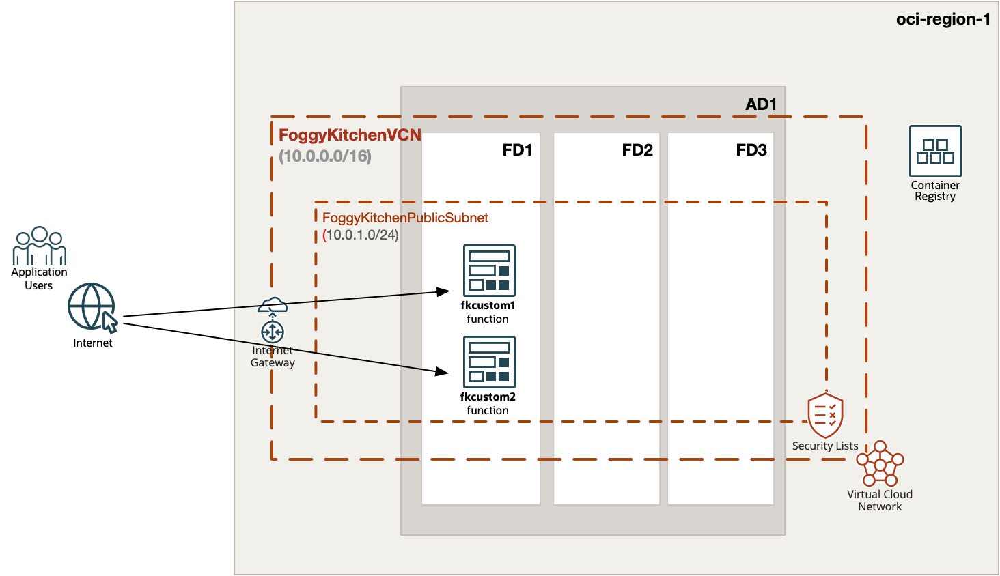

# Lesson 3: Two Functions Under One Application

This lesson extends [lesson2](../lesson2_custom_function/) by deploying two custom functions, `fncustom1` and `fncustom2`, under a single shared OCI Functions application. It keeps explicit VCN and subnet composition through `terraform-oci-fk-vcn`, while the second function reuses the application created by the first function module.



## What This Lesson Shows

- Two custom OCI Functions deployed under one shared Functions application
- The local `terraform-oci-fk-function` module consumed twice through `../..`
- Explicit VCN and subnet composition through `terraform-oci-fk-vcn`
- Shared application reuse through `my_fn_app_ocid`
- Different `FN_CUSTOM_MESSAGE` values per function
- Automatic invocation enabled for both functions

This lesson is the first point in the training track where one function module instance becomes the producer of the shared application context and another function module instance becomes a consumer of that application.

## Architecture Notes

This lesson uses:

- the local function module via `../..` for `fncustom1`
- the local function module via `../..` for `fncustom2`
- `terraform-oci-fk-vcn` for the VCN, subnet, and Internet Gateway path
- local file datasources for the two custom function source trees
- one shared Functions application created by the first module instance
- one shared subnet injected into both module instances

The networking composition lives in [networking.tf](/Users/mlinxfeld/codes/github/terraform-oci-fk-function/training/lesson3_two_functions_under_one_app/networking.tf), the shared function deployment logic lives in [functions_UPDATED.tf](/Users/mlinxfeld/codes/github/terraform-oci-fk-function/training/lesson3_two_functions_under_one_app/functions_UPDATED.tf), the injected source file datasources live in [local_files_UPDATED.tf](/Users/mlinxfeld/codes/github/terraform-oci-fk-function/training/lesson3_two_functions_under_one_app/local_files_UPDATED.tf), and OCI provider authentication is configured in [provider.tf](/Users/mlinxfeld/codes/github/terraform-oci-fk-function/training/lesson3_two_functions_under_one_app/provider.tf).

## Deploy Using Terraform CLI

### Clone The Repository

```bash
git clone https://github.com/mlinxfeld/terraform-oci-fk-function.git
cd terraform-oci-fk-function/training/lesson3_two_functions_under_one_app
```

### Create `terraform.tfvars`

Start from the example file:

```bash
cp terraform.tfvars.example terraform.tfvars
```

Minimum required values:

```hcl
tenancy_ocid       = "ocid1.tenancy.oc1..<your_tenancy_ocid>"
user_ocid          = "ocid1.user.oc1..<your_user_ocid>"
compartment_ocid   = "ocid1.compartment.oc1..<your_compartment_ocid>"
region             = "<oci_region>"
fingerprint        = "<fingerprint>"
private_key_path   = "<private_key_path>"
ocir_user_name     = "<user_name>"
ocir_user_password = "<user_auth_token>"
```

### Initialize Terraform

```bash
terraform init
```

Expected module sources:

- local `../..` for both function module instances
- `terraform-oci-fk-vcn` for networking

### Apply

```bash
terraform apply
```

With the current defaults, this lesson creates:

- one shared OCI Functions application
- two OCI Functions
- two OCI Container Registry repositories
- one OCI Logging log group and log for the first function application path
- one VCN
- one subnet
- one route table
- one internet gateway
- two optional function invocation steps

## Key Configuration

Current lesson settings:

- `use_my_fn = true` in both module instances
- `use_my_fn_network = true` in both module instances
- `my_fn_subnet_ocid = module.fk_vcn.subnet_ids["functions_public"]` in both module instances
- `use_my_fn_app = false` for `fncustom1`
- `use_my_fn_app = true` for `fncustom2`
- `my_fn_app_ocid = module.oci-fk-custom-function-1.oci_app_fn.fn_app_ocid` for `fncustom2`
- `fn_config = { FN_CUSTOM_MESSAGE = ... }` with a different message for each function

The important behavioral point is that lesson3 keeps the 2026 explicit networking model from [lesson1](../lesson1_hello_world_function/) and [lesson2](../lesson2_custom_function/), while introducing the first shared-application composition pattern.

## Outputs

This lesson exposes the outputs from both root module instances, including:

- shared Functions application OCID
- both function OCIDs
- shared subnet OCID associated with the application

## Destroy

To remove all resources created by this lesson:

```bash
terraform destroy
```

## Contributing

This project is open source. Contributions are welcome through pull requests.

## License

Licensed under the **Universal Permissive License (UPL), Version 1.0**.
See [LICENSE](../../LICENSE) for details.

---

© 2026 [FoggyKitchen.com](https://foggykitchen.com) - Cloud. Code. Clarity.
