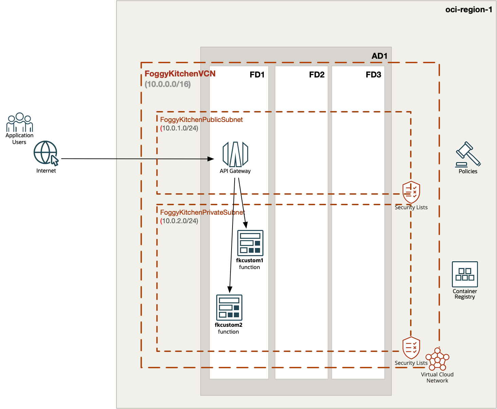
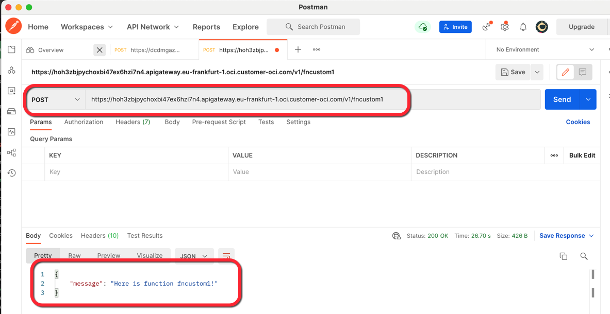
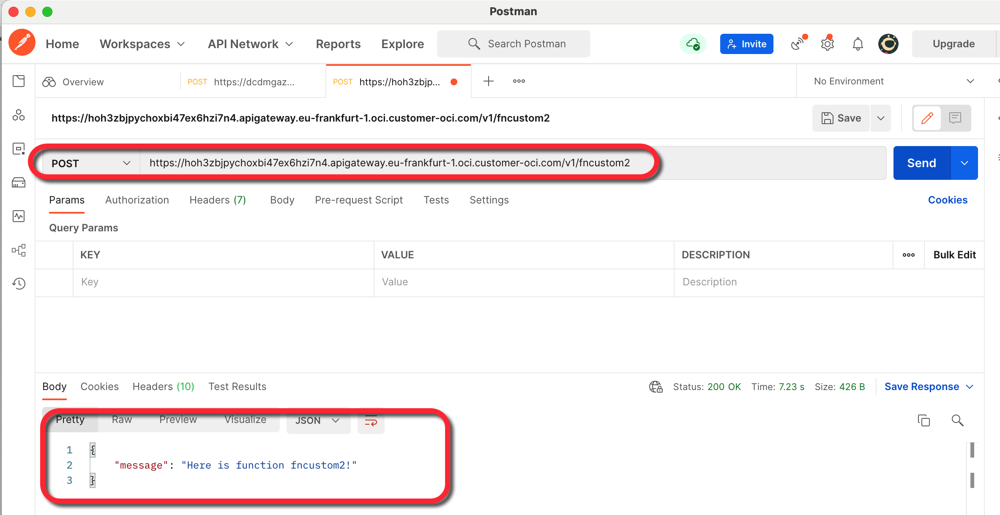
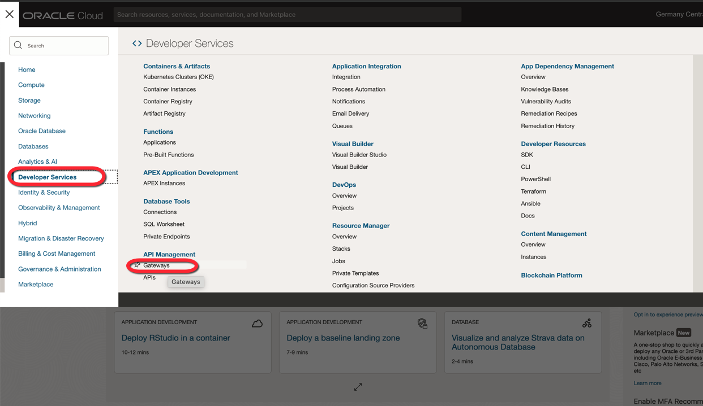
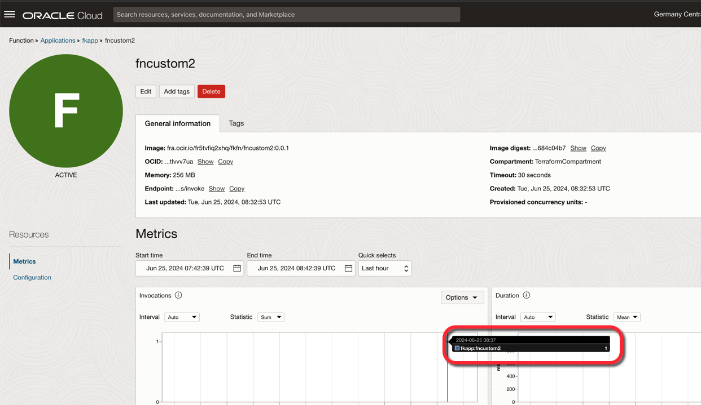

# FoggyKitchen OCI Function with Terraform 

## LESSON 4 - Two Functions and API Gateway

In this fourth lesson, we will create two functions, `fncustom1` and `fncustom2`, both residing in a private subnet. These functions will be exposed to the public Internet through an API Gateway endpoint. The API Gateway service plays a critical role in securing and unifying access to functions within a microservices architecture, providing a robust layer of security and management.

To facilitate this setup, we will implement an IAM policy that grants the necessary permissions for the API Gateway to access and invoke the functions. This ensures that only authorized requests can reach the functions, enhancing the overall security posture of our deployment. By the end of this lesson, you will have a secure, efficient means of exposing private functions to the public Internet using the API Gateway.



## Deploy Using Oracle Resource Manager

1. Click [](https://cloud.oracle.com/resourcemanager/stacks/create?region=home&zipUrl=https://github.com/mlinxfeld/terraform-oci-fk-function/releases/latest/download/terraform-oci-fk-function-lesson4.zip)

    If you aren't already signed in, when prompted, enter the tenancy and user credentials.

2. Review and accept the terms and conditions.

3. Select the region where you want to deploy the stack.

4. Follow the on-screen prompts and instructions to create the stack.

5. After creating the stack, click **Terraform Actions**, and select **Plan**.

6. Wait for the job to be completed, and review the plan.

    To make any changes, return to the Stack Details page, click **Edit Stack**, and make the required changes. Then, run the **Plan** action again.

7. If no further changes are necessary, return to the Stack Details page, click **Terraform Actions**, and select **Apply**. 

## Deploy Using the Terraform CLI in Cloud Shell

### Clone of the repo into OCI Cloud Shell

Now, you'll want a local copy of this repo. You can make that with the commands:
Clone the repo from github by executing the command as follows and then go to proper subdirectory:

```
martin_lin@codeeditor:~ (eu-frankfurt-1)$ git clone https://github.com/mlinxfeld/terraform-oci-fk-function.git

martin_lin@codeeditor:~ (eu-frankfurt-1)$ cd terraform-oci-fk-function

martin_lin@codeeditor:terraform-oci-fk-adb (eu-frankfurt-1)$ cd training/lesson4_two_functions_api_gateway/
```

### Prerequisites
Create environment file with terraform.tfvars file starting with example file:

```
martin_lin@codeeditor:lesson4_two_functions_api_gateway (eu-frankfurt-1)$ cp terraform.tfvars.example terraform.tfvars

martin_lin@codeeditor:lesson4_two_functions_api_gateway (eu-frankfurt-1)$ vi terraform.tfvars

tenancy_ocid       = "ocid1.tenancy.oc1..<your_tenancy_ocid>"
compartment_ocid   = "ocid1.compartment.oc1..<your_comparment_ocid>"
region             = "<oci_region>"
ocir_user_name     = "<user_name>"
ocir_user_password = "<user_auth_token>"
```

### Initialize Terraform

Run the following command to initialize Terraform environment:

```
martin_lin@codeeditor:lesson4_two_functions_api_gateway (eu-frankfurt-1)$ terraform init 

Initializing the backend...
Upgrading modules...
Downloading git::https://github.com/mlinxfeld/terraform-oci-fk-function.git for oci-fk-custom-function-1...
- oci-fk-custom-function-1 in .terraform/modules/oci-fk-custom-function-1
Downloading git::https://github.com/mlinxfeld/terraform-oci-fk-function.git for oci-fk-custom-function-2...
- oci-fk-custom-function-2 in .terraform/modules/oci-fk-custom-function-2

Initializing provider plugins...
- Finding latest version of hashicorp/local...
- Finding latest version of hashicorp/null...
- Finding latest version of hashicorp/oci...
- Using previously-installed hashicorp/local v2.5.1
- Using previously-installed hashicorp/null v3.2.2
- Installing hashicorp/oci v5.46.0...
- Installed hashicorp/oci v5.46.0 (unauthenticated)

Terraform has made some changes to the provider dependency selections recorded
in the .terraform.lock.hcl file. Review those changes and commit them to your
version control system if they represent changes you intended to make.

Terraform has been successfully initialized!

You may now begin working with Terraform. Try running "terraform plan" to see
any changes that are required for your infrastructure. All Terraform commands
should now work.

If you ever set or change modules or backend configuration for Terraform,
rerun this command to reinitialize your working directory. If you forget, other
commands will detect it and remind you to do so if necessary.
```

### Apply the changes 

Run the following command for applying changes with the proposed plan:

```
martin_lin@codeeditor:lesson4_two_functions_api_gateway (eu-frankfurt-1)$ terraform apply 

data.local_file.fncustom1_func_yaml: Reading...
data.local_file.fncustom2_func_py: Reading...
data.local_file.fncustom1_func_py: Reading...
data.local_file.fncustom2_requirements_txt: Reading...
data.local_file.fncustom1_dockerfile: Reading...
data.local_file.fncustom2_func_yaml: Reading...
data.local_file.fncustom1_requirements_txt: Reading...
data.local_file.fncustom2_dockerfile: Reading...
data.local_file.fncustom1_requirements_txt: Read complete after 0s [id=91bd32a35ac20833294303bda57f32b4c1692a09]
data.local_file.fncustom1_dockerfile: Read complete after 0s [id=aa3833301ffe31669490f8269952e79a0989b142]

(...)

# module.oci-fk-custom-function-2.oci_functions_function.FoggyKitchenFn will be created
  + resource "oci_functions_function" "FoggyKitchenFn" {
      + application_id     = (known after apply)
      + compartment_id     = (known after apply)
      + config             = {
          + "FN_CUSTOM_MESSAGE" = "Here is function fncustom2!"
        }
      + defined_tags       = (known after apply)
      + display_name       = "fncustom2"
      + freeform_tags      = (known after apply)
      + id                 = (known after apply)
      + image              = "fra.ocir.io/fr5tvfiq2xhq/fkfn/fncustom2:0.0.1"
      + image_digest       = (known after apply)
      + invoke_endpoint    = (known after apply)
      + memory_in_mbs      = "256"
      + shape              = (known after apply)
      + state              = (known after apply)
      + time_created       = (known after apply)
      + time_updated       = (known after apply)
      + timeout_in_seconds = 30
    }

Plan: 29 to add, 0 to change, 0 to destroy.

Changes to Outputs:
  + api_gateway_endpoints = {
      + fn_custom1_endpoint = (known after apply)
      + fn_custom2_endpoint = (known after apply)
    }

Do you want to perform these actions?
  Terraform will perform the actions described above.
  Only 'yes' will be accepted to approve.

  Enter a value: yes

(...)

module.oci-fk-custom-function-1.null_resource.FoggyKitchenMyFnSetup[0]: Still creating... [4m20s elapsed]
module.oci-fk-custom-function-1.null_resource.FoggyKitchenMyFnSetup[0] (local-exec): e829239188f8: Pushed
module.oci-fk-custom-function-2.null_resource.FoggyKitchenMyFnSetup[0]: Still creating... [4m30s elapsed]
module.oci-fk-custom-function-1.null_resource.FoggyKitchenMyFnSetup[0]: Still creating... [4m30s elapsed]
module.oci-fk-custom-function-2.null_resource.FoggyKitchenMyFnSetup[0] (local-exec): 9dcd1c686051: Pushed
module.oci-fk-custom-function-2.null_resource.FoggyKitchenMyFnSetup[0] (local-exec): 0.0.1: digest: sha256:1da98beaf5391aae53b2d8fcedf7258dca4666c70a7ce93d67eaf53e684c04b7 size: 2415
module.oci-fk-custom-function-2.null_resource.FoggyKitchenMyFnSetup[0]: Creation complete after 4m36s [id=4503275578663701259]
module.oci-fk-custom-function-1.null_resource.FoggyKitchenMyFnSetup[0] (local-exec): 4671ae97c05c: Pushed
module.oci-fk-custom-function-1.null_resource.FoggyKitchenMyFnSetup[0] (local-exec): 0.0.1: digest: sha256:5e3e2bc2969d23e3ad8d66a58670b032847ef6c7434ac53aaa3f15fbba90bc69 size: 2415
module.oci-fk-custom-function-1.null_resource.FoggyKitchenMyFnSetup[0]: Creation complete after 4m34s [id=4257337413834236142]
module.oci-fk-custom-function-1.oci_functions_function.FoggyKitchenFn: Creating...
module.oci-fk-custom-function-1.oci_functions_function.FoggyKitchenFn: Creation complete after 1s [id=ocid1.fnfunc.oc1.eu-frankfurt-1.aaaaaaaa5iqopwjkwovzhhqemia7gvhufhorlnlxj6xhnzdsxc66ft43omra]
module.oci-fk-custom-function-2.oci_functions_function.FoggyKitchenFn: Creating...
module.oci-fk-custom-function-2.oci_functions_function.FoggyKitchenFn: Creation complete after 0s [id=ocid1.fnfunc.oc1.eu-frankfurt-1.aaaaaaaar2tejgg542zz46pit22jmhb3uokxs2rmp6ggr5beghnktlvvv7ua]
oci_apigateway_deployment.FoggyKitchenAPIGatewayDeployment: Creating...
oci_apigateway_deployment.FoggyKitchenAPIGatewayDeployment: Still creating... [10s elapsed]
oci_apigateway_deployment.FoggyKitchenAPIGatewayDeployment: Still creating... [20s elapsed]
oci_apigateway_deployment.FoggyKitchenAPIGatewayDeployment: Creation complete after 28s [id=ocid1.apideployment.oc1.eu-frankfurt-1.amaaaaaadngk4gia3xz6qtws3o55jaapq4362cfdkl733oqxzbrl63pgnh2a]

Apply complete! Resources: 29 added, 0 changed, 0 destroyed.

Outputs:

api_gateway_endpoints = {
  "fn_custom1_endpoint" = "https://hoh3zbjpychoxbi47ex6hzi7n4.apigateway.eu-frankfurt-1.oci.customer-oci.com/v1/fncustom1"
  "fn_custom2_endpoint" = "https://hoh3zbjpychoxbi47ex6hzi7n4.apigateway.eu-frankfurt-1.oci.customer-oci.com/v1/fncustom2"
}
```

### Validate the deployment

1. Use Postman to test the accessibility of the `fncustom1` function through the API Gateway endpoint:



2. Use Postman to test the accessibility of the `fncustom2` function through the API Gateway endpoint:



3. From the hamburger menu in the top left corner, navigate to **Developer Services** and then select **Gateways**:



4. Confirm that the API Gateway has been invoked:


5. Confirm that `fkcustom1` has been invoked by checking the metrics section:


6. Confirm that `fkcustom2` has been invoked by checking the metrics section:



### Destroy the changes 

Run the following command for destroying all resources:

```
martin_lin@codeeditor:lesson4_two_functions_api_gateway (eu-frankfurt-1)$ terraform destroy 
data.local_file.fncustom1_func_yaml: Reading...
data.local_file.fncustom1_requirements_txt: Reading...
data.local_file.fncustom2_func_yaml: Reading...
data.local_file.fncustom1_func_py: Reading...
data.local_file.fncustom2_func_py: Reading...
data.local_file.fncustom2_dockerfile: Reading...
data.local_file.fncustom2_requirements_txt: Reading...
data.local_file.fncustom1_dockerfile: Reading...
data.local_file.fncustom2_func_py: Read complete after 0s [id=871fae224158a4fdc178b10d9f52b88d58c484c1]
data.local_file.fncustom1_func_py: Read complete after 0s [id=871fae224158a4fdc178b10d9f52b88d58c484c1]
data.local_file.fncustom1_requirements_txt: Read complete after 0s [id=91bd32a35ac20833294303bda57f32b4c1692a09]
data.local_file.fncustom1_dockerfile: Read complete after 0s [id=aa3833301ffe31669490f8269952e79a0989b142]
data.local_file.fncustom1_func_yaml: Read complete after 0s [id=360abaa9f473ff6ecdc46f1cceaf66184973b64a]

(...)

      - state              = "ACTIVE" -> null
      - time_created       = "2024-06-25 08:32:53.557 +0000 UTC" -> null
      - time_updated       = "2024-06-25 08:32:53.557 +0000 UTC" -> null
      - timeout_in_seconds = 30 -> null

      - trace_config {
          - is_enabled = false -> null
        }
    }

Plan: 0 to add, 0 to change, 29 to destroy.

Changes to Outputs:
  - api_gateway_endpoints = {
      - fn_custom1_endpoint = "https://hoh3zbjpychoxbi47ex6hzi7n4.apigateway.eu-frankfurt-1.oci.customer-oci.com/v1/fncustom1"
      - fn_custom2_endpoint = "https://hoh3zbjpychoxbi47ex6hzi7n4.apigateway.eu-frankfurt-1.oci.customer-oci.com/v1/fncustom2"
    } -> null

Do you really want to destroy all resources?
  Terraform will destroy all your managed infrastructure, as shown above.
  There is no undo. Only 'yes' will be accepted to confirm.

  Enter a value: yes

module.oci-fk-custom-function-1.oci_logging_log.FoggyKitchenFnAppInvokeLog[0]: Destroying... [id=ocid1.log.oc1.eu-frankfurt-1.amaaaaaadngk4gia5r336trarngi4xqfqgv7gn7fc2t3jtgosy4stauekpnq]
oci_apigateway_deployment.FoggyKitchenAPIGatewayDeployment: Destroying... [id=ocid1.apideployment.oc1.eu-frankfurt-1.amaaaaaadngk4gia3xz6qtws3o55jaapq4362cfdkl733oqxzbrl63pgnh2a]
oci_identity_policy.FoggyKitchenAPIGatewayPolicy: Destroying... [id=ocid1.policy.oc1..aaaaaaaamjmx3b74327toe5gd46osglfg44yjohu3sctsy3cg7qssbhlbnsq]
oci_identity_policy.FoggyKitchenAPIGatewayPolicy: Destruction complete after 0s
module.oci-fk-custom-function-1.oci_logging_log.FoggyKitchenFnAppInvokeLog[0]: Destruction complete after 3s
module.oci-fk-custom-function-1.oci_logging_log_group.FoggyKitchenFnAppLogGroup[0]: Destroying... [id=ocid1.loggroup.oc1.eu-frankfurt-1.amaaaaaadngk4giakooy5ijeuqjuxa5w5tpyhnicpfx74ch33aizvk3m5p7a]
module.oci-fk-custom-function-1.oci_logging_log_group.FoggyKitchenFnAppLogGroup[0]: Destruction complete after 1s

(...)

module.oci-fk-custom-function-1.oci_functions_application.FoggyKitchenFnApp[0]: Still destroying... [id=ocid1.fnapp.oc1.eu-frankfurt-1.aaaaaaaa...zx2enyexn6kjuc5e3kkqeo5tcdlbt5xiugdb6a, 5m0s elapsed]
module.oci-fk-custom-function-1.oci_functions_application.FoggyKitchenFnApp[0]: Destruction complete after 5m0s
oci_core_subnet.FoggyKitchenPrivateSubnet: Destroying... [id=ocid1.subnet.oc1.eu-frankfurt-1.aaaaaaaa7nqvxemhhajqfwizasdxgvgumnpunz5q3n2hcr2eq7hw5ifybcqa]
oci_core_subnet.FoggyKitchenPrivateSubnet: Destruction complete after 1s
oci_core_dhcp_options.FoggyKitchenDhcpOptions1: Destroying... [id=ocid1.dhcpoptions.oc1.eu-frankfurt-1.aaaaaaaambkr6hyytwhygpyts4qykbuoastjvdn67y5tt3ho2v3h7xxusj3q]
oci_core_route_table.FoggyKitchenRouteTableViaNAT: Destroying... [id=ocid1.routetable.oc1.eu-frankfurt-1.aaaaaaaa2froe352ck3p5frr5if6ax2ry6kn3aqppqeearawccht6kmnnjwq]
oci_core_security_list.FoggyKitchenSecurityList: Destroying... [id=ocid1.securitylist.oc1.eu-frankfurt-1.aaaaaaaaxknqw7mk75qvumpd6k2wrdmsrccg35inb6ehwazkqlug5xgzy6ha]
oci_core_dhcp_options.FoggyKitchenDhcpOptions1: Destruction complete after 0s
oci_core_security_list.FoggyKitchenSecurityList: Destruction complete after 0s
oci_core_route_table.FoggyKitchenRouteTableViaNAT: Destruction complete after 1s
oci_core_nat_gateway.FoggyKitchenNATGateway: Destroying... [id=ocid1.natgateway.oc1.eu-frankfurt-1.aaaaaaaaqsmt4vbi5oivamfpkoezwafgtoowtc7snbga4iracig6qosktxsq]
oci_core_nat_gateway.FoggyKitchenNATGateway: Destruction complete after 0s
oci_core_virtual_network.FoggyKitchenVCN: Destroying... [id=ocid1.vcn.oc1.eu-frankfurt-1.amaaaaaadngk4giagkp4rr4lyjoauarpsbdjzsaib26vv6iwaj4ygsorhrdq]
oci_core_virtual_network.FoggyKitchenVCN: Destruction complete after 1s

Destroy complete! Resources: 29 destroyed.

```