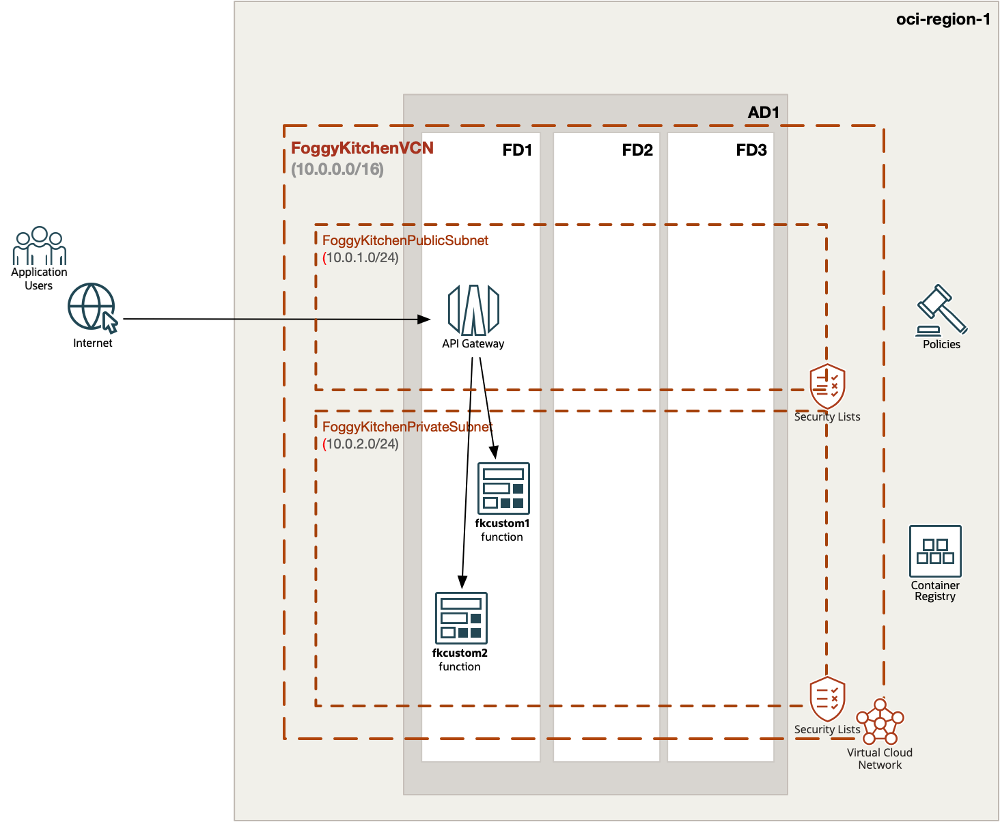
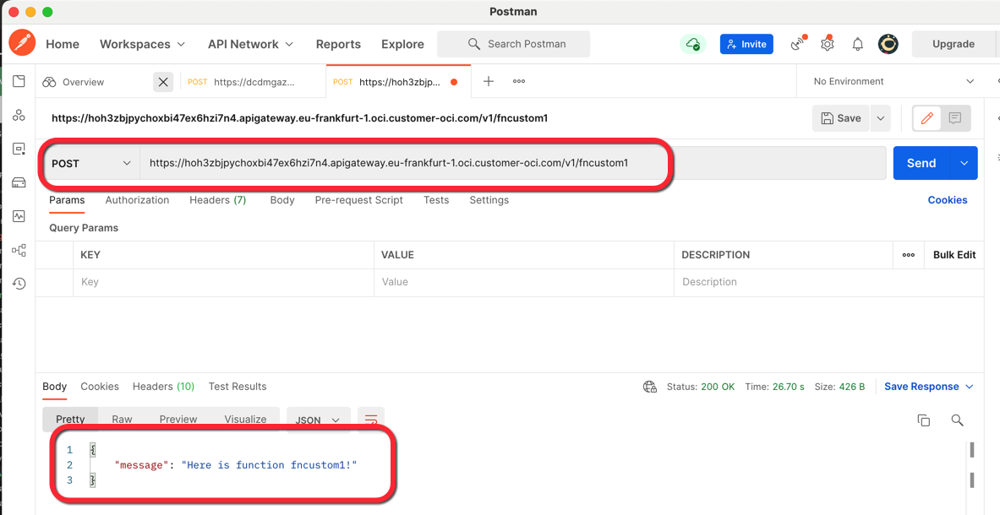
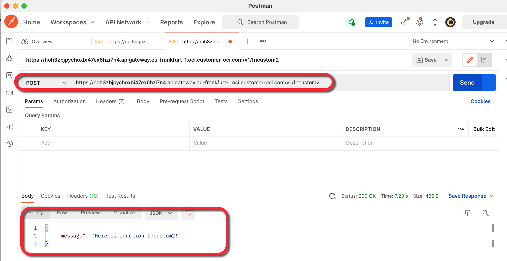
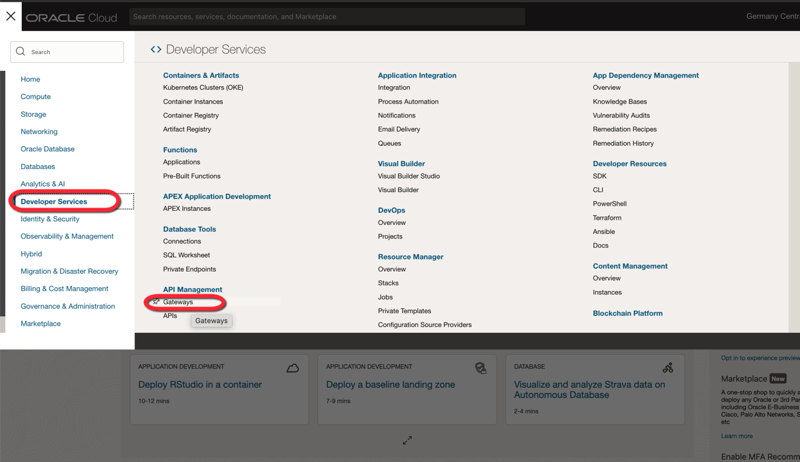
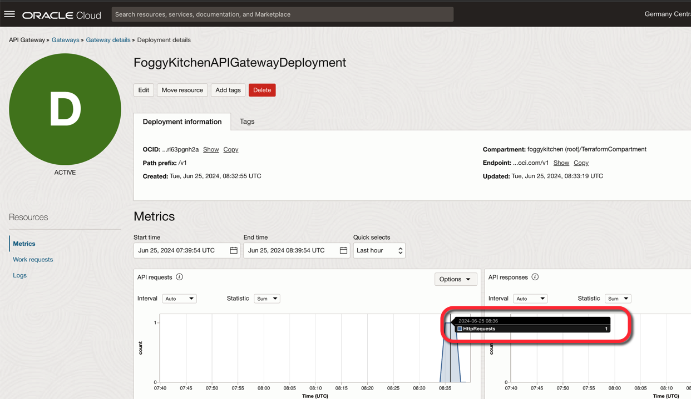
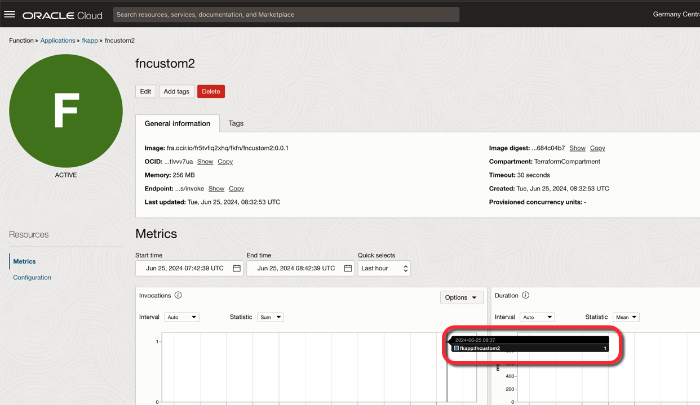

# Lesson 4: Two Functions Behind API Gateway

This lesson shows how to publish **two OCI Functions** through a shared **OCI API Gateway** endpoint.

The Functions Application stays in a **private subnet**. A separate **public subnet** is used for API Gateway, which becomes the controlled public entry point for both functions.

The lesson also introduces an explicit multi-module serverless composition:

- `terraform-oci-fk-vcn` for networking
- `terraform-oci-fk-policy` for IAM
- `terraform-oci-fk-api-gateway` for API publishing



---

## What This Lesson Shows

- Two custom OCI Functions under one shared Functions Application
- Private subnet placement for the Functions Application
- Public subnet placement for OCI API Gateway
- API Gateway routing to multiple Functions backends
- Explicit IAM policy allowing API Gateway to invoke Functions
- Reusable building block composition instead of self-contained hidden infrastructure

---

## Architecture Notes

- `terraform-oci-fk-vcn` creates the VCN, public API Gateway subnet, and private Functions subnet
- `terraform-oci-fk-function` creates both functions and the shared Functions Application
- `terraform-oci-fk-policy` creates the tenancy policy that authorizes API Gateway to invoke Functions
- `terraform-oci-fk-api-gateway` creates the gateway, deployment, and routes

This is the first lesson where the serverless flow becomes explicitly multi-module rather than relying on raw OCI resources embedded directly in the lesson.

---

## Deploy Using Terraform CLI

### Clone The Repository

```bash
git clone https://github.com/mlinxfeld/terraform-oci-fk-function.git
cd terraform-oci-fk-function/training/lesson4_two_functions_api_gateway
```

### Prepare Variables

```bash
cp terraform.tfvars.example terraform.tfvars
```

Populate at least:

```hcl
tenancy_ocid       = "ocid1.tenancy.oc1..<your_tenancy_ocid>"
compartment_ocid   = "ocid1.compartment.oc1..<your_compartment_ocid>"
user_ocid          = "ocid1.user.oc1..<your_user_ocid>"
fingerprint        = "<your_api_key_fingerprint>"
private_key_path   = "~/.oci/oci_api_key.pem"
region             = "eu-frankfurt-1"
ocir_user_name     = "<user_name>"
ocir_user_password = "<user_auth_token>"
```

### Initialize

```bash
tofu init
```

### Review The Plan

```bash
tofu plan
```

### Apply

```bash
tofu apply
```

After apply, the lesson outputs:

- `fn_custom1_endpoint`
- `fn_custom2_endpoint`

### Terminal Smoke Test

```bash
eval "$(tofu output -json | jq -r '
  .api_gateway_endpoints.value
  | "export FNCUSTOM1_URL=\(.fn_custom1_endpoint)\nexport FNCUSTOM2_URL=\(.fn_custom2_endpoint)"
')"

curl -s -X POST "$FNCUSTOM1_URL" | jq .
curl -s -X POST "$FNCUSTOM2_URL" | jq .
```

---

## Validate The Deployment

1. Use Postman or `curl` to test `fncustom1` through the API Gateway endpoint.
2. Use Postman or `curl` to test `fncustom2` through the API Gateway endpoint.
3. In the OCI Console, open **Developer Services** -> **Gateways** and inspect the deployed gateway.
4. Confirm API Gateway invocation metrics.
5. Confirm both functions show invocation activity.

The screenshots below illustrate the expected result:








---

## Destroy

```bash
tofu destroy
```

---

## Related Resources

- [Training index](../README.md)
- [Lesson 3: Two Functions Under One App](../lesson3_two_functions_under_one_app/README.md)
- [FoggyKitchen OCI VCN Module](https://github.com/foggykitchen/terraform-oci-fk-vcn)
- [FoggyKitchen OCI Policy Module](https://github.com/foggykitchen/terraform-oci-fk-policy)
- [FoggyKitchen OCI API Gateway Module](https://github.com/foggykitchen/terraform-oci-fk-api-gateway)

---

## License

Licensed under the **Universal Permissive License (UPL), Version 1.0**.
See [LICENSE](../../LICENSE) for details.

---

© 2026 [FoggyKitchen.com](https://foggykitchen.com) - Cloud. Code. Clarity.
