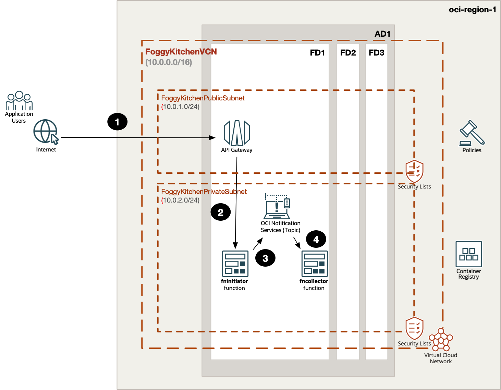
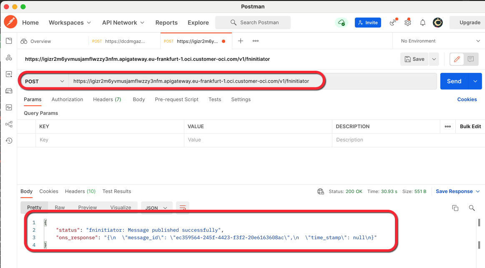
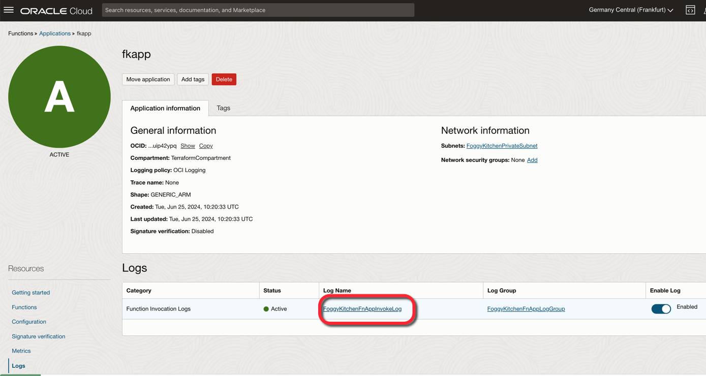
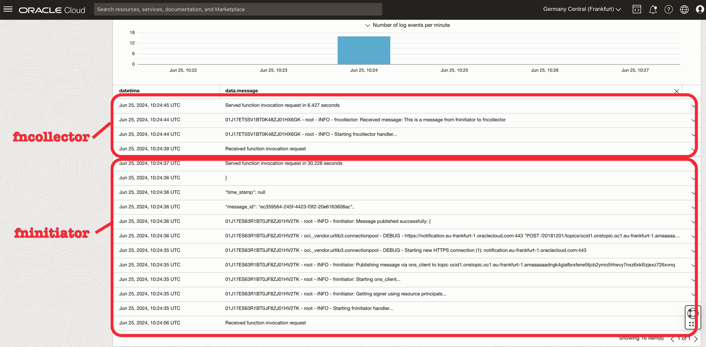
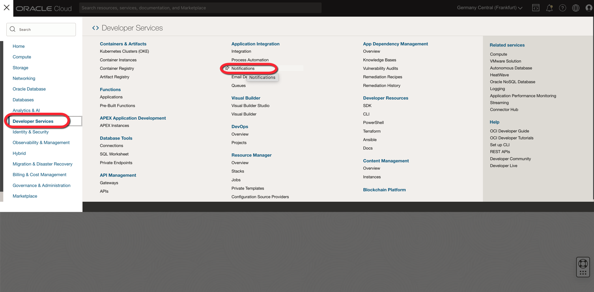
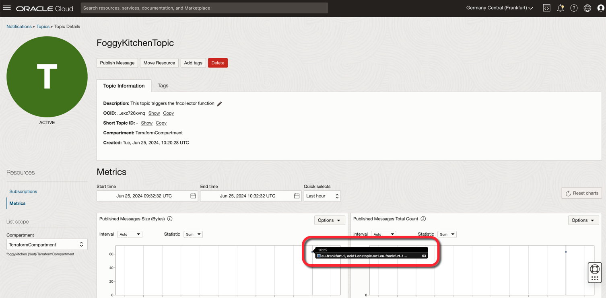

# FoggyKitchen OCI Function with Terraform 

## LESSON 5 - Two Functions, API Gateway and ONS

In this fifth lesson, we will delve into creating an advanced event-driven architecture with two functions, `fninititor` and `fncollector`, both residing in a private subnet. This architecture demonstrates how to efficiently manage asynchronous processes and enhance scalability.

The first function, `fninititor`, will be exposed to the public Internet via an API Gateway. This means you will invoke `fninititor` using an endpoint provided by the API Gateway, ensuring secure and controlled access. Each invocation of `fninititor` will send a message to the OCI Notification Service (ONS), leveraging the capabilities of ONS to handle notifications efficiently.

The second function, `fncollector`, will be subscribed to a topic within ONS. This setup ensures that whenever `fninititor` posts a message to ONS, it automatically triggers the execution of `fncollector`. This decoupling of functions allows `fninititor` to handle requests quickly and offload processing tasks to `fncollector`, which will process the message asynchronously.

We will utilize OCI logging to track and visualize this workflow, providing clear insights into the sequence of events and the interaction between the functions. This event-driven architecture offers several key benefits:
1. **Decoupling**: Functions operate independently, making the system more modular and easier to manage.
2. **Scalability**: The asynchronous processing allows the system to handle a high volume of requests without performance degradation.
3. **Efficiency**: `fninititor` can quickly respond to incoming requests, while `fncollector` handles processing in the background, improving overall responsiveness.

This architecture lays a strong foundation for more complex workflows and integrations, which will be explored in further lessons. By the end of this lesson, you will have a robust understanding of building scalable, event-driven systems using OCI services.



## Deploy Using Oracle Resource Manager

1. Click [](https://cloud.oracle.com/resourcemanager/stacks/create?region=home&zipUrl=https://github.com/mlinxfeld/terraform-oci-fk-function/releases/latest/download/terraform-oci-fk-function-lesson5.zip)

    If you aren't already signed in, when prompted, enter the tenancy and user credentials.

2. Review and accept the terms and conditions.

3. Select the region where you want to deploy the stack.

4. Follow the on-screen prompts and instructions to create the stack.

5. After creating the stack, click **Terraform Actions**, and select **Plan**.

6. Wait for the job to be completed, and review the plan.

    To make any changes, return to the Stack Details page, click **Edit Stack**, and make the required changes. Then, run the **Plan** action again.

7. If no further changes are necessary, return to the Stack Details page, click **Terraform Actions**, and select **Apply**. 

## Deploy Using the Terraform CLI in Cloud Shell

### Clone of the repo into OCI Cloud Shell

Now, you'll want a local copy of this repo. You can make that with the commands:
Clone the repo from github by executing the command as follows and then go to proper subdirectory:

```
martin_lin@codeeditor:~ (eu-frankfurt-1)$ git clone https://github.com/mlinxfeld/terraform-oci-fk-function.git

martin_lin@codeeditor:~ (eu-frankfurt-1)$ cd terraform-oci-fk-function

martin_lin@codeeditor:terraform-oci-fk-adb (eu-frankfurt-1)$ cd training/lesson5_two_functions_api_gateway_ons/
```

### Prerequisites
Create environment file with terraform.tfvars file starting with example file:

```
martin_lin@codeeditor:lesson5_two_functions_api_gateway_ons (eu-frankfurt-1)$ cp terraform.tfvars.example terraform.tfvars

martin_lin@codeeditor:lesson5_two_functions_api_gateway_ons (eu-frankfurt-1)$ vi terraform.tfvars

tenancy_ocid       = "ocid1.tenancy.oc1..<your_tenancy_ocid>"
compartment_ocid   = "ocid1.compartment.oc1..<your_comparment_ocid>"
region             = "<oci_region>"
ocir_user_name     = "<user_name>"
ocir_user_password = "<user_auth_token>"
```

### Initialize Terraform

Run the following command to initialize Terraform environment:

```
martin_lin@codeeditor:lesson5_two_functions_api_gateway_ons (eu-frankfurt-1)$ terraform init 

Initializing the backend...
Upgrading modules...
Downloading git::https://github.com/mlinxfeld/terraform-oci-fk-function.git for oci-fk-collector-function...
- oci-fk-collector-function in .terraform/modules/oci-fk-collector-function
Downloading git::https://github.com/mlinxfeld/terraform-oci-fk-function.git for oci-fk-initiator-function...
- oci-fk-initiator-function in .terraform/modules/oci-fk-initiator-function

Initializing provider plugins...
- Finding latest version of hashicorp/local...
- Finding latest version of hashicorp/null...
- Finding latest version of hashicorp/oci...
- Using previously-installed hashicorp/local v2.5.1
- Using previously-installed hashicorp/null v3.2.2
- Installing hashicorp/oci v5.46.0...
- Installed hashicorp/oci v5.46.0 (unauthenticated)

Terraform has made some changes to the provider dependency selections recorded
in the .terraform.lock.hcl file. Review those changes and commit them to your
version control system if they represent changes you intended to make.

Terraform has been successfully initialized!

You may now begin working with Terraform. Try running "terraform plan" to see
any changes that are required for your infrastructure. All Terraform commands
should now work.

If you ever set or change modules or backend configuration for Terraform,
rerun this command to reinitialize your working directory. If you forget, other
commands will detect it and remind you to do so if necessary.
```

### Apply the changes 

Run the following command for applying changes with the proposed plan:

```
martin_lin@codeeditor:lesson5_two_functions_api_gateway_ons (eu-frankfurt-1)$ terraform apply 

data.local_file.fninitiator_dockerfile: Reading...
data.local_file.fncollector_dockerfile: Reading...
data.local_file.fncollector_requirements_txt: Reading...
data.local_file.fncollector_func_py: Reading...
data.local_file.fninitiator_func_yaml: Reading...
data.local_file.fninitiator_func_py: Reading...
data.local_file.fncollector_func_yaml: Reading...
data.local_file.fninitiator_requirements_txt: Reading...
data.local_file.fncollector_func_yaml: Read complete after 0s [id=99f92ef5b29cc6c37f4c6107485d9695b44eb518]
data.local_file.fncollector_dockerfile: Read complete after 0s [id=aa3833301ffe31669490f8269952e79a0989b142]
data.local_file.fninitiator_requirements_txt: Read complete after 0s [id=91bd32a35ac20833294303bda57f32b4c1692a09]

(...)

# module.oci-fk-initiator-function.oci_logging_log_group.FoggyKitchenFnAppLogGroup[0] will be created
  + resource "oci_logging_log_group" "FoggyKitchenFnAppLogGroup" {
      + compartment_id     = "ocid1.compartment.oc1..aaaaaaaaiyy4srmrb32v5rlniicwmpxsytywiucgbcp5ext6e4ahjfuloewa"
      + defined_tags       = (known after apply)
      + description        = "Foggy Kitchen Fn App Log Group"
      + display_name       = "FoggyKitchenFnAppLogGroup"
      + freeform_tags      = (known after apply)
      + id                 = (known after apply)
      + state              = (known after apply)
      + time_created       = (known after apply)
      + time_last_modified = (known after apply)
    }

Plan: 33 to add, 0 to change, 0 to destroy.

Changes to Outputs:
  + api_gateway_endpoints = {
      + fninitiator_endpoint = (known after apply)
    }

Do you want to perform these actions?
  Terraform will perform the actions described above.
  Only 'yes' will be accepted to approve.

  Enter a value: yes

(...)

module.oci-fk-collector-function.oci_functions_function.FoggyKitchenFn: Creation complete after 1s [id=ocid1.fnfunc.oc1.eu-frankfurt-1.aaaaaaaacf3z5xckujvhmhoxdztb737djtv4psxrzdaaprsgxxkyqw3ayhfa]
oci_ons_subscription.FoggyKitchenSubscription: Creating...
oci_ons_subscription.FoggyKitchenSubscription: Creation complete after 0s [id=ocid1.onssubscription.oc1.eu-frankfurt-1.aaaaaaaagfhkjvonpy4n4tdiwin6rle6kll3eytnoucmy4jv2hq4yf66jatq]
oci_apigateway_deployment.FoggyKitchenAPIGatewayDeployment: Still creating... [10s elapsed]
oci_apigateway_deployment.FoggyKitchenAPIGatewayDeployment: Still creating... [20s elapsed]
oci_apigateway_deployment.FoggyKitchenAPIGatewayDeployment: Still creating... [30s elapsed]
oci_apigateway_deployment.FoggyKitchenAPIGatewayDeployment: Creation complete after 36s [id=ocid1.apideployment.oc1.eu-frankfurt-1.amaaaaaadngk4giaqyi6tad6alum623i6uxh3jisscevyduwnelrylyj3dka]

Apply complete! Resources: 33 added, 0 changed, 0 destroyed.

Outputs:

api_gateway_endpoints = {
  "fninitiator_endpoint" = "https://igizr2m6yvmusjamflwzzy3nfm.apigateway.eu-frankfurt-1.oci.customer-oci.com/v1/fninitiator"
}

```

### Validate the deployment

1. Use Postman to execute a POST request to the `fninitiator` function through the API Gateway endpoint:



2. Locate the OCI Logging Service logs for the application and functions:



3. In the logs, locate the entries for the invocation of the `fninitiator` function, followed by the entries for the `fncollector` function:



4. From the hamburger menu in the top left corner, navigate to **Developer Services** and then select **Notifications**:



5. Confirm that a message has been sent for the ONS Topic:



### Destroy the changes 

Run the following command for destroying all resources:

```
martin_lin@codeeditor:lesson5_two_functions_api_gateway_ons (eu-frankfurt-1)$ terraform destroy 
data.local_file.fninitiator_func_py: Reading...
data.local_file.fncollector_requirements_txt: Reading...
data.local_file.fninitiator_dockerfile: Reading...
data.local_file.fninitiator_func_yaml: Reading...
data.local_file.fninitiator_requirements_txt: Reading...
data.local_file.fncollector_func_py: Reading...
data.local_file.fncollector_dockerfile: Reading...
data.local_file.fncollector_func_yaml: Reading...
data.local_file.fninitiator_requirements_txt: Read complete after 0s [id=91bd32a35ac20833294303bda57f32b4c1692a09]
data.local_file.fncollector_func_yaml: Read complete after 0s [id=99f92ef5b29cc6c37f4c6107485d9695b44eb518]
data.local_file.fncollector_requirements_txt: Read complete after 0s [id=91bd32a35ac20833294303bda57f32b4c1692a09]
data.local_file.fninitiator_func_py: Read complete after 0s [id=6dced7fa8b82617897a42c0eab5dfa89817728e3]
data.local_file.fninitiator_dockerfile: Read complete after 0s [id=aa3833301ffe31669490f8269952e79a0989b142]
data.local_file.fninitiator_func_yaml: Read complete after 0s [id=761aa78c00bb99a16a6afbd05af3fd3a79cc3627]
data.local_file.fncollector_dockerfile: Read complete after 0s [id=aa3833301ffe31669490f8269952e79a0989b142]
data.local_file.fncollector_func_py: Read complete after 0s [id=0b3913ed36bb28e5aeaf4392200b953fcb743c6c]

(...)

  # module.oci-fk-initiator-function.oci_logging_log_group.FoggyKitchenFnAppLogGroup[0] will be destroyed
  - resource "oci_logging_log_group" "FoggyKitchenFnAppLogGroup" {
      - compartment_id     = "ocid1.compartment.oc1..aaaaaaaaiyy4srmrb32v5rlniicwmpxsytywiucgbcp5ext6e4ahjfuloewa" -> null
      - defined_tags       = {} -> null
      - description        = "Foggy Kitchen Fn App Log Group" -> null
      - display_name       = "FoggyKitchenFnAppLogGroup" -> null
      - freeform_tags      = {} -> null
      - id                 = "ocid1.loggroup.oc1.eu-frankfurt-1.amaaaaaadngk4giajyqlq67cvjbyn5uk7r3bbvd6ezlt6juyh6bhqaouz54a" -> null
      - state              = "ACTIVE" -> null
      - time_created       = "2024-06-25 10:20:29.324 +0000 UTC" -> null
      - time_last_modified = "2024-06-25 10:20:29.324 +0000 UTC" -> null
    }

Plan: 0 to add, 0 to change, 33 to destroy.

Changes to Outputs:
  - api_gateway_endpoints = {
      - fninitiator_endpoint = "https://igizr2m6yvmusjamflwzzy3nfm.apigateway.eu-frankfurt-1.oci.customer-oci.com/v1/fninitiator"
    } -> null

Do you really want to destroy all resources?
  Terraform will destroy all your managed infrastructure, as shown above.
  There is no undo. Only 'yes' will be accepted to confirm.

  Enter a value: yes

(...)

oci_ons_notification_topic.FoggyKitchenTopic: Still destroying... [id=ocid1.onstopic.oc1.eu-frankfurt-1.amaaa...ne5tjcb2ymo5hhevy7nxz6xkl5zjexz726xvnq, 13m30s elapsed]
oci_ons_notification_topic.FoggyKitchenTopic: Still destroying... [id=ocid1.onstopic.oc1.eu-frankfurt-1.amaaa...ne5tjcb2ymo5hhevy7nxz6xkl5zjexz726xvnq, 13m40s elapsed]
oci_ons_notification_topic.FoggyKitchenTopic: Still destroying... [id=ocid1.onstopic.oc1.eu-frankfurt-1.amaaa...ne5tjcb2ymo5hhevy7nxz6xkl5zjexz726xvnq, 13m50s elapsed]
oci_ons_notification_topic.FoggyKitchenTopic: Still destroying... [id=ocid1.onstopic.oc1.eu-frankfurt-1.amaaa...ne5tjcb2ymo5hhevy7nxz6xkl5zjexz726xvnq, 14m0s elapsed]
oci_ons_notification_topic.FoggyKitchenTopic: Still destroying... [id=ocid1.onstopic.oc1.eu-frankfurt-1.amaaa...ne5tjcb2ymo5hhevy7nxz6xkl5zjexz726xvnq, 14m10s elapsed]
oci_ons_notification_topic.FoggyKitchenTopic: Still destroying... [id=ocid1.onstopic.oc1.eu-frankfurt-1.amaaa...ne5tjcb2ymo5hhevy7nxz6xkl5zjexz726xvnq, 14m20s elapsed]
oci_ons_notification_topic.FoggyKitchenTopic: Still destroying... [id=ocid1.onstopic.oc1.eu-frankfurt-1.amaaa...ne5tjcb2ymo5hhevy7nxz6xkl5zjexz726xvnq, 14m30s elapsed]
oci_ons_notification_topic.FoggyKitchenTopic: Still destroying... [id=ocid1.onstopic.oc1.eu-frankfurt-1.amaaa...ne5tjcb2ymo5hhevy7nxz6xkl5zjexz726xvnq, 14m40s elapsed]
oci_ons_notification_topic.FoggyKitchenTopic: Still destroying... [id=ocid1.onstopic.oc1.eu-frankfurt-1.amaaa...ne5tjcb2ymo5hhevy7nxz6xkl5zjexz726xvnq, 14m50s elapsed]
oci_ons_notification_topic.FoggyKitchenTopic: Still destroying... [id=ocid1.onstopic.oc1.eu-frankfurt-1.amaaa...ne5tjcb2ymo5hhevy7nxz6xkl5zjexz726xvnq, 15m0s elapsed]
oci_ons_notification_topic.FoggyKitchenTopic: Destruction complete after 15m9s

Destroy complete! Resources: 33 destroyed.

```