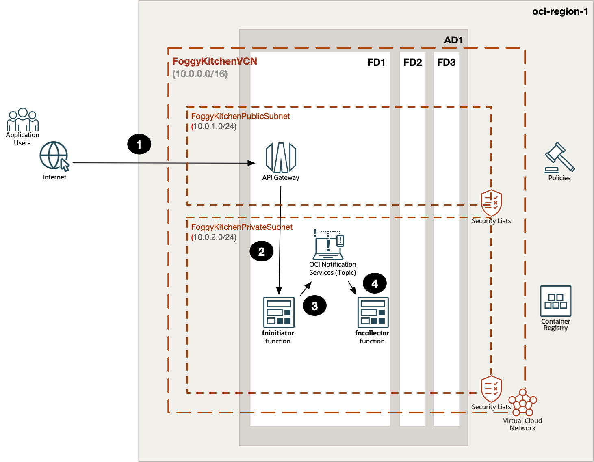
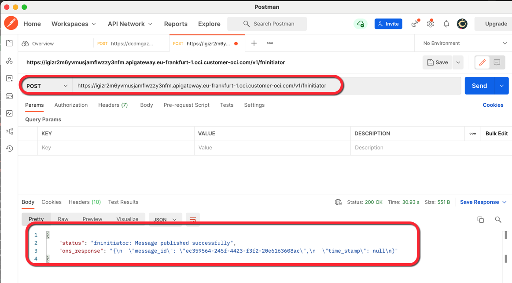
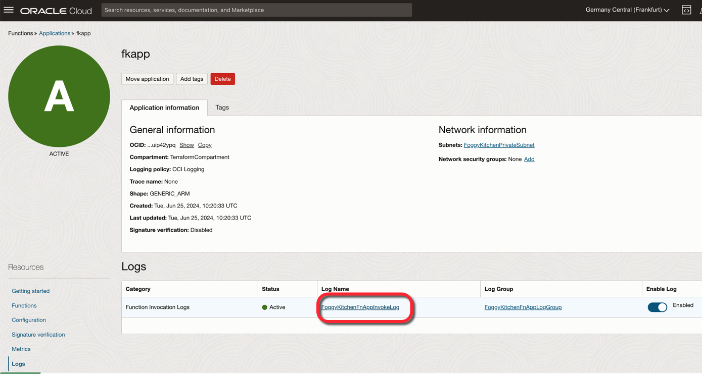
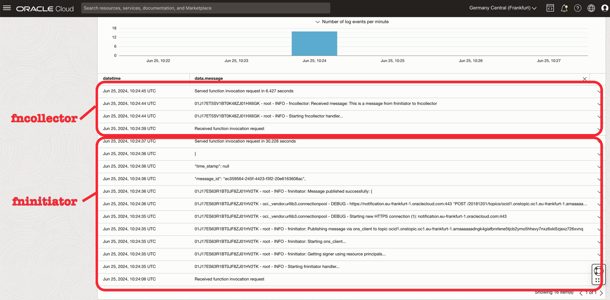
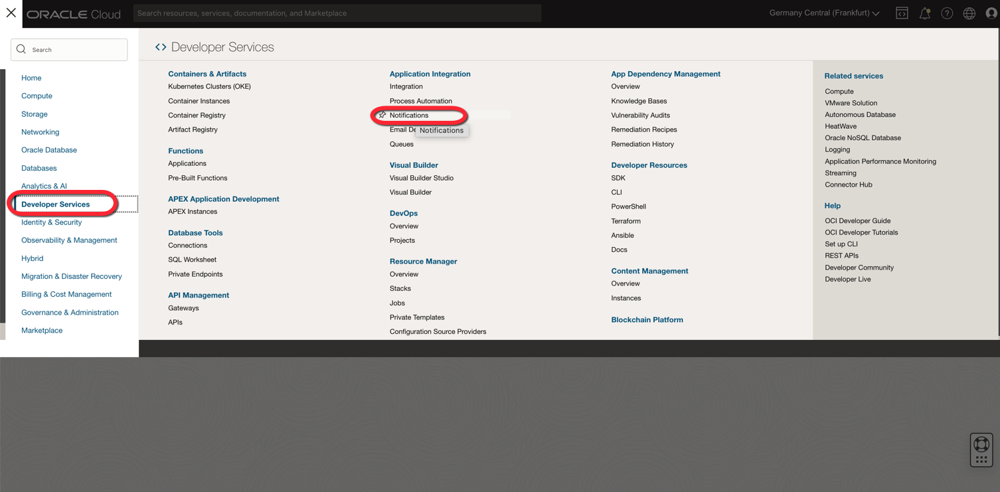
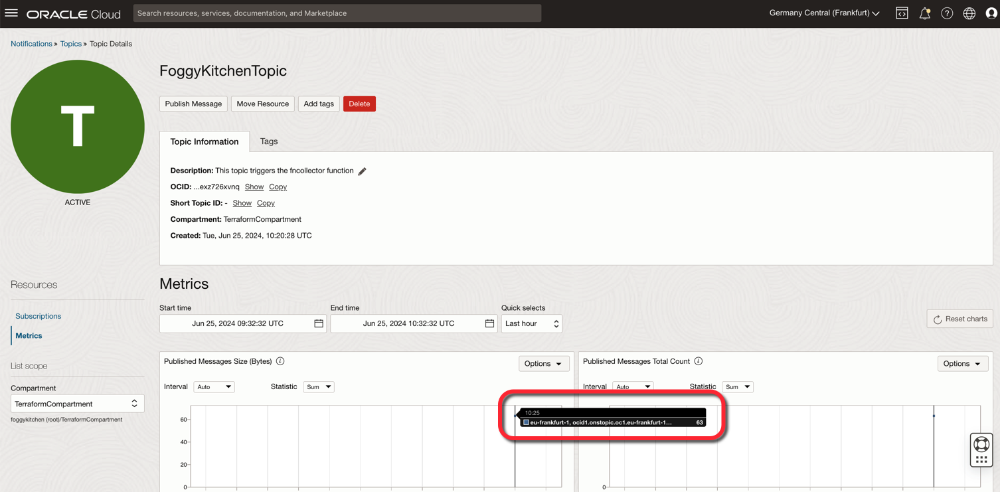

# Lesson 5: Two Functions, API Gateway and OCI Notifications

This lesson shows how to build a small **event-driven serverless workflow** on OCI using **two Functions**, **OCI API Gateway**, and **OCI Notifications Service (ONS)**.

The public entry point is the `fninitiator` function, exposed through **API Gateway**. It publishes a message to an **ONS topic**, and the private `fncollector` function is subscribed to that topic and processes the message asynchronously.

The Functions Application stays in a **private subnet**. A separate **public subnet** is used for API Gateway, which becomes the only internet-facing entry point.

The lesson also extends the multi-module pattern introduced in [Lesson 4](../lesson4_two_functions_api_gateway/README.md):

- `terraform-oci-fk-vcn` for networking
- `terraform-oci-fk-policy` for IAM
- `terraform-oci-fk-api-gateway` for API publishing
- `terraform-oci-fk-ons` for OCI Notifications topics and subscriptions



**Figure 1.** Architecture overview for the asynchronous serverless flow. API Gateway exposes the public `fninitiator` endpoint, the initiator publishes a message to an OCI Notifications topic, and the private `fncollector` function receives that message through the ONS subscription.

---

## What This Lesson Shows

- Two custom OCI Functions under one shared Functions Application
- Private subnet placement for the Functions Application
- Public subnet placement for OCI API Gateway
- API Gateway routing to the public `fninitiator` function
- OCI Notifications topic publication from `fninitiator`
- OCI Notifications subscription that triggers `fncollector`
- Explicit IAM for both API Gateway invocation and Functions-to-ONS publishing
- Reusable building block composition instead of raw OCI resources embedded in the lesson

---

## Architecture Notes

- `terraform-oci-fk-vcn` creates the VCN, public API Gateway subnet, and private Functions subnet
- `terraform-oci-fk-function` creates both functions and the shared Functions Application
- `terraform-oci-fk-policy` creates:
  - the tenancy policy that allows API Gateway to invoke Functions
  - the dynamic group and tenancy policy that allow Functions to publish to OCI Notifications
- `terraform-oci-fk-ons` creates the topic and the Function subscription
- `terraform-oci-fk-api-gateway` creates the public gateway, deployment, and route

This lesson builds directly on the explicit module composition introduced in [Lesson 4](../lesson4_two_functions_api_gateway/README.md), but adds an asynchronous event hop through OCI Notifications.

---

## Deploy Using Terraform CLI

### Clone The Repository

```bash
git clone https://github.com/foggykitchen/terraform-oci-fk-function.git
cd terraform-oci-fk-function/training/lesson5_two_functions_api_gateway_ons
```

### Prepare Variables

```bash
cp terraform.tfvars.example terraform.tfvars
```

Populate at least:

```hcl
tenancy_ocid       = "ocid1.tenancy.oc1..<your_tenancy_ocid>"
compartment_ocid   = "ocid1.compartment.oc1..<your_compartment_ocid>"
user_ocid          = "ocid1.user.oc1..<your_user_ocid>"
fingerprint        = "<your_api_key_fingerprint>"
private_key_path   = "~/.oci/oci_api_key.pem"
region             = "eu-frankfurt-1"
ocir_user_name     = "<user_name>"
ocir_user_password = "<user_auth_token>"
```

### Initialize

```bash
tofu init
```

### Review The Plan

```bash
tofu plan
```

### Apply

```bash
tofu apply
```

After apply, the lesson outputs:

- `fninitiator_endpoint`

### Terminal Smoke Test

The first invocation may take a little longer. Right after `tofu apply`, OCI API Gateway, OCI Functions, and the OCI Notifications subscription can still be settling, so the first request may briefly return a transient error such as `404 Not Found`. Retry after a short pause if that happens.

```bash
export FNINITIATOR_URL="$(tofu output -json | jq -r '.api_gateway_endpoints.value.fninitiator_endpoint')"

RESPONSE="$(curl -s -X POST "$FNINITIATOR_URL")"
echo "$RESPONSE" | jq .

export CORRELATION_ID="$(echo "$RESPONSE" | jq -r '.correlation_id')"
echo "$CORRELATION_ID"
```

Possible early response:

```text
<html>
<head><title>404 Not Found</title></head>
<body>
<center><h1>404 Not Found</h1></center>
</body>
</html>
```

Expected healthy response:

```json
{"status":"fninitiator: Message published successfully","correlation_id":"<uuid>","ons_response":"<OCI ONS response payload>"}
```

### Validate The Asynchronous Flow

After the `fninitiator` call succeeds, use the returned `correlation_id` to confirm the asynchronous hop into `fncollector`.

1. Open **Logging** in the OCI Console and confirm that the `fninitiator` function logged successful ONS publication.
2. Search for the same `correlation_id` in the `fncollector` logs and confirm that the ONS subscription invoked the collector function.
3. Open **Developer Services** -> **Notifications** and inspect the created topic and subscription.
4. Confirm that the Functions Application still stays in the private subnet while only API Gateway remains public.

If you want to verify this from the terminal, the same pattern can be checked with OCI CLI log search:

```bash
export COMPARTMENT_OCID="$(grep '^compartment_ocid' terraform.tfvars | cut -d '"' -f2)"
export TIME_START="$(date -u -v-15M '+%Y-%m-%dT%H:%M:%SZ')"
export TIME_END="$(date -u '+%Y-%m-%dT%H:%M:%SZ')"

oci logging-search search-logs \
  --search-query "search \"${COMPARTMENT_OCID}\" | sort by datetime desc" \
  --time-start "$TIME_START" \
  --time-end "$TIME_END" \
  | jq -r '.data.results[].data.logContent.data.message // empty' \
  | grep "$CORRELATION_ID"
```

Expected `fncollector` log pattern:

```text
fncollector: Received correlation_id=<uuid> message=This is a message from fninitiator to fncollector
```

The screenshots below illustrate the expected result:



**Figure 2.** Postman confirms that a `POST` request to the public API Gateway route returns a successful `fninitiator` response. This is the synchronous entry point into the workflow and the first proof that the gateway-to-function path works.



**Figure 3.** The Functions Application stays attached to the private subnet and has invocation logging enabled. This confirms that only API Gateway is exposed publicly while the Functions runtime remains private.



**Figure 4.** Function invocation logs show the complete asynchronous hop. The lower block contains the `fninitiator` publication logs, and the upper block shows `fncollector` receiving the same message from OCI Notifications.



**Figure 5.** OCI Console navigation to Developer Services and Notifications. This is the service area used to inspect the topic and subscription created for the fan-out between the two functions.



**Figure 6.** Topic metrics confirm that OCI Notifications received and published the message emitted by `fninitiator`. This complements the function logs and provides service-level confirmation that the event passed through ONS.

---

## Destroy

```bash
tofu destroy
```

---

## Related Resources

- [Training index](../README.md)
- [Lesson 4: Two Functions Behind API Gateway](../lesson4_two_functions_api_gateway/README.md)
- [FoggyKitchen OCI VCN Module](https://github.com/foggykitchen/terraform-oci-fk-vcn)
- [FoggyKitchen OCI Policy Module](https://github.com/foggykitchen/terraform-oci-fk-policy)
- [FoggyKitchen OCI API Gateway Module](https://github.com/foggykitchen/terraform-oci-fk-api-gateway)
- [FoggyKitchen OCI ONS Module](https://github.com/foggykitchen/terraform-oci-fk-ons)

---

## License

Licensed under the **Universal Permissive License (UPL), Version 1.0**.
See [LICENSE](../../LICENSE) for details.

---

© 2026 [FoggyKitchen.com](https://foggykitchen.com) - Cloud. Code. Clarity.
