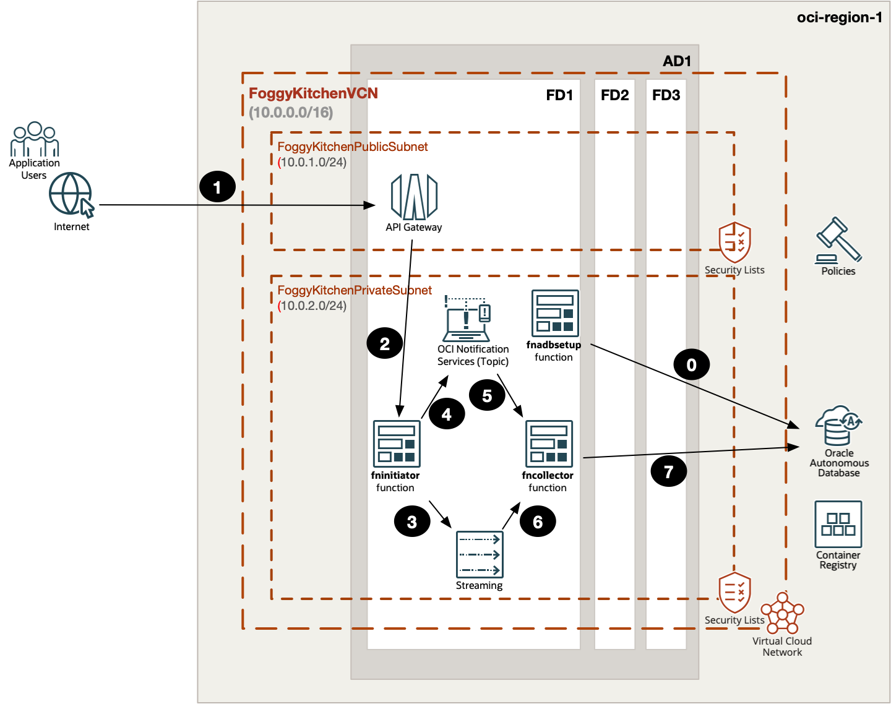
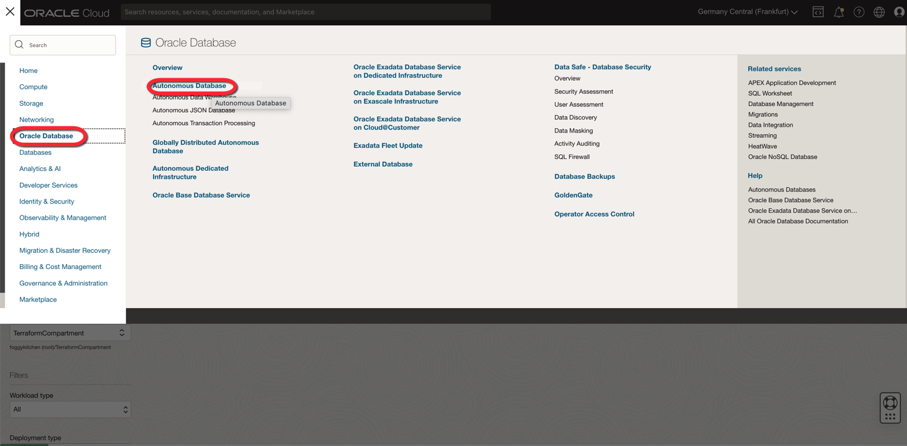
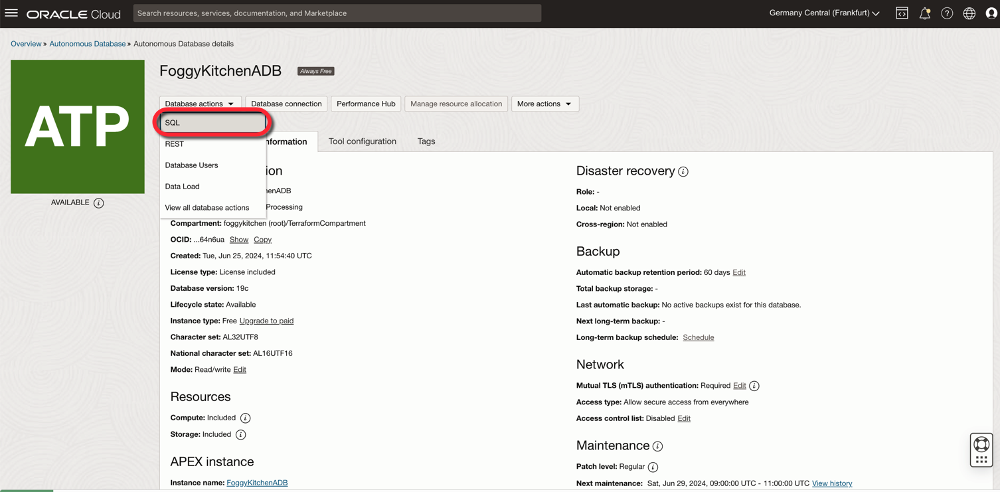
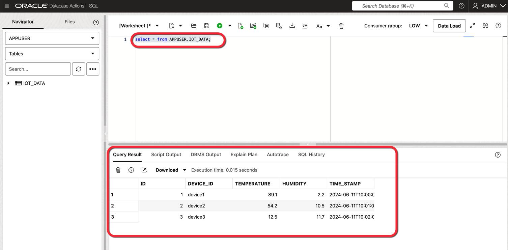
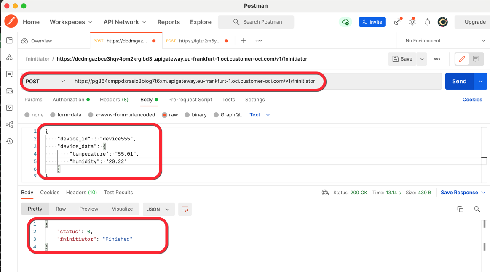
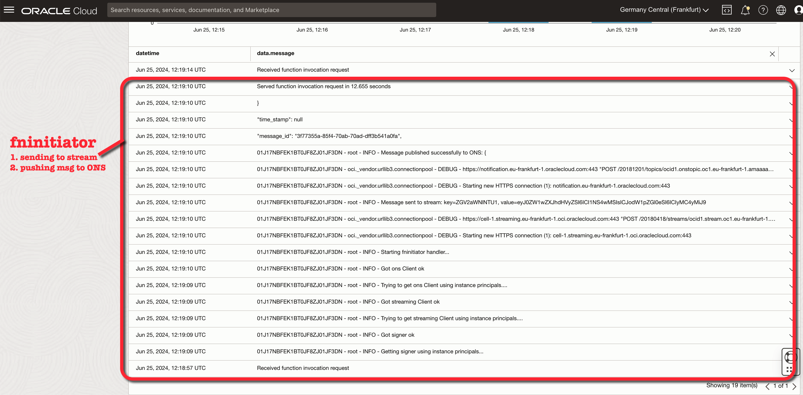
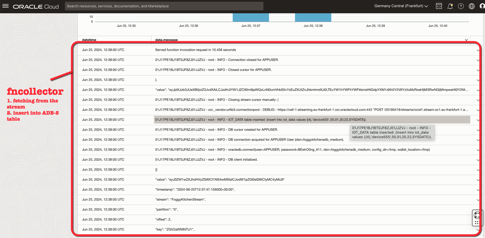
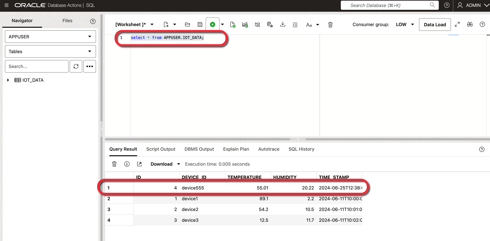

# Lesson 6: Three Functions, API Gateway, ONS, Streaming, and ADB

This lesson extends the event-driven flow from [Lesson 5](../lesson5_two_functions_api_gateway_ons/README.md) by adding **OCI Streaming** and **Autonomous Database** to the pipeline.

The public `fninitiator` function is exposed through **API Gateway**. It publishes a trigger message to **OCI Notifications Service (ONS)** and, independently, pushes device data into **OCI Streaming**. The private `fncollector` function is triggered asynchronously through ONS, then fetches records from the stream and writes them into **Autonomous Database Serverless**.

A third helper function, `fnadbsetup`, is invoked by Terraform during `tofu apply`. Its job is to prepare the database bootstrap state by creating `APPUSER`, creating the `IOT_DATA` table structures, and loading the initial seed records used later during validation.



**Figure 1.** Architecture overview for the asynchronous ingestion flow. API Gateway exposes `fninitiator`, ONS triggers `fncollector`, Streaming buffers device data, and `fnadbsetup` bootstraps Autonomous Database before the business flow starts.

---

## What This Lesson Shows

- Three custom OCI Functions under one shared Functions Application
- Public API Gateway in a public subnet
- Functions Application placed in a private subnet
- Reusable VCN, API Gateway, ONS, Streaming, Policy, and ADB modules
- Asynchronous trigger flow where `fninitiator` does not wait for the downstream ADB insert
- Bootstrap of ADB schema and seed data through a Terraform-invoked helper function
- Final verification through both function logs and database query results

---

## Architecture Notes

- `terraform-oci-fk-vcn` creates the public API Gateway subnet and private Functions subnet
- `terraform-oci-fk-api-gateway` exposes the public `POST /v1/fninitiator` route
- `terraform-oci-fk-ons` creates the topic and the Oracle Functions subscription for `fncollector`
- `terraform-oci-fk-streaming` creates the stream pool and stream used for buffering device records
- `terraform-oci-fk-policy` creates:
  - the tenancy policy that allows API Gateway to invoke Functions
  - the dynamic group and tenancy policies that allow Functions to use ONS, Streaming, and ADB
- `terraform-oci-fk-adb` creates the Autonomous Database
- `fnadbsetup` is invoked automatically by Terraform and prepares the ADB schema state before application traffic starts

This lesson is intentionally asynchronous:

- `fninitiator` accepts the request and returns quickly
- `fncollector` is triggered separately through ONS
- `fncollector` then pulls data from Streaming and writes it into ADB
- the final proof of success is the new row visible in `APPUSER.IOT_DATA`

---

## Deploy Using Terraform CLI

### Clone The Repository

```bash
git clone https://github.com/foggykitchen/terraform-oci-fk-function.git
cd terraform-oci-fk-function/training/lesson6_three_functions_api_gateway_ons_streaming_adb
```

### Prepare Variables

```bash
cp terraform.tfvars.example terraform.tfvars
```

Populate at least:

```hcl
tenancy_ocid          = "ocid1.tenancy.oc1..<your_tenancy_ocid>"
compartment_ocid      = "ocid1.compartment.oc1..<your_compartment_ocid>"
user_ocid             = "ocid1.user.oc1..<your_user_ocid>"
fingerprint           = "<your_api_key_fingerprint>"
private_key_path      = "~/.oci/oci_api_key.pem"
region                = "eu-frankfurt-1"
ocir_user_name        = "<user_name>"
ocir_user_password    = "<user_auth_token>"
adb_admin_password    = "<adb_admin_password>"
adb_app_user_password = "<adb_app_user_password>"
```

### Initialize

```bash
tofu init
```

### Review The Plan

```bash
tofu plan
```

### Apply

```bash
tofu apply
```

During apply, Terraform invokes `fnadbsetup`, so the database is already seeded when the public `fninitiator` route becomes available.

After apply, the lesson outputs:

- `fninitiator_endpoint`

---

## Terminal Smoke Test

Use a payload similar to the one shown in the original Postman validation:

```bash
export FNINITIATOR_URL="$(tofu output -json | jq -r '.api_gateway_endpoints.value.fninitiator_endpoint')"

curl -s -X POST "$FNINITIATOR_URL" \
  -H "Content-Type: application/json" \
  -d '{
    "device_id": "device555",
    "device_data": {
      "temperature": "55.01",
      "humidity": "20.22"
    }
  }' | jq .
```

Expected healthy response:

```json
{
  "status": 0,
  "fninitiator": "Finished",
  "record_count": 1,
  "device_id": "device555"
}
```

Important behavior:

- this response confirms only that `fninitiator` accepted the request
- it does **not** mean the record is already written into ADB
- the downstream insert happens asynchronously through `fncollector`

---

## Validate ADB Bootstrap

Before testing the business request, confirm that `fnadbsetup` prepared the schema and inserted the initial seed rows.

1. Open **Oracle Database** and navigate to **Autonomous Database**.
2. Open **Database Actions** for the created database.
3. Start the SQL worksheet.
4. Run:

```sql
select * from APPUSER.IOT_DATA;
```

You should see the initial seed rows created by `fnadbsetup`.



**Figure 2.** OCI Console navigation to Autonomous Database before opening Database Actions for validation.



**Figure 3.** Database Actions is used to open the SQL worksheet against the created Autonomous Database.



**Figure 4.** Initial query result from `APPUSER.IOT_DATA`. These seed rows confirm that `fnadbsetup` completed the database bootstrap successfully during `tofu apply`.

---

## Validate The Asynchronous Flow

1. Send the `POST` request to `fninitiator`.
2. Check `fninitiator` logs and confirm that it:
   - accepted the request
   - pushed the device payload into Streaming
   - published the ONS trigger
3. Check `fncollector` logs and confirm that it:
   - fetched records from the stream
   - inserted the row into `APPUSER.IOT_DATA`
4. Run the SQL query again:

```sql
select * from APPUSER.IOT_DATA;
```

5. Confirm that the new `device555` record is now present.

Because this lesson is asynchronous, the final row can appear a short moment after the HTTP response already returned `status = 0`.



**Figure 5.** Postman sends the public `POST /v1/fninitiator` request with the device payload that will later be written into Streaming and then into ADB.



**Figure 6.** `fninitiator` logs show the synchronous part of the flow: request handling, write to Streaming, and publication of the ONS trigger message.



**Figure 7.** `fncollector` logs show the asynchronous part of the flow: reading the buffered record from Streaming and inserting it into `APPUSER.IOT_DATA`.



**Figure 8.** Final query result from `APPUSER.IOT_DATA` includes the new `device555` row, which is the end-to-end proof that the asynchronous pipeline completed successfully.

---

## Destroy

```bash
tofu destroy
```

---

## Related Resources

- [Training index](../README.md)
- [Lesson 5: Two Functions, API Gateway and OCI Notifications](../lesson5_two_functions_api_gateway_ons/README.md)
- [FoggyKitchen OCI VCN Module](https://github.com/foggykitchen/terraform-oci-fk-vcn)
- [FoggyKitchen OCI Policy Module](https://github.com/foggykitchen/terraform-oci-fk-policy)
- [FoggyKitchen OCI API Gateway Module](https://github.com/foggykitchen/terraform-oci-fk-api-gateway)
- [FoggyKitchen OCI ONS Module](https://github.com/foggykitchen/terraform-oci-fk-ons)
- [FoggyKitchen OCI Streaming Module](https://github.com/foggykitchen/terraform-oci-fk-streaming)
- [FoggyKitchen OCI ADB Module](https://github.com/foggykitchen/terraform-oci-fk-adb)

---

## License

Licensed under the **Universal Permissive License (UPL), Version 1.0**.
See [LICENSE](../../LICENSE) for details.

---

© 2026 [FoggyKitchen.com](https://foggykitchen.com) - Cloud. Code. Clarity.
