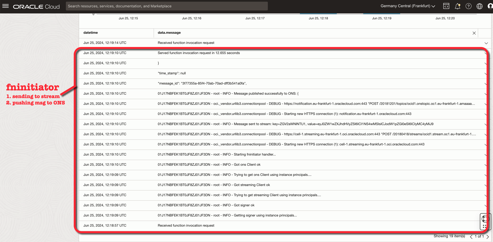

# FoggyKitchen OCI Function with Terraform 

## LESSON 6 - Three Functions, API Gateway, ONS, Streaming and ADB-S

In this sixth lesson, we will enhance our event-driven architecture by incorporating additional components, such as the Streaming Service. The `fninitiator` function will continue to call the OCI Notification Service (ONS) with a message, and the subscription to the topic by the `fncollector` function will trigger its execution. Additionally, `fninitiator` will publish messages to the stream, which `fncollector` will consume. 
Subsequently, `fncollector` will interact with the Autonomous Database Serverless FreeTier (ADB-S), where IoT records will be saved in an `IOT_TABLE` table. In addition to the two functions you are already familiar with, we will introduce a helper function named `fnadbsetup`, which will be invoked by Terraform code. This helper function will create an `APPUSER` in ADB-S and populate the `IOT_TABLE` with initial data.

This lesson will provide a comprehensive understanding of integrating the Streaming Service and Autonomous Database with your event-driven architecture, further expanding your ability to manage and process data efficiently in a serverless environment.


## Deploy Using Oracle Resource Manager

1. Click [](https://cloud.oracle.com/resourcemanager/stacks/create?region=home&zipUrl=https://github.com/mlinxfeld/terraform-oci-fk-function/releases/latest/download/terraform-oci-fk-function-lesson6.zip)

    If you aren't already signed in, when prompted, enter the tenancy and user credentials.

2. Review and accept the terms and conditions.

3. Select the region where you want to deploy the stack.

4. Follow the on-screen prompts and instructions to create the stack.

5. After creating the stack, click **Terraform Actions**, and select **Plan**.

6. Wait for the job to be completed, and review the plan.

    To make any changes, return to the Stack Details page, click **Edit Stack**, and make the required changes. Then, run the **Plan** action again.

7. If no further changes are necessary, return to the Stack Details page, click **Terraform Actions**, and select **Apply**. 

## Deploy Using the Terraform CLI in Cloud Shell

### Clone of the repo into OCI Cloud Shell

Now, you'll want a local copy of this repo. You can make that with the commands:
Clone the repo from github by executing the command as follows and then go to proper subdirectory:

```
martin_lin@codeeditor:~ (eu-frankfurt-1)$ git clone https://github.com/mlinxfeld/terraform-oci-fk-function.git

martin_lin@codeeditor:~ (eu-frankfurt-1)$ cd terraform-oci-fk-function

martin_lin@codeeditor:terraform-oci-fk-adb (eu-frankfurt-1)$ cd training/lesson6_three_functions_api_gateway_ons_streaming_adb/
```

### Prerequisites
Create environment file with terraform.tfvars file starting with example file:

```
martin_lin@codeeditor:lesson6_three_functions_api_gateway_ons_streaming_adb (eu-frankfurt-1)$ cp terraform.tfvars.example terraform.tfvars

martin_lin@codeeditor:lesson6_three_functions_api_gateway_ons_streaming_adb (eu-frankfurt-1)$ vi terraform.tfvars

tenancy_ocid          = "ocid1.tenancy.oc1..<your_tenancy_ocid>"
compartment_ocid      = "ocid1.compartment.oc1..<your_comparment_ocid>"
region                = "<oci_region>"
ocir_user_name        = "<user_name>"
ocir_user_password    = "<user_auth_token>"
adb_admin_password    = "<adb_admin_password>"
adb_app_user_password = "<adb_app_user_password>"
```

### Initialize Terraform

Run the following command to initialize Terraform environment:

```
martin_lin@codeeditor:lesson6_three_functions_api_gateway_ons_streaming_adb (eu-frankfurt-1)$ terraform init 

Initializing the backend...
Downloading git::https://github.com/mlinxfeld/terraform-oci-fk-adb.git for oci-fk-adb...
- oci-fk-adb in .terraform/modules/oci-fk-adb
Downloading git::https://github.com/mlinxfeld/terraform-oci-fk-function.git for oci-fk-adb-setup-function...
- oci-fk-adb-setup-function in .terraform/modules/oci-fk-adb-setup-function
Downloading git::https://github.com/mlinxfeld/terraform-oci-fk-function.git for oci-fk-collector-function...
- oci-fk-collector-function in .terraform/modules/oci-fk-collector-function
Downloading git::https://github.com/mlinxfeld/terraform-oci-fk-function.git for oci-fk-initiator-function...
- oci-fk-initiator-function in .terraform/modules/oci-fk-initiator-function

Initializing provider plugins...
- Finding latest version of hashicorp/local...
- Finding latest version of hashicorp/null...
- Finding latest version of hashicorp/oci...
- Using previously-installed hashicorp/local v2.5.1
- Using previously-installed hashicorp/null v3.2.2
- Installing hashicorp/oci v5.46.0...
- Installed hashicorp/oci v5.46.0 (unauthenticated)

Terraform has made some changes to the provider dependency selections recorded
in the .terraform.lock.hcl file. Review those changes and commit them to your
version control system if they represent changes you intended to make.

Terraform has been successfully initialized!

You may now begin working with Terraform. Try running "terraform plan" to see
any changes that are required for your infrastructure. All Terraform commands
should now work.

If you ever set or change modules or backend configuration for Terraform,
rerun this command to reinitialize your working directory. If you forget, other
commands will detect it and remind you to do so if necessary.
```

### Apply the changes 

Run the following command for applying changes with the proposed plan:

```
martin_lin@codeeditor:lesson6_three_functions_api_gateway_ons_streaming_adb (eu-frankfurt-1)$ terraform apply 

data.local_file.fninitiator_dockerfile: Reading...
data.local_file.fncollector_dockerfile: Reading...

(...)

  # module.oci-fk-initiator-function.oci_logging_log_group.FoggyKitchenFnAppLogGroup[0] will be created
  + resource "oci_logging_log_group" "FoggyKitchenFnAppLogGroup" {
      + compartment_id     = "ocid1.compartment.oc1..aaaaaaaaiyy4srmrb32v5rlniicwmpxsytywiucgbcp5ext6e4ahjfuloewa"
      + defined_tags       = (known after apply)
      + description        = "Foggy Kitchen Fn App Log Group"
      + display_name       = "FoggyKitchenFnAppLogGroup"
      + freeform_tags      = (known after apply)
      + id                 = (known after apply)
      + state              = (known after apply)
      + time_created       = (known after apply)
      + time_last_modified = (known after apply)
    }

Plan: 48 to add, 0 to change, 0 to destroy.

Changes to Outputs:
  + api_gateway_endpoints = {
      + fninitiator_endpoint = (known after apply)
    }

Do you want to perform these actions?
  Terraform will perform the actions described above.
  Only 'yes' will be accepted to approve.

  Enter a value: yes

(...)

module.oci-fk-collector-function.null_resource.FoggyKitchenMyFnSetup[0] (local-exec): 0.0.1: digest: sha256:3470fe69dbf4c5d98cd32727d6f08138e1d8b866420d713f85ae635eac3d12bb size: 4086
module.oci-fk-collector-function.null_resource.FoggyKitchenMyFnSetup[0]: Creation complete after 15m54s [id=6647134153207415838]
module.oci-fk-collector-function.oci_functions_function.FoggyKitchenFn: Creating...
module.oci-fk-collector-function.oci_functions_function.FoggyKitchenFn: Creation complete after 0s [id=ocid1.fnfunc.oc1.eu-frankfurt-1.aaaaaaaadq76v24to2esvtix2d6mtumnquwwdofsu5r64fg2hy2pzbvtpvaq]
oci_ons_subscription.FoggyKitchenSubscription: Creating...
oci_ons_subscription.FoggyKitchenSubscription: Creation complete after 1s [id=ocid1.onssubscription.oc1.eu-frankfurt-1.aaaaaaaa73dsmrgnplkvcte323vcpuefl2qwoy5chr6bytipevbsbmyknita]
module.oci-fk-adb-setup-function.null_resource.FoggyKitchenFnInvoke[0]: Still creating... [40s elapsed]
module.oci-fk-adb-setup-function.null_resource.FoggyKitchenFnInvoke[0]: Still creating... [50s elapsed]
module.oci-fk-adb-setup-function.null_resource.FoggyKitchenFnInvoke[0]: Still creating... [1m0s elapsed]
module.oci-fk-adb-setup-function.null_resource.FoggyKitchenFnInvoke[0]: Still creating... [1m10s elapsed]
module.oci-fk-adb-setup-function.null_resource.FoggyKitchenFnInvoke[0]: Still creating... [1m20s elapsed]
module.oci-fk-adb-setup-function.null_resource.FoggyKitchenFnInvoke[0]: Still creating... [1m30s elapsed]
module.oci-fk-adb-setup-function.null_resource.FoggyKitchenFnInvoke[0] (local-exec): {
module.oci-fk-adb-setup-function.null_resource.FoggyKitchenFnInvoke[0] (local-exec):   "data": "",
module.oci-fk-adb-setup-function.null_resource.FoggyKitchenFnInvoke[0] (local-exec):   "headers": {
module.oci-fk-adb-setup-function.null_resource.FoggyKitchenFnInvoke[0] (local-exec):     "Content-Length": "0",
module.oci-fk-adb-setup-function.null_resource.FoggyKitchenFnInvoke[0] (local-exec):     "Content-Type": "text/plain",
module.oci-fk-adb-setup-function.null_resource.FoggyKitchenFnInvoke[0] (local-exec):     "Date": "Tue, 25 Jun 2024 12:15:25 GMT",
module.oci-fk-adb-setup-function.null_resource.FoggyKitchenFnInvoke[0] (local-exec):     "Fn-Call-Id": "01J17N30SP1BT0MY0ZJ01JV8E2",
module.oci-fk-adb-setup-function.null_resource.FoggyKitchenFnInvoke[0] (local-exec):     "Fn-Fdk-Runtime": "python/3.8.17 final",
module.oci-fk-adb-setup-function.null_resource.FoggyKitchenFnInvoke[0] (local-exec):     "Fn-Fdk-Version": "fdk-python/0.1.73",
module.oci-fk-adb-setup-function.null_resource.FoggyKitchenFnInvoke[0] (local-exec):     "Opc-Request-Id": "B00E4054C8804A4392045DF30D29BE2F/01J17N30QG0000000000318CP0/01J17N30QG0000000000318CP1"
module.oci-fk-adb-setup-function.null_resource.FoggyKitchenFnInvoke[0] (local-exec):   },
module.oci-fk-adb-setup-function.null_resource.FoggyKitchenFnInvoke[0] (local-exec):   "status": "200 OK"
module.oci-fk-adb-setup-function.null_resource.FoggyKitchenFnInvoke[0] (local-exec): }
module.oci-fk-adb-setup-function.null_resource.FoggyKitchenFnInvoke[0]: Creation complete after 1m37s [id=6518019707911249626]

Apply complete! Resources: 48 added, 0 changed, 0 destroyed.

Outputs:

api_gateway_endpoints = {
  "fninitiator_endpoint" = "https://pg364cmppdxrasix3biog7t6xm.apigateway.eu-frankfurt-1.oci.customer-oci.com/v1/fninitiator"
}
```

### Check the function in OCI Console

1. From the hamburger menu in the top left corner navigate to Oracle Database and then to Autonomous Database:


2. For Autonomous Database start SQL from Database Actions:


3. Select from APPUSER.IOT_DATA table to confirm that `fnadbsetup` was successful:


4. With Postman execute POST message to `fnintiator` via API Gateway endpoint (include IOT data in form of JSON):


5. In the logs find logs for invocation of `fninitiator` function:



6. In the logs find logs for invocation of `fncollector` function:


7. Select again from APPUSER.IOT_DATA table to confirm that `fncollector` was successful with the insert:


### Destroy the changes 

Run the following command for destroying all resources:

```
martin_lin@codeeditor:lesson6_three_functions_api_gateway_ons_streaming_adb (eu-fankfurt-1)$ terraform destroy 
data.local_file.fninitiator_dockerfile: Reading...
data.local_file.fninitiator_requirements_txt: Reading...
data.local_file.fninitiator_func_yaml: Reading...
data.local_file.fnadbsetup_requirements_txt: Reading...
data.local_file.fncollector_dockerfile: Reading...
data.local_file.fncollector_func_py: Reading...

(...)

 # module.oci-fk-initiator-function.oci_logging_log_group.FoggyKitchenFnAppLogGroup[0] will be destroyed
  - resource "oci_logging_log_group" "FoggyKitchenFnAppLogGroup" {
      - compartment_id     = "ocid1.compartment.oc1..aaaaaaaaiyy4srmrb32v5rlniicwmpxsytywiucgbcp5ext6e4ahjfuloewa" -> null
      - defined_tags       = {} -> null
      - description        = "Foggy Kitchen Fn App Log Group" -> null
      - display_name       = "FoggyKitchenFnAppLogGroup" -> null
      - freeform_tags      = {} -> null
      - id                 = "ocid1.loggroup.oc1.eu-frankfurt-1.amaaaaaadngk4giay74kw4el4bx5s6xepzt6pke32kimle54wufkmjwe5i6q" -> null
      - state              = "ACTIVE" -> null
      - time_created       = "2024-06-25 11:54:39.27 +0000 UTC" -> null
      - time_last_modified = "2024-06-25 11:54:39.27 +0000 UTC" -> null
    }

Plan: 0 to add, 0 to change, 48 to destroy.

Changes to Outputs:
  - api_gateway_endpoints = {
      - fninitiator_endpoint = "https://pg364cmppdxrasix3biog7t6xm.apigateway.eu-frankfurt-1.oci.customer-oci.com/v1/fninitiator"
    } -> null

Do you really want to destroy all resources?
  Terraform will destroy all your managed infrastructure, as shown above.
  There is no undo. Only 'yes' will be accepted to confirm.

  Enter a value: yes

(...)

oci_ons_notification_topic.FoggyKitchenTopic: Still destroying... [id=ocid1.onstopic.oc1.eu-frankfurt-1.amaaa...h3a2mcdjufpsd2k5we3zqspudicxftvlmr2sba, 15m0s elapsed]
oci_ons_notification_topic.FoggyKitchenTopic: Still destroying... [id=ocid1.onstopic.oc1.eu-frankfurt-1.amaaa...h3a2mcdjufpsd2k5we3zqspudicxftvlmr2sba, 15m10s elapsed]
oci_ons_notification_topic.FoggyKitchenTopic: Still destroying... [id=ocid1.onstopic.oc1.eu-frankfurt-1.amaaa...h3a2mcdjufpsd2k5we3zqspudicxftvlmr2sba, 15m20s elapsed]
oci_ons_notification_topic.FoggyKitchenTopic: Destruction complete after 15m24s

Destroy complete! Resources: 48 destroyed.
```