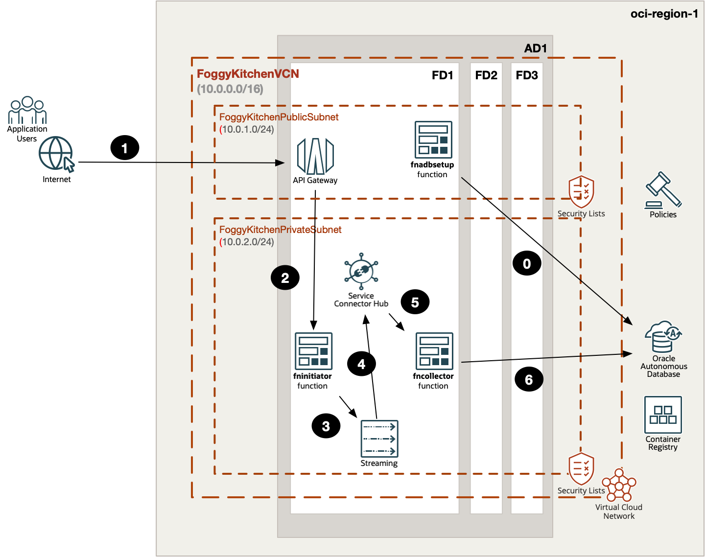
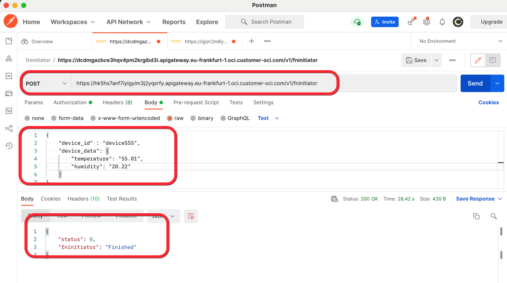
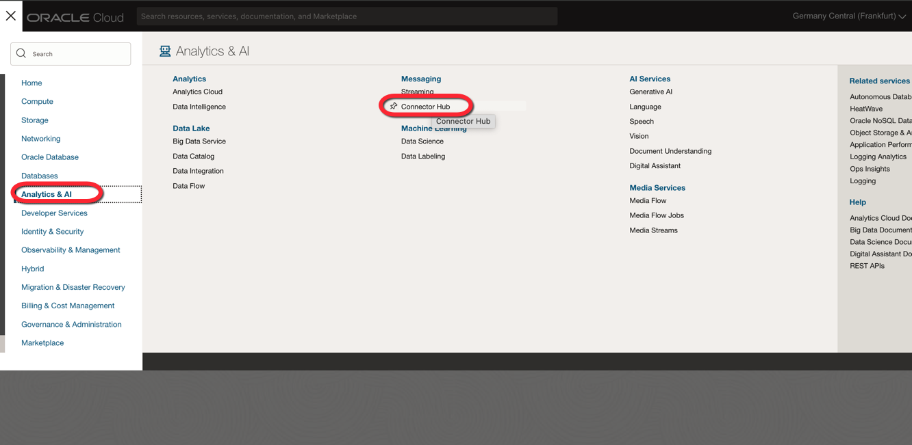
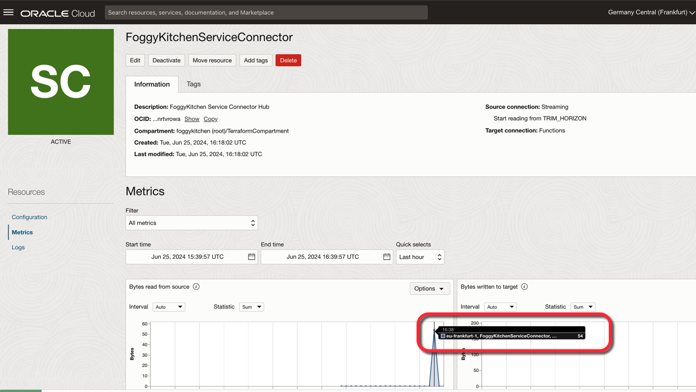
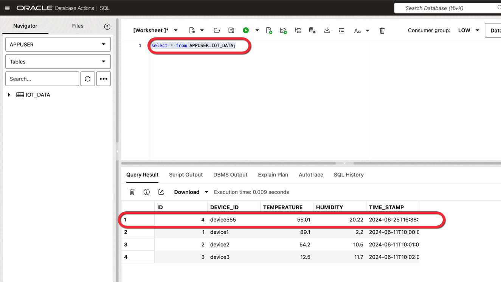

# FoggyKitchen OCI Function with Terraform 

## LESSON 7 - Three Functions, API Gateway, Service Connector Hub, Streaming and ADB-S

In this seventh lesson, we will enhance our event-driven architecture by replacing the OCI Notification Service (ONS) mechanism with the OCI Service Connector Hub. This advanced setup will designate the Streaming Service as the source and the `fncollector` function as the target.

By using the Service Connector Hub, we can significantly simplify the `fncollector` function, as the hub will manage the data flow from the stream to the function. This modification not only streamlines the function but also enhances the overall reliability and efficiency of the system. The Service Connector Hub provides a more robust and scalable solution, ensuring that our architecture is better equipped to handle increased loads and complex workflows.

This lesson will give you a deeper understanding of how to leverage OCI's advanced services to build a more efficient and resilient event-driven architecture, improving both performance and maintainability.



## Deploy Using Oracle Resource Manager

1. Click [](https://cloud.oracle.com/resourcemanager/stacks/create?region=home&zipUrl=https://github.com/mlinxfeld/terraform-oci-fk-function/releases/latest/download/terraform-oci-fk-function-lesson7.zip)

    If you aren't already signed in, when prompted, enter the tenancy and user credentials.

2. Review and accept the terms and conditions.

3. Select the region where you want to deploy the stack.

4. Follow the on-screen prompts and instructions to create the stack.

5. After creating the stack, click **Terraform Actions**, and select **Plan**.

6. Wait for the job to be completed, and review the plan.

    To make any changes, return to the Stack Details page, click **Edit Stack**, and make the required changes. Then, run the **Plan** action again.

7. If no further changes are necessary, return to the Stack Details page, click **Terraform Actions**, and select **Apply**. 

## Deploy Using the Terraform CLI in Cloud Shell

### Clone of the repo into OCI Cloud Shell

Now, you'll want a local copy of this repo. You can make that with the commands:
Clone the repo from github by executing the command as follows and then go to proper subdirectory:

```
martin_lin@codeeditor:~ (eu-frankfurt-1)$ git clone https://github.com/mlinxfeld/terraform-oci-fk-function.git

martin_lin@codeeditor:~ (eu-frankfurt-1)$ cd terraform-oci-fk-function

martin_lin@codeeditor:terraform-oci-fk-adb (eu-frankfurt-1)$ cd training/lesson7_three_functions_api_gateway_sch_stream_adb/
```

### Prerequisites
Create environment file with terraform.tfvars file starting with example file:

```
martin_lin@codeeditor:lesson7_three_functions_api_gateway_sch_stream_adb (eu-frankfurt-1)$ cp terraform.tfvars.example terraform.tfvars

martin_lin@codeeditor:lesson7_three_functions_api_gateway_sch_stream_adb (eu-frankfurt-1)$ vi terraform.tfvars

tenancy_ocid          = "ocid1.tenancy.oc1..<your_tenancy_ocid>"
compartment_ocid      = "ocid1.compartment.oc1..<your_comparment_ocid>"
region                = "<oci_region>"
ocir_user_name        = "<user_name>"
ocir_user_password    = "<user_auth_token>"
adb_admin_password    = "<adb_admin_password>"
adb_app_user_password = "<adb_app_user_password>"
```

### Initialize Terraform

Run the following command to initialize Terraform environment:

```
martin_lin@codeeditor:lesson7_three_functions_api_gateway_sch_stream_adb (eu-frankfurt-1)$ terraform init 

Initializing the backend...
Downloading git::https://github.com/mlinxfeld/terraform-oci-fk-adb.git for oci-fk-adb...
- oci-fk-adb in .terraform/modules/oci-fk-adb
Downloading git::https://github.com/mlinxfeld/terraform-oci-fk-function.git for oci-fk-adb-setup-function...
- oci-fk-adb-setup-function in .terraform/modules/oci-fk-adb-setup-function
Downloading git::https://github.com/mlinxfeld/terraform-oci-fk-function.git for oci-fk-collector-function...
- oci-fk-collector-function in .terraform/modules/oci-fk-collector-function
Downloading git::https://github.com/mlinxfeld/terraform-oci-fk-function.git for oci-fk-initiator-function...
- oci-fk-initiator-function in .terraform/modules/oci-fk-initiator-function

Initializing provider plugins...
- Finding latest version of hashicorp/local...
- Finding latest version of hashicorp/null...
- Finding latest version of hashicorp/oci...
- Using previously-installed hashicorp/local v2.5.1
- Using previously-installed hashicorp/null v3.2.2
- Installing hashicorp/oci v5.46.0...
- Installed hashicorp/oci v5.46.0 (unauthenticated)

Terraform has made some changes to the provider dependency selections recorded
in the .terraform.lock.hcl file. Review those changes and commit them to your
version control system if they represent changes you intended to make.

Terraform has been successfully initialized!

You may now begin working with Terraform. Try running "terraform plan" to see
any changes that are required for your infrastructure. All Terraform commands
should now work.

If you ever set or change modules or backend configuration for Terraform,
rerun this command to reinitialize your working directory. If you forget, other
commands will detect it and remind you to do so if necessary.
```

### Apply the changes 

Run the following command for applying changes with the proposed plan:

```
martin_lin@codeeditor:lesson7_three_functions_api_gateway_sch_stream_adb (eu-frankfurt-1)$ terraform apply 

data.local_file.fninitiator_dockerfile: Reading...
data.local_file.fncollector_dockerfile: Reading...

(...)

  # module.oci-fk-initiator-function.oci_logging_log_group.FoggyKitchenFnAppLogGroup[0] will be created
  + resource "oci_logging_log_group" "FoggyKitchenFnAppLogGroup" {
      + compartment_id     = "ocid1.compartment.oc1..aaaaaaaaiyy4srmrb32v5rlniicwmpxsytywiucgbcp5ext6e4ahjfuloewa"
      + defined_tags       = (known after apply)
      + description        = "Foggy Kitchen Fn App Log Group"
      + display_name       = "FoggyKitchenFnAppLogGroup"
      + freeform_tags      = (known after apply)
      + id                 = (known after apply)
      + state              = (known after apply)
      + time_created       = (known after apply)
      + time_last_modified = (known after apply)
    }

Plan: 47 to add, 0 to change, 0 to destroy.

Changes to Outputs:
  + api_gateway_endpoints = {
      + fninitiator_endpoint = (known after apply)
    }

Do you want to perform these actions?
  Terraform will perform the actions described above.
  Only 'yes' will be accepted to approve.

  Enter a value: yes

(...)

module.oci-fk-collector-function.null_resource.FoggyKitchenMyFnSetup[0]: Still creating... [3m0s elapsed]
module.oci-fk-collector-function.null_resource.FoggyKitchenMyFnSetup[0]: Still creating... [3m10s elapsed]
module.oci-fk-collector-function.null_resource.FoggyKitchenMyFnSetup[0] (local-exec): aec9c494c45b: Pushed
module.oci-fk-collector-function.null_resource.FoggyKitchenMyFnSetup[0] (local-exec): 0.0.1: digest: sha256:88c632bfab61caea53f0bb4a3379093c85ba5f358ead837bb80e01557351841d size: 4086
module.oci-fk-collector-function.null_resource.FoggyKitchenMyFnSetup[0]: Creation complete after 3m18s [id=5468308978946968837]
module.oci-fk-collector-function.oci_functions_function.FoggyKitchenFn: Creating...
module.oci-fk-collector-function.oci_functions_function.FoggyKitchenFn: Creation complete after 1s [id=ocid1.fnfunc.oc1.eu-frankfurt-1.aaaaaaaas5hdg6ou7z7ihfnbaniqmqriumzfttvxryjzewoqmc4yusyolbqa]
oci_sch_service_connector.FoggyKitchenServiceConnector: Creating...
oci_sch_service_connector.FoggyKitchenServiceConnector: Creation complete after 1s [id=ocid1.serviceconnector.oc1.eu-frankfurt-1.amaaaaaadngk4giaxlnhvxv3gso6xfvfjzn2cqfrkrhxr3vj5lklnrtvrowa]

Apply complete! Resources: 47 added, 0 changed, 0 destroyed.

Outputs:

api_gateway_endpoints = {
  "fninitiator_endpoint" = "https://hk5hs7anf7iyigyim3j2yqxrfy.apigateway.eu-frankfurt-1.oci.customer-oci.com/v1/fninitiator"
}
Apply complete! Resources: 48 added, 0 changed, 0 destroyed.


```

### Validate the deployment

1. Use Postman to execute a POST request to the `fninitiator` function via the API Gateway endpoint, including IoT data in JSON format:



2. From the hamburger menu in the top left corner, navigate to **Analytics & AI**, and then select **Messaging / Connector Hub**:



3. CConfirm that the Service Connector Hub has been used by checking the Metrics section:



4. Run a SQL query to select data from the `APPUSER.IOT_DATA` table to confirm that `fncollector` was successful with the insert:



### Destroy the changes 

Run the following command for destroying all resources:

```
martin_lin@codeeditor:lesson7_three_functions_api_gateway_sch_stream_adb (eu-fankfurt-1)$ terraform destroy 
data.local_file.fninitiator_dockerfile: Reading...
data.local_file.fnadbsetup_dockerfile: Reading...
data.local_file.fncollector_func_py: Reading...
data.local_file.fninitiator_requirements_txt: Reading...
data.local_file.fninitiator_func_py: Reading...
data.local_file.fncollector_func_yaml: Reading...

(...)

  # module.oci-fk-initiator-function.oci_logging_log_group.FoggyKitchenFnAppLogGroup[0] will be destroyed
  - resource "oci_logging_log_group" "FoggyKitchenFnAppLogGroup" {
      - compartment_id     = "ocid1.compartment.oc1..aaaaaaaaiyy4srmrb32v5rlniicwmpxsytywiucgbcp5ext6e4ahjfuloewa" -> null
      - defined_tags       = {} -> null
      - description        = "Foggy Kitchen Fn App Log Group" -> null
      - display_name       = "FoggyKitchenFnAppLogGroup" -> null
      - freeform_tags      = {} -> null
      - id                 = "ocid1.loggroup.oc1.eu-frankfurt-1.amaaaaaadngk4giamltf2sftjr5ob2zmvmj74wi3lyzuxtsv6oonhckrqffq" -> null
      - state              = "ACTIVE" -> null
      - time_created       = "2024-06-25 15:45:57.938 +0000 UTC" -> null
      - time_last_modified = "2024-06-25 15:45:57.938 +0000 UTC" -> null
    }

Plan: 0 to add, 0 to change, 47 to destroy.

Changes to Outputs:
  - api_gateway_endpoints = {
      - fninitiator_endpoint = "https://hk5hs7anf7iyigyim3j2yqxrfy.apigateway.eu-frankfurt-1.oci.customer-oci.com/v1/fninitiator"
    } -> null

Do you really want to destroy all resources?
  Terraform will destroy all your managed infrastructure, as shown above.
  There is no undo. Only 'yes' will be accepted to confirm.

  Enter a value: yes

(...)

module.oci-fk-initiator-function.oci_functions_application.FoggyKitchenFnApp[0]: Still destroying... [id=ocid1.fnapp.oc1.eu-frankfurt-1.aaaaaaaa...bgjswl3e57bsa7oidia4kz7ievbublmkduhy2a, 5m0s elapsed]
module.oci-fk-initiator-function.oci_functions_application.FoggyKitchenFnApp[0]: Destruction complete after 5m0s
oci_core_subnet.FoggyKitchenPrivateSubnet: Destroying... [id=ocid1.subnet.oc1.eu-frankfurt-1.aaaaaaaawchxohylzjrb3btya2ojvrgfq4jv7msftf7pipp3dwrqg6g43sma]
oci_core_subnet.FoggyKitchenPrivateSubnet: Destruction complete after 1s
oci_core_dhcp_options.FoggyKitchenDhcpOptions1: Destroying... [id=ocid1.dhcpoptions.oc1.eu-frankfurt-1.aaaaaaaantfujozxwlr557t5bi7ksibafybccrhvbt6biptklu4bcu6ivnkq]
oci_core_route_table.FoggyKitchenRouteTableViaNAT: Destroying... [id=ocid1.routetable.oc1.eu-frankfurt-1.aaaaaaaa5pnzgtciv56d7bchm22bd43mob67n7sndinqypeg36wyotcfsr7a]
oci_core_security_list.FoggyKitchenSecurityList: Destroying... [id=ocid1.securitylist.oc1.eu-frankfurt-1.aaaaaaaadaelopcbbkxeq4mdxmtmawf6jmvjgnekiui7uqii467cvirojmca]
oci_core_dhcp_options.FoggyKitchenDhcpOptions1: Destruction complete after 0s
oci_core_security_list.FoggyKitchenSecurityList: Destruction complete after 0s
oci_core_route_table.FoggyKitchenRouteTableViaNAT: Destruction complete after 0s
oci_core_nat_gateway.FoggyKitchenNATGateway: Destroying... [id=ocid1.natgateway.oc1.eu-frankfurt-1.aaaaaaaau6ty3quidzqiibz4eu4otelwl4zzjufbi7biqj6pdeejefykaxla]
oci_core_nat_gateway.FoggyKitchenNATGateway: Destruction complete after 1s
oci_core_virtual_network.FoggyKitchenVCN: Destroying... [id=ocid1.vcn.oc1.eu-frankfurt-1.amaaaaaadngk4gia5axoqi77nz6xpkyeedrced5kq65axoaegh44othdd6ma]
oci_core_virtual_network.FoggyKitchenVCN: Destruction complete after 1s

Destroy complete! Resources: 47 destroyed.

```