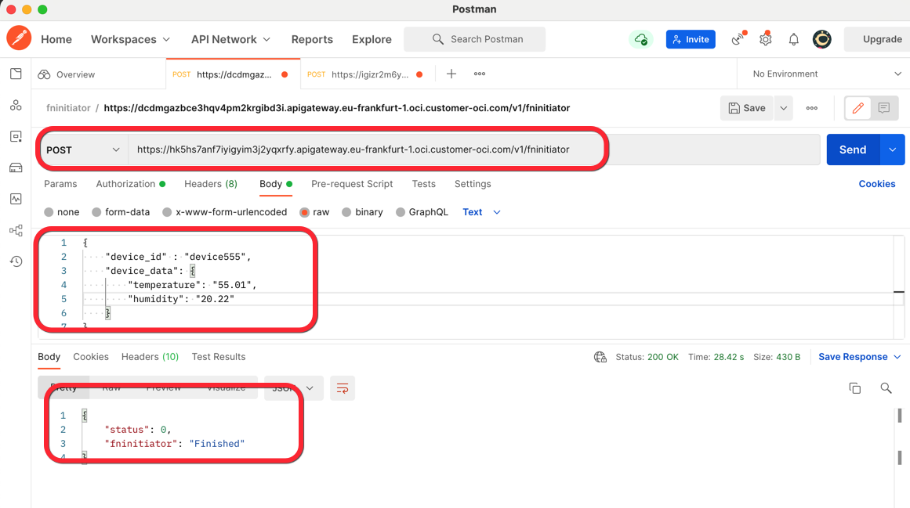
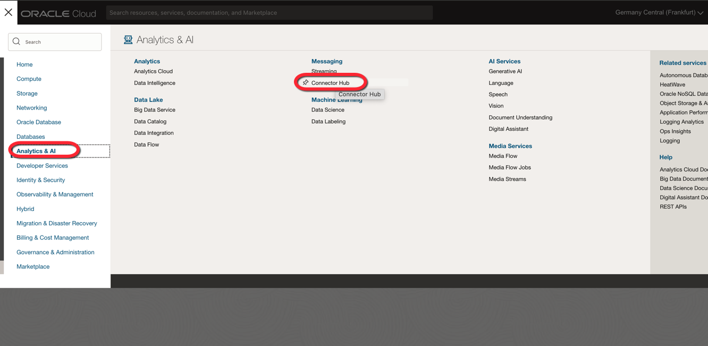
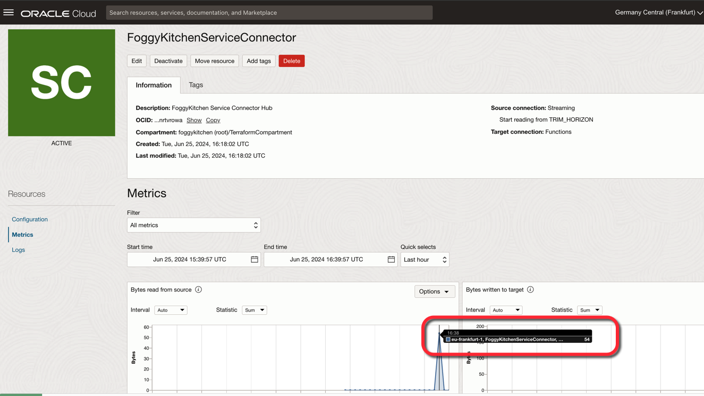
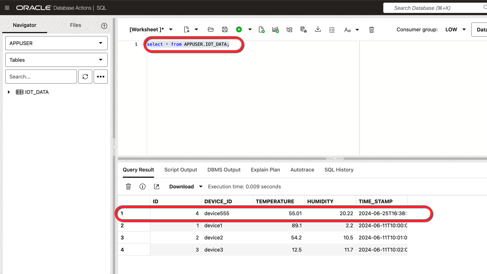

# Lesson 7: Three Functions, API Gateway, Service Connector Hub, Streaming, and ADB

This lesson evolves the event-driven pipeline from [Lesson 6](../lesson6_three_functions_api_gateway_ons_streaming_adb/README.md) by replacing **OCI Notifications Service (ONS)** with **OCI Service Connector Hub (SCH)**.

The public `fninitiator` function is exposed through **API Gateway**. It pushes device data into **OCI Streaming** and returns immediately. **Service Connector Hub** consumes the stream asynchronously and invokes the private `fncollector` function, which persists the records into **Autonomous Database Serverless**.

As in Lesson 6, a third helper function named `fnadbsetup` is invoked by Terraform during `tofu apply`. It prepares the database bootstrap state by creating `APPUSER`, creating the `IOT_DATA` table structures, and loading the initial seed rows used later during validation.


**Figure 1.** Architecture overview for the Service Connector Hub pattern. API Gateway exposes `fninitiator`, Streaming buffers device records, SCH invokes `fncollector`, and `fnadbsetup` bootstraps Autonomous Database before the ingestion flow starts.

---

## What This Lesson Shows

- Three custom OCI Functions under one shared Functions Application
- Public API Gateway in a public subnet
- Functions Application placed in a private subnet
- Reusable VCN, API Gateway, Policy, Streaming, Service Connector Hub, and ADB modules
- Asynchronous trigger flow where `fninitiator` returns before the downstream ADB insert completes
- Bootstrap of ADB schema and seed data through a Terraform-invoked helper function
- Final verification through Service Connector Hub metrics and database query results

---

## Architecture Notes

- `terraform-oci-fk-vcn` creates the public API Gateway subnet and private Functions subnet
- `terraform-oci-fk-api-gateway` exposes the public `POST /v1/fninitiator` route
- `terraform-oci-fk-streaming` creates the stream pool and stream used for buffering device records
- `terraform-oci-fk-sch` creates the Streaming-to-Functions Service Connector that invokes `fncollector`
- `terraform-oci-fk-policy` creates:
  - the tenancy policy that allows API Gateway to invoke Functions
  - the dynamic group and tenancy policies that allow Functions to push to Streaming and use ADB
  - the tenancy policy that allows Service Connector Hub to consume the stream and invoke `fncollector`
- `terraform-oci-fk-adb` creates the Autonomous Database
- `fnadbsetup` is invoked automatically by Terraform and prepares the ADB schema state before application traffic starts

This lesson is intentionally asynchronous:

- `fninitiator` accepts the request and returns quickly
- Service Connector Hub consumes the buffered stream payload separately
- `fncollector` receives the stream payload from SCH and writes it into ADB
- the final proof of success is the new row visible in `APPUSER.IOT_DATA`

---

## Deploy Using Terraform CLI

### Clone The Repository

```bash
git clone https://github.com/foggykitchen/terraform-oci-fk-function.git
cd terraform-oci-fk-function/training/lesson7_three_functions_api_gateway_sch_stream_adb
```

### Prepare Variables

```bash
cp terraform.tfvars.example terraform.tfvars
```

Populate at least:

```hcl
tenancy_ocid          = "ocid1.tenancy.oc1..<your_tenancy_ocid>"
compartment_ocid      = "ocid1.compartment.oc1..<your_compartment_ocid>"
user_ocid             = "ocid1.user.oc1..<your_user_ocid>"
fingerprint           = "<your_api_key_fingerprint>"
private_key_path      = "~/.oci/oci_api_key.pem"
region                = "eu-frankfurt-1"
ocir_user_name        = "<user_name>"
ocir_user_password    = "<user_auth_token>"
adb_admin_password    = "<adb_admin_password>"
adb_app_user_password = "<adb_app_user_password>"
```

### Initialize

```bash
tofu init
```

### Review The Plan

```bash
tofu plan
```

### Apply

```bash
tofu apply
```

During apply, Terraform invokes `fnadbsetup`, so the database is already seeded when the public `fninitiator` route becomes available.

After apply, the lesson outputs:

- `fninitiator_endpoint`

---

## Terminal Smoke Test

Use a payload similar to the one shown in the original Postman validation:

```bash
export FNINITIATOR_URL="$(tofu output -json | jq -r '.api_gateway_endpoints.value.fninitiator_endpoint')"

curl -s -X POST "$FNINITIATOR_URL" \
  -H "Content-Type: application/json" \
  -d '{
    "device_id": "device555",
    "device_data": {
      "temperature": "55.01",
      "humidity": "20.22"
    }
  }' | jq .
```

Expected healthy response:

```json
{
  "status": 0,
  "fninitiator": "Finished",
  "record_count": 1,
  "device_id": "device555"
}
```

Important behavior:

- this response confirms only that `fninitiator` accepted the request and pushed the record into Streaming
- it does **not** mean the row is already visible in ADB
- the downstream insert happens asynchronously through Service Connector Hub and `fncollector`

---

## OCI CLI Validation

You can validate the asynchronous control plane without opening the OCI Console.

Read the Service Connector Hub OCID from Terraform state:

```bash
export SCH_ID="$(printf 'module.fk_sch.service_connector_id\n' | tofu console | tr -d '"')"
```

Confirm that the connector is active:

```bash
oci sch service-connector get --service-connector-id "$SCH_ID" | jq '.data."lifecycle-state"'
```

Expected result:

```json
"ACTIVE"
```

Read the Autonomous Database OCID from Terraform state:

```bash
export ADB_OCID="$(printf 'module.oci-fk-adb.adb_database.adb_database_id\n' | tofu console | tr -d '"')"
```

Generate a temporary wallet with OCI CLI:

```bash
export ADB_WALLET_DIR="$(pwd)/.tmpwallet-lesson7"
rm -rf "$ADB_WALLET_DIR"
mkdir -p "$ADB_WALLET_DIR"

oci db autonomous-database generate-wallet \
  --autonomous-database-id "$ADB_OCID" \
  --password "TmpWallet11" \
  --file "$ADB_WALLET_DIR/adb_wallet.zip"

unzip -o "$ADB_WALLET_DIR/adb_wallet.zip" -d "$ADB_WALLET_DIR" >/dev/null
```

Then query the database through the same Python runtime used by `fncollector`:

```bash
docker run --rm \
  -v "$ADB_WALLET_DIR":/tmp/adb_wallet \
  --entrypoint /usr/bin/python3.11 \
  fra.ocir.io/fr5tvfiq2xhq/fkfn/fncollector:0.0.1 \
  -c "import json, os, oracledb; \
os.environ['TNS_ADMIN']='/tmp/adb_wallet'; \
conn=oracledb.connect(user='APPUSER', password='BEstrO0ng_#11', dsn='foggykitchenadb_medium', config_dir='/tmp/adb_wallet', wallet_location='/tmp/adb_wallet', wallet_password='TmpWallet11'); \
cur=conn.cursor(); \
cur.execute(\"select id, device_id, temperature, humidity from iot_data where device_id = 'device777' order by id desc\"); \
rows=cur.fetchall(); \
cur.close(); \
conn.close(); \
print(json.dumps(rows))"
```

Expected result after the smoke test request:

```json
[[5, "device777", 77.01, 33.22]]
```

This is the terminal-only proof that:

- `fninitiator` accepted the public request
- the stream received the payload
- Service Connector Hub invoked `fncollector`
- `fncollector` inserted the record into `APPUSER.IOT_DATA`

---

## Validate ADB Bootstrap

Before testing the business request, confirm that `fnadbsetup` prepared the schema and inserted the initial seed rows.

1. Open **Oracle Database** and navigate to **Autonomous Database**.
2. Open **Database Actions** for the created database.
3. Start the SQL worksheet.
4. Run:

```sql
select * from APPUSER.IOT_DATA;
```

You should see the initial seed rows created by `fnadbsetup`.

---

## Validate The Asynchronous Flow

1. Send the `POST` request to `fninitiator`.
2. Confirm that the HTTP response returned `status = 0`.
3. In the OCI Console, open **Analytics & AI** -> **Service Connector Hub**.
4. Confirm that the connector metrics increased after the request.
5. Open the SQL worksheet again and run:

```sql
select * from APPUSER.IOT_DATA;
```

6. Confirm that the new `device555` record is now present.

Because this lesson is asynchronous, the final row can appear a short moment after the HTTP response already returned `status = 0`.



**Figure 2.** Postman sends the public `POST /v1/fninitiator` request with the device payload that will later be written into Streaming and then into ADB through Service Connector Hub.



**Figure 3.** OCI Console navigation into Service Connector Hub for this lesson after the request has been executed.



**Figure 4.** Service Connector Hub metrics confirm that the connector consumed messages from Streaming and delivered them to the target function.



**Figure 5.** Final query result from `APPUSER.IOT_DATA` includes the new `device555` row, which is the end-to-end proof that the asynchronous pipeline completed successfully.

---

## Destroy

```bash
tofu destroy
```

---

## Related Resources

- [Training index](../README.md)
- [Lesson 6: Three Functions, API Gateway, ONS, Streaming, and ADB](../lesson6_three_functions_api_gateway_ons_streaming_adb/README.md)
- [FoggyKitchen OCI VCN Module](https://github.com/foggykitchen/terraform-oci-fk-vcn)
- [FoggyKitchen OCI Policy Module](https://github.com/foggykitchen/terraform-oci-fk-policy)
- [FoggyKitchen OCI API Gateway Module](https://github.com/foggykitchen/terraform-oci-fk-api-gateway)
- [FoggyKitchen OCI Streaming Module](https://github.com/foggykitchen/terraform-oci-fk-streaming)
- [FoggyKitchen OCI Service Connector Hub Module](https://github.com/foggykitchen/terraform-oci-fk-sch)
- [FoggyKitchen OCI ADB Module](https://github.com/foggykitchen/terraform-oci-fk-adb)

---

## License

Licensed under the **Universal Permissive License (UPL), Version 1.0**.
See [LICENSE](../../LICENSE) for details.

---

© 2026 [FoggyKitchen.com](https://foggykitchen.com) - Cloud. Code. Clarity.
