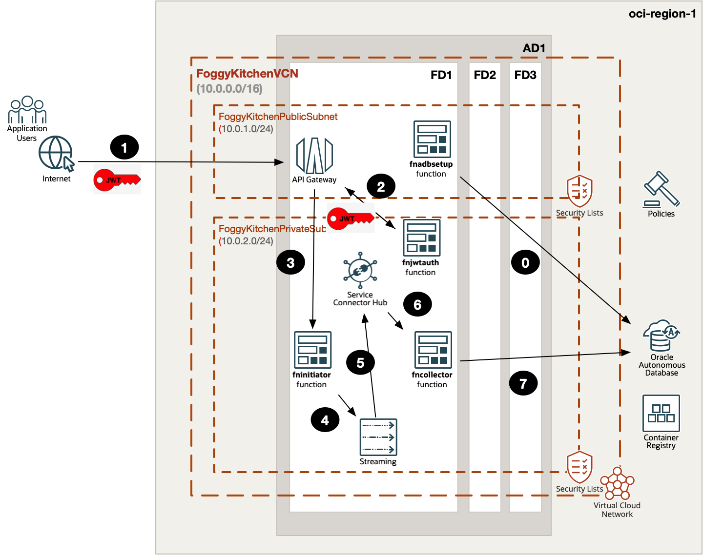
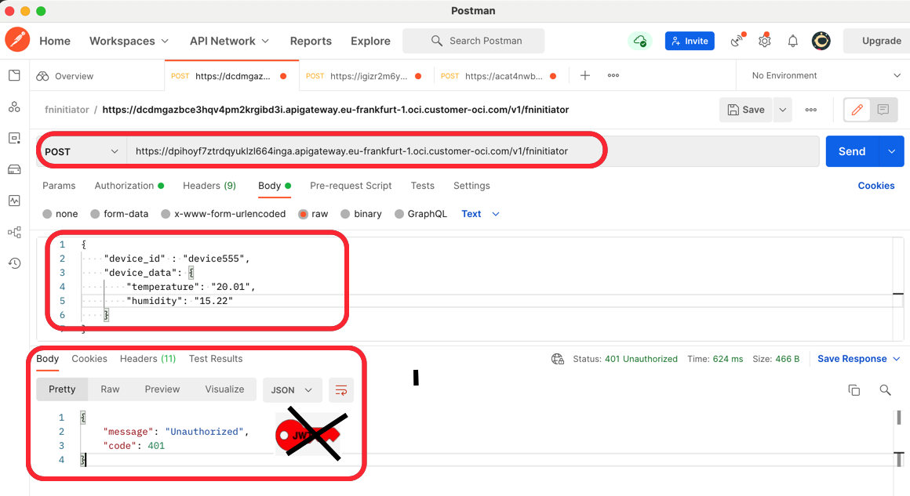
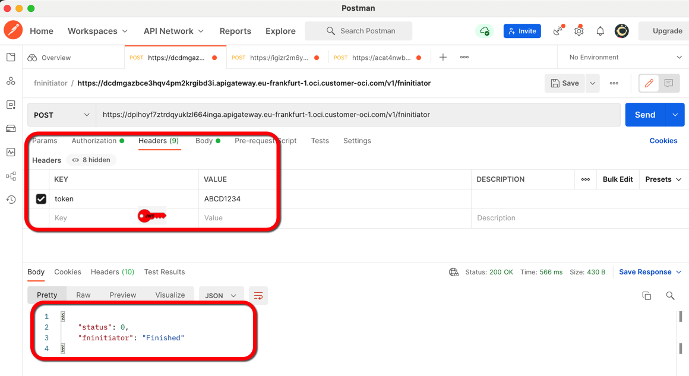
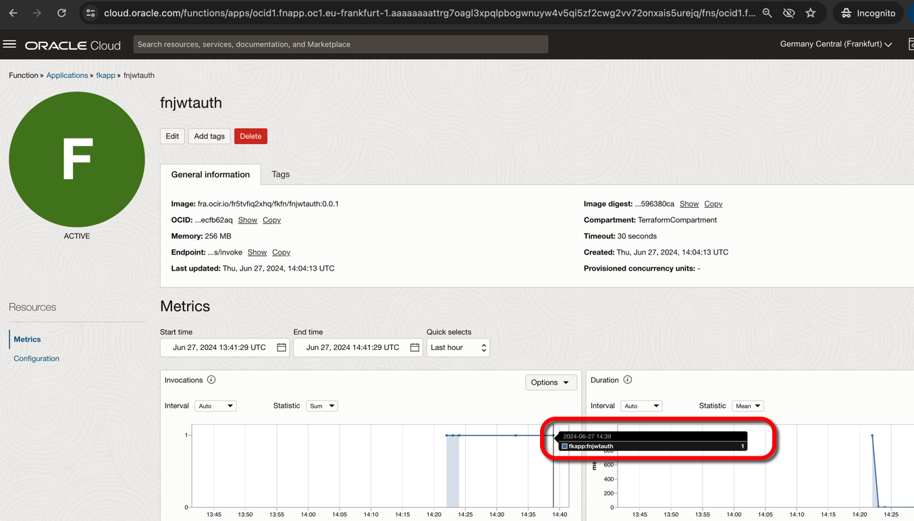
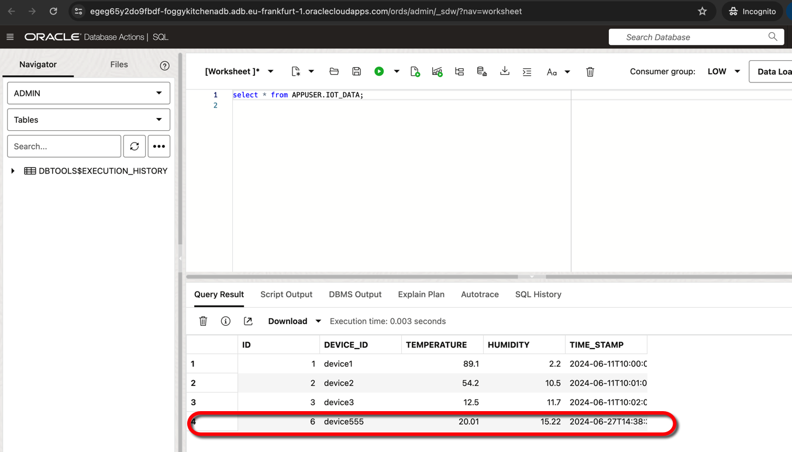

# Lesson 8: Four Functions, API Gateway with JWT Auth, Service Connector Hub, Streaming, and ADB

This lesson extends the event-driven ingestion pattern from [Lesson 7](../lesson7_three_functions_api_gateway_sch_stream_adb/README.md) by adding a custom JWT authorization function in front of the public API route.

The public `fninitiator` function is exposed through **API Gateway**, but access is now protected by a fourth function named `fnjwtauth`. API Gateway invokes `fnjwtauth` first. Only requests with a valid token header are allowed to continue to `fninitiator`.

After authorization succeeds, `fninitiator` writes device data into **OCI Streaming** and returns immediately. **OCI Service Connector Hub (SCH)** consumes the stream asynchronously and invokes `fncollector`, which writes the records into **Autonomous Database Serverless**. As in Lesson 7, the helper function `fnadbsetup` is invoked by Terraform during `tofu apply` to bootstrap the database schema and seed rows before application traffic starts.



**Figure 1.** Architecture overview for the JWT-protected ingestion pattern. API Gateway first invokes `fnjwtauth`, then forwards authorized requests to `fninitiator`, which pushes data to Streaming. Service Connector Hub invokes `fncollector`, and `fnadbsetup` prepares Autonomous Database during deployment.

---

## What This Lesson Shows

- Four custom OCI Functions under one shared Functions Application
- Public API Gateway route protected by a custom JWT authorization function
- Functions Application placed in a private subnet
- Reusable VCN, API Gateway, Policy, Streaming, Service Connector Hub, and ADB modules
- Asynchronous ingest flow where authorization and request acceptance are synchronous, but the final ADB insert is asynchronous
- Bootstrap of ADB schema and seed data through a Terraform-invoked helper function
- Final verification through HTTP `401/200`, SCH state, and database query results

---

## Architecture Notes

- `terraform-oci-fk-vcn` creates the public API Gateway subnet and private Functions subnet
- `terraform-oci-fk-api-gateway` exposes the public `POST /v1/fninitiator` route and configures custom authentication through `fnjwtauth`
- `terraform-oci-fk-streaming` creates the stream pool and stream used for buffering device records
- `terraform-oci-fk-sch` creates the Streaming-to-Functions Service Connector that invokes `fncollector`
- `terraform-oci-fk-policy` creates:
  - the tenancy policy that allows API Gateway to invoke Functions
  - the dynamic group and tenancy policies that allow Functions to push to Streaming and use ADB
  - the tenancy policy that allows Service Connector Hub to consume the stream and invoke `fncollector`
- `terraform-oci-fk-adb` creates the Autonomous Database
- `fnadbsetup` is invoked automatically by Terraform and prepares the ADB schema state before application traffic starts

This lesson is intentionally split between synchronous and asynchronous stages:

- `fnjwtauth` validates the incoming token
- `fninitiator` accepts the request and returns quickly after writing to Streaming
- Service Connector Hub consumes the buffered stream payload separately
- `fncollector` receives the stream payload from SCH and writes it into ADB
- the final proof of success is the new row visible in `APPUSER.IOT_DATA`

Step mapping from the architecture diagram:

- `0` `fnadbsetup` bootstraps ADB
- `1` client sends the public request to API Gateway
- `2` API Gateway invokes `fninitiator` only after `fnjwtauth` accepts the token
- `3` `fninitiator` writes the payload to Streaming
- `4` Service Connector Hub consumes the stream
- `5` SCH invokes `fncollector`
- `6` `fncollector` inserts the record into ADB

---

## Deploy Using Terraform CLI

### Clone The Repository

```bash
git clone https://github.com/foggykitchen/terraform-oci-fk-function.git
cd terraform-oci-fk-function/training/lesson8_four_functions_api_gateway_jwt_sch_stream_adb
```

### Prepare Variables

```bash
cp terraform.tfvars.example terraform.tfvars
```

Populate at least:

```hcl
tenancy_ocid          = "ocid1.tenancy.oc1..<your_tenancy_ocid>"
compartment_ocid      = "ocid1.compartment.oc1..<your_compartment_ocid>"
user_ocid             = "ocid1.user.oc1..<your_user_ocid>"
fingerprint           = "<your_api_key_fingerprint>"
private_key_path      = "~/.oci/oci_api_key.pem"
region                = "eu-frankfurt-1"
ocir_user_name        = "<user_name>"
ocir_user_password    = "<user_auth_token>"
adb_admin_password    = "<adb_admin_password>"
adb_app_user_password = "<adb_app_user_password>"
fn_jwt_token          = "ABCD1234"
```

### Initialize

```bash
tofu init
```

### Review The Plan

```bash
tofu plan
```

### Apply

```bash
tofu apply
```

During apply, Terraform invokes `fnadbsetup`, so the database is already seeded when the protected `fninitiator` route becomes available.

After apply, the lesson outputs:

- `fninitiator_endpoint`
- `fn_jwt_token`

---

## Terminal Smoke Test

Read the route URL and token from outputs:

```bash
export FNINITIATOR_URL="$(tofu output -json | jq -r '.api_gateway_endpoints.value.fninitiator_endpoint')"
export FN_JWT_TOKEN="$(tofu output -json | jq -r '.fn_jwt_token.value')"
```

### Unauthorized Request

Send the request without the JWT token header:

```bash
curl -i -s -X POST \
  "$FNINITIATOR_URL?device_id=device888&temperature=88.01&humidity=44.22"
```

Expected healthy unauthorized result:

```text
HTTP/2 401
www-authenticate: API-key
...
{"code":401,"message":"Unauthorized"}
```

### Authorized Request

Repeat the request with the valid token. In this lesson the verified stable path is to pass the payload through query parameters after custom authentication:

```bash
curl -s -X POST \
  "$FNINITIATOR_URL?device_id=device888&temperature=88.01&humidity=44.22" \
  -H "token: $FN_JWT_TOKEN" | jq .
```

Expected healthy response:

```json
{
  "status": 0,
  "fninitiator": "Finished",
  "record_count": 1,
  "device_id": "device888"
}
```

Important behavior:

- `401` proves that API Gateway called `fnjwtauth` and blocked unauthorized traffic
- `200` proves that the same route was accepted only after successful JWT validation
- this response still confirms only request acceptance and Streaming write
- the downstream insert into ADB happens asynchronously through SCH and `fncollector`

---

## OCI CLI Validation

You can validate the asynchronous control plane without opening the OCI Console.

Read the Service Connector Hub OCID from Terraform state:

```bash
export SCH_ID="$(printf 'module.fk_sch.service_connector_id\n' | tofu console | tr -d '"')"
```

Confirm that the connector is active:

```bash
oci sch service-connector get --service-connector-id "$SCH_ID" | jq '.data."lifecycle-state"'
```

Expected result:

```json
"ACTIVE"
```

Read the Autonomous Database OCID from Terraform state:

```bash
export ADB_OCID="$(printf 'module.oci-fk-adb.adb_database.adb_database_id\n' | tofu console | tr -d '"')"
```

Generate a temporary wallet with OCI CLI:

```bash
export ADB_WALLET_DIR="$(pwd)/.tmpwallet-lesson8"
rm -rf "$ADB_WALLET_DIR"
mkdir -p "$ADB_WALLET_DIR"

oci db autonomous-database generate-wallet \
  --autonomous-database-id "$ADB_OCID" \
  --password "TmpWallet11" \
  --file "$ADB_WALLET_DIR/adb_wallet.zip"

unzip -o "$ADB_WALLET_DIR/adb_wallet.zip" -d "$ADB_WALLET_DIR" >/dev/null
```

Then query the database through the same Python runtime used by `fncollector`:

```bash
docker run --rm \
  -v "$ADB_WALLET_DIR":/tmp/adb_wallet \
  -e TNS_ADMIN=/tmp/adb_wallet \
  --entrypoint /usr/bin/python3.11 \
  fra.ocir.io/fr5tvfiq2xhq/fkfn/fncollector:0.0.1 \
  -c "import json, oracledb; \
conn=oracledb.connect(user='APPUSER', password='BEstrO0ng_#11', dsn='foggykitchenadb_tp', config_dir='/tmp/adb_wallet', wallet_location='/tmp/adb_wallet', wallet_password='TmpWallet11'); \
cur=conn.cursor(); \
cur.execute(\"select id, device_id, temperature, humidity from iot_data where device_id = 'device888' order by id desc\"); \
rows=cur.fetchall(); \
cur.close(); \
conn.close(); \
print(json.dumps(rows))"
```

Expected result after the authorized smoke test request:

```json
[[5, "device888", 88.01, 44.22]]
```

This is the terminal-only proof that:

- API Gateway enforced custom authentication
- `fninitiator` accepted the authorized request
- the stream received the payload
- Service Connector Hub invoked `fncollector`
- `fncollector` inserted the record into `APPUSER.IOT_DATA`

---

## Validate ADB Bootstrap

Before testing the business request, confirm that `fnadbsetup` prepared the schema and inserted the initial seed rows. You can use the same wallet and runtime shown above, but run a broader query:

```bash
docker run --rm \
  -v "$ADB_WALLET_DIR":/tmp/adb_wallet \
  -e TNS_ADMIN=/tmp/adb_wallet \
  --entrypoint /usr/bin/python3.11 \
  fra.ocir.io/fr5tvfiq2xhq/fkfn/fncollector:0.0.1 \
  -c "import json, oracledb; \
conn=oracledb.connect(user='APPUSER', password='BEstrO0ng_#11', dsn='foggykitchenadb_tp', config_dir='/tmp/adb_wallet', wallet_location='/tmp/adb_wallet', wallet_password='TmpWallet11'); \
cur=conn.cursor(); \
cur.execute(\"select id, device_id, temperature, humidity from iot_data order by id\"); \
rows=cur.fetchall(); \
cur.close(); \
conn.close(); \
print(json.dumps(rows))"
```

The initial rows prove that `fnadbsetup` completed during `tofu apply`. The later `device888` row proves that the protected ingestion path also worked.

---

## OCI Console Verification



**Figure 2.** First validation call without the `token` header. API Gateway rejects the request with `401 Unauthorized`, which confirms that `fnjwtauth` is actively protecting the route.



**Figure 3.** Second validation call with the correct `token` header. The request is accepted and reaches `fninitiator`, which returns a successful JSON response.



**Figure 4.** Metrics view for the JWT authorizer function. This confirms that `fnjwtauth` was invoked during the protected API Gateway flow.



**Figure 5.** SQL verification of the final ADB state. The inserted row confirms that the authorized request was processed asynchronously through Streaming, SCH, and `fncollector`.

---

## Destroy

```bash
tofu destroy
```

---

## Contributing

Pull requests are welcome. For major changes, open an issue first to discuss what you would like to change.

---

## License

Licensed under the **Universal Permissive License (UPL), Version 1.0**.

© 2026 [FoggyKitchen.com](https://foggykitchen.com) - Cloud. Code. Clarity.
