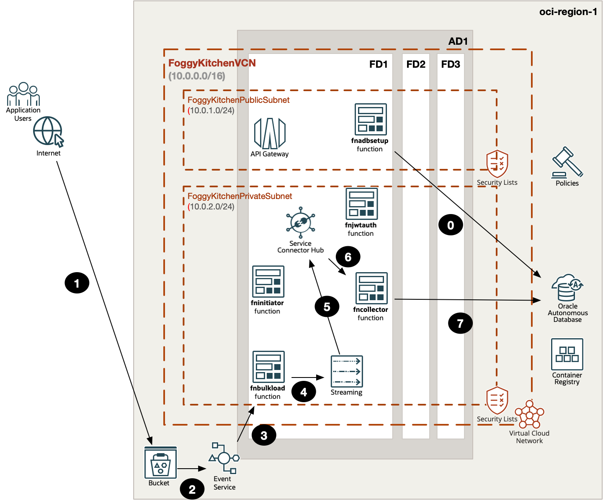
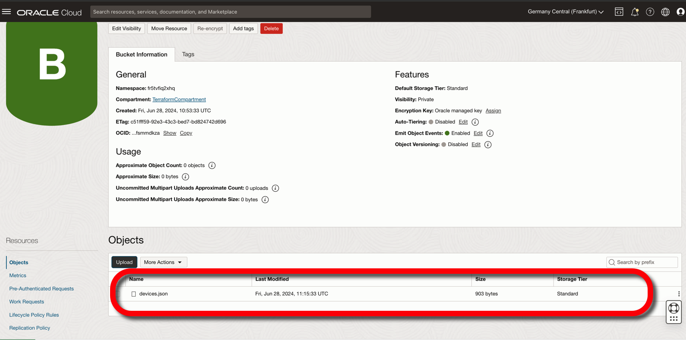
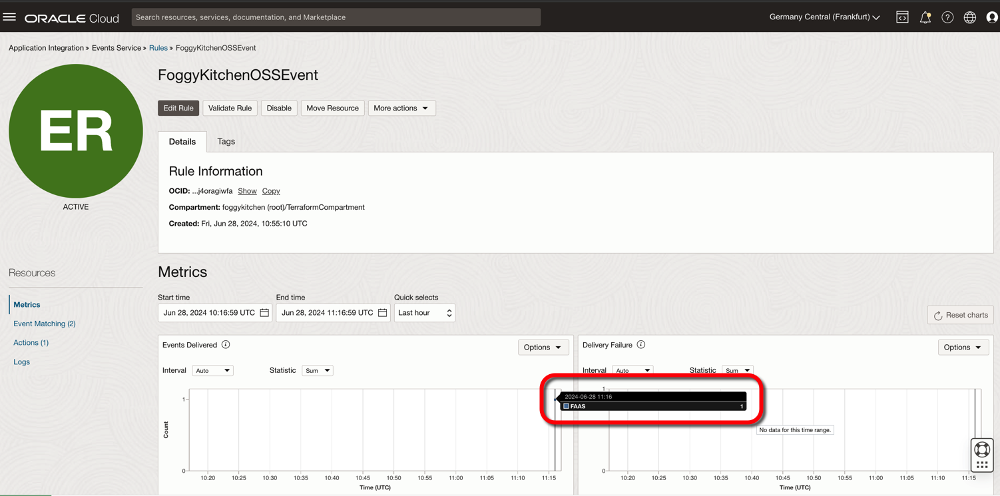
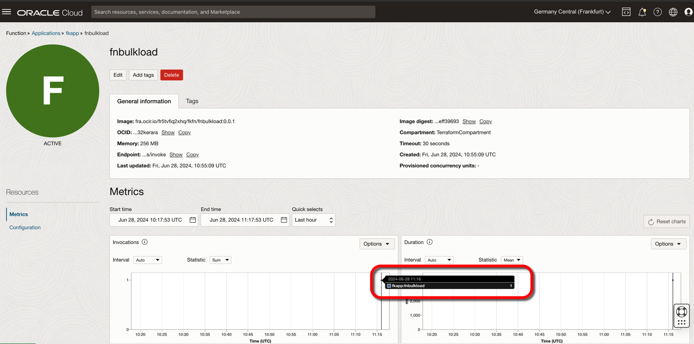
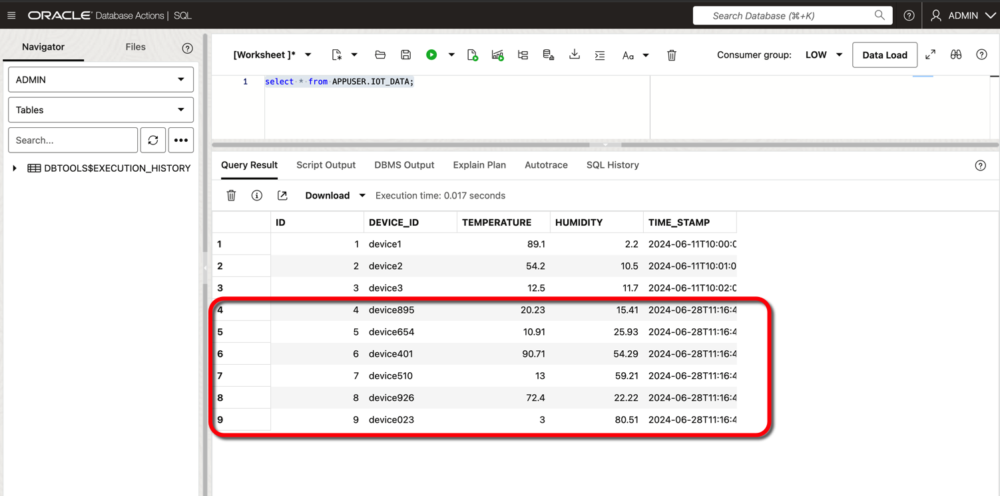

# FoggyKitchen OCI Function with Terraform 

## LESSON 9 - Five Functions, API Gateway with JWT Token Auth, Service Connector Hub, Streaming, ADB-S, OSS Bucket and Event Services

In this ninth lesson, we will introduce a new function named `fnbulkload`. This function will be automatically triggered by an OCI Event emitted when a new file is uploaded to an Object Storage Bucket. The function will access the Bucket and read the uploaded file. We will upload the [devices.json](lesson9_five_functions_api_gateway_jwt_sch_stream_adb_bucket_event/examples/devices.json) file from the [examples](lesson9_five_functions_api_gateway_jwt_sch_stream_adb_bucket_event/examples/) subdirectory, which contains an array of device data. The `fnbulkload` function will extract all the records from the file and put them into the stream. The rest of the workflow will deliver these records into ATP-S using the Service Connector Hub and the `fncollector` function. This setup provides us with two channels for uploading data into the database: one channel via API Gateway for posting singular measurements, and the second one for bulk loading via JSON files uploaded to the OSS bucket.



## Deploy Using Oracle Resource Manager

1. Click [](https://cloud.oracle.com/resourcemanager/stacks/create?region=home&zipUrl=https://github.com/mlinxfeld/terraform-oci-fk-function/releases/latest/download/terraform-oci-fk-function-lesson9.zip)

    If you aren't already signed in, when prompted, enter the tenancy and user credentials.

2. Review and accept the terms and conditions.

3. Select the region where you want to deploy the stack.

4. Follow the on-screen prompts and instructions to create the stack.

5. After creating the stack, click **Terraform Actions**, and select **Plan**.

6. Wait for the job to be completed, and review the plan.

    To make any changes, return to the Stack Details page, click **Edit Stack**, and make the required changes. Then, run the **Plan** action again.

7. If no further changes are necessary, return to the Stack Details page, click **Terraform Actions**, and select **Apply**. 

## Deploy Using the Terraform CLI in Cloud Shell

### Clone of the repo into OCI Cloud Shell

Now, you'll want a local copy of this repo. You can make that with the commands:
Clone the repo from github by executing the command as follows and then go to proper subdirectory:

```
martin_lin@codeeditor:~ (eu-frankfurt-1)$ git clone https://github.com/mlinxfeld/terraform-oci-fk-function.git

martin_lin@codeeditor:~ (eu-frankfurt-1)$ cd terraform-oci-fk-function

martin_lin@codeeditor:terraform-oci-fk-adb (eu-frankfurt-1)$ cd training/lesson9_five_functions_api_gateway_jwt_sch_stream_adb_bucket_event/
```

### Prerequisites
Create environment file with terraform.tfvars file starting with example file:

```
martin_lin@codeeditor:lesson9_five_functions_api_gateway_jwt_sch_stream_adb_bucket_event (eu-frankfurt-1)$ cp terraform.tfvars.example terraform.tfvars

martin_lin@codeeditor:lesson9_five_functions_api_gateway_jwt_sch_stream_adb_bucket_event (eu-frankfurt-1)$ vi terraform.tfvars

tenancy_ocid          = "ocid1.tenancy.oc1..<your_tenancy_ocid>"
compartment_ocid      = "ocid1.compartment.oc1..<your_comparment_ocid>"
region                = "<oci_region>"
ocir_user_name        = "<user_name>"
ocir_user_password    = "<user_auth_token>"
adb_admin_password    = "<adb_admin_password>"
adb_app_user_password = "<adb_app_user_password>"
```

### Initialize Terraform

Run the following command to initialize Terraform environment:

```
martin_lin@codeeditor:lesson9_five_functions_api_gateway_jwt_sch_stream_adb_bucket_event (eu-frankfurt-1)$ terraform init 

Initializing the backend...
Downloading git::https://github.com/mlinxfeld/terraform-oci-fk-adb.git for oci-fk-adb...
- oci-fk-adb in .terraform/modules/oci-fk-adb
Downloading git::https://github.com/mlinxfeld/terraform-oci-fk-function.git for oci-fk-adb-setup-function...
- oci-fk-adb-setup-function in .terraform/modules/oci-fk-adb-setup-function
Downloading git::https://github.com/mlinxfeld/terraform-oci-fk-function.git for oci-fk-bulk-load-function...
- oci-fk-bulk-load-function in .terraform/modules/oci-fk-bulk-load-function
Downloading git::https://github.com/mlinxfeld/terraform-oci-fk-function.git for oci-fk-collector-function...
- oci-fk-collector-function in .terraform/modules/oci-fk-collector-function
Downloading git::https://github.com/mlinxfeld/terraform-oci-fk-function.git for oci-fk-initiator-function...
- oci-fk-initiator-function in .terraform/modules/oci-fk-initiator-function
Downloading git::https://github.com/mlinxfeld/terraform-oci-fk-function.git for oci-fk-jwt-auth-function...
- oci-fk-jwt-auth-function in .terraform/modules/oci-fk-jwt-auth-function

Initializing provider plugins...
- Finding latest version of hashicorp/local...
- Finding latest version of hashicorp/null...
- Finding latest version of hashicorp/oci...
- Using previously-installed hashicorp/local v2.5.1
- Using previously-installed hashicorp/null v3.2.2
- Installing hashicorp/oci v5.46.0...
- Installed hashicorp/oci v5.46.0 (unauthenticated)

Terraform has made some changes to the provider dependency selections recorded
in the .terraform.lock.hcl file. Review those changes and commit them to your
version control system if they represent changes you intended to make.

Terraform has been successfully initialized!

You may now begin working with Terraform. Try running "terraform plan" to see
any changes that are required for your infrastructure. All Terraform commands
should now work.

If you ever set or change modules or backend configuration for Terraform,
rerun this command to reinitialize your working directory. If you forget, other
commands will detect it and remind you to do so if necessary.
```

### Apply the changes 

Run the following command for applying changes with the proposed plan:

```
martin_lin@codeeditor:lesson9_five_functions_api_gateway_jwt_sch_stream_adb_bucket_event (eu-frankfurt-1)$ terraform apply 

data.local_file.fninitiator_dockerfile: Reading...
data.local_file.fncollector_dockerfile: Reading...

(...)

  # module.oci-fk-jwt-auth-function.oci_functions_function.FoggyKitchenFn will be created
  + resource "oci_functions_function" "FoggyKitchenFn" {
      + application_id     = (known after apply)
      + compartment_id     = (known after apply)
      + config             = {
          + "FN_JWT_TOKEN" = "ABCD1234"
        }
      + defined_tags       = (known after apply)
      + display_name       = "fnjwtauth"
      + freeform_tags      = (known after apply)
      + id                 = (known after apply)
      + image              = "fra.ocir.io/fr5tvfiq2xhq/fkfn/fnjwtauth:0.0.1"
      + image_digest       = (known after apply)
      + invoke_endpoint    = (known after apply)
      + memory_in_mbs      = "256"
      + shape              = (known after apply)
      + state              = (known after apply)
      + time_created       = (known after apply)
      + time_updated       = (known after apply)
      + timeout_in_seconds = 30
    }

Plan: 64 to add, 0 to change, 0 to destroy.

Changes to Outputs:
  + api_gateway_endpoints = {
      + fninitiator_endpoint = (known after apply)
    }
  + fn_jwt_token          = "ABCD1234"

Do you want to perform these actions?
  Terraform will perform the actions described above.
  Only 'yes' will be accepted to approve.

  Enter a value: yes

(...)

oci_sch_service_connector.FoggyKitchenServiceConnector: Creating...
oci_sch_service_connector.FoggyKitchenServiceConnector: Creation complete after 1s [id=ocid1.serviceconnector.oc1.eu-frankfurt-1.amaaaaaadngk4giagbxm35qhek4ypjgdpd3orbqv4jigzczy6ialolcdnjwa]
module.oci-fk-adb-setup-function.null_resource.FoggyKitchenFnInvoke[0]: Still creating... [20s elapsed]
module.oci-fk-adb-setup-function.null_resource.FoggyKitchenFnInvoke[0]: Still creating... [30s elapsed]
module.oci-fk-adb-setup-function.null_resource.FoggyKitchenFnInvoke[0]: Provisioning with 'local-exec'...
module.oci-fk-adb-setup-function.null_resource.FoggyKitchenFnInvoke[0] (local-exec): Executing: ["/bin/sh" "-c" "oci raw-request --http-method POST --target-uri https://rt3d6oipj7q.eu-frankfurt-1.functions.oci.oraclecloud.com/20181201/functions/ocid1.fnfunc.oc1.eu-frankfurt-1.aaaaaaaagckmqv6z2nvgcdiznxcsvnrjjd2ki4qlkmqhjyh2pckliwrfsvnq/actions/invoke --request-body '' "]
module.oci-fk-adb-setup-function.null_resource.FoggyKitchenFnInvoke[0]: Still creating... [40s elapsed]
module.oci-fk-adb-setup-function.null_resource.FoggyKitchenFnInvoke[0]: Still creating... [50s elapsed]
module.oci-fk-adb-setup-function.null_resource.FoggyKitchenFnInvoke[0]: Still creating... [1m0s elapsed]
module.oci-fk-adb-setup-function.null_resource.FoggyKitchenFnInvoke[0]: Still creating... [1m10s elapsed]
module.oci-fk-adb-setup-function.null_resource.FoggyKitchenFnInvoke[0]: Still creating... [1m20s elapsed]
module.oci-fk-adb-setup-function.null_resource.FoggyKitchenFnInvoke[0]: Still creating... [1m30s elapsed]
module.oci-fk-adb-setup-function.null_resource.FoggyKitchenFnInvoke[0] (local-exec): {
module.oci-fk-adb-setup-function.null_resource.FoggyKitchenFnInvoke[0] (local-exec):   "data": "",
module.oci-fk-adb-setup-function.null_resource.FoggyKitchenFnInvoke[0] (local-exec):   "headers": {
module.oci-fk-adb-setup-function.null_resource.FoggyKitchenFnInvoke[0] (local-exec):     "Content-Length": "0",
module.oci-fk-adb-setup-function.null_resource.FoggyKitchenFnInvoke[0] (local-exec):     "Content-Type": "text/plain",
module.oci-fk-adb-setup-function.null_resource.FoggyKitchenFnInvoke[0] (local-exec):     "Date": "Fri, 28 Jun 2024 11:14:20 GMT",
module.oci-fk-adb-setup-function.null_resource.FoggyKitchenFnInvoke[0] (local-exec):     "Fn-Call-Id": "01J1F8SDC81BT0JF8ZJ027B14B",
module.oci-fk-adb-setup-function.null_resource.FoggyKitchenFnInvoke[0] (local-exec):     "Fn-Fdk-Runtime": "python/3.8.17 final",
module.oci-fk-adb-setup-function.null_resource.FoggyKitchenFnInvoke[0] (local-exec):     "Fn-Fdk-Version": "fdk-python/0.1.74",
module.oci-fk-adb-setup-function.null_resource.FoggyKitchenFnInvoke[0] (local-exec):     "Opc-Request-Id": "8C2F4CFCD95A4838B2DE7CBF13B4A622/01J1F8SD92000000000048284F/01J1F8SD92000000000048284G"
module.oci-fk-adb-setup-function.null_resource.FoggyKitchenFnInvoke[0] (local-exec):   },
module.oci-fk-adb-setup-function.null_resource.FoggyKitchenFnInvoke[0] (local-exec):   "status": "200 OK"
module.oci-fk-adb-setup-function.null_resource.FoggyKitchenFnInvoke[0] (local-exec): }
module.oci-fk-adb-setup-function.null_resource.FoggyKitchenFnInvoke[0]: Creation complete after 1m35s [id=8889759373892056855]

Apply complete! Resources: 64 added, 0 changed, 0 destroyed.

Outputs:

api_gateway_endpoints = {
  "fninitiator_endpoint" = "https://dpihoyf7ztrdqyuklzl664inga.apigateway.eu-frankfurt-1.oci.customer-oci.com/v1/fninitiator"
}
fn_jwt_token = "ABCD1234"


```

### Validate the deployment

1. Upload [devices.json](lesson9_five_functions_api_gateway_jwt_sch_stream_adb_bucket_event/examples/devices.json) file into OSS Bucket:



2. Confirm that event has been emitted:



3. Confirm that `fnbulkload` function has been triggered:



4. Run a SQL query to select data from the `APPUSER.IOT_DATA` table to confirm that `fncollector` was successful with the insert:



### Destroy the changes 

Run the following command for destroying all resources:

```
martin_lin@codeeditor:lesson8_four_functions_api_gateway_jwt_sch_stream_adb (eu-fankfurt-1)$ terraform destroy 
module.oci-fk-adb.random_password.wallet_password: Refreshing state... [id=none]
data.local_file.fncollector_func_yaml: Reading...
data.local_file.fnadbsetup_func_py: Reading...
data.local_file.fnjwtauth_requirements_txt: Reading...
data.local_file.fncollector_requirements_txt: Reading...
data.local_file.fnadbsetup_requirements_txt: Reading...
data.local_file.fnadbsetup_dockerfile: Reading...
data.local_file.fnjwtauth_func_yaml: Reading...

(...)

 # module.oci-fk-jwt-auth-function.oci_functions_function.FoggyKitchenFn will be destroyed
  - resource "oci_functions_function" "FoggyKitchenFn" {
      - application_id     = "ocid1.fnapp.oc1.eu-frankfurt-1.aaaaaaaattrg7oagl3xpqlpbogwnuyw4v5qi5zf2cwg2vv72onxais5urejq" -> null
      - compartment_id     = "ocid1.compartment.oc1..aaaaaaaaiyy4srmrb32v5rlniicwmpxsytywiucgbcp5ext6e4ahjfuloewa" -> null
      - config             = {
          - "FN_JWT_TOKEN" = "ABCD1234"
        } -> null
      - defined_tags       = {} -> null
      - display_name       = "fnjwtauth" -> null
      - freeform_tags      = {} -> null
      - id                 = "ocid1.fnfunc.oc1.eu-frankfurt-1.aaaaaaaasmetfl223366h6dd2jcmte4kzv6bz22mzr74pxff32nyecfb62aq" -> null
      - image              = "fra.ocir.io/fr5tvfiq2xhq/fkfn/fnjwtauth:0.0.1" -> null
      - image_digest       = "sha256:a389f594bad383ee46a4f9594de6ea15f0bd11c6bb20964a03f88945596380ca" -> null
      - invoke_endpoint    = "https://nxais5urejq.eu-frankfurt-1.functions.oci.oraclecloud.com" -> null
      - memory_in_mbs      = "256" -> null
      - shape              = "GENERIC_ARM" -> null
      - state              = "ACTIVE" -> null
      - time_created       = "2024-06-27 14:04:13.367 +0000 UTC" -> null
      - time_updated       = "2024-06-27 14:04:13.367 +0000 UTC" -> null
      - timeout_in_seconds = 30 -> null

      - trace_config {
          - is_enabled = false -> null
        }
    }

Plan: 0 to add, 0 to change, 64 to destroy.

Changes to Outputs:
  - api_gateway_endpoints = {
      - fninitiator_endpoint = "https://dpihoyf7ztrdqyuklzl664inga.apigateway.eu-frankfurt-1.oci.customer-oci.com/v1/fninitiator"
    } -> null
  - fn_jwt_token          = "ABCD1234" -> null

Do you really want to destroy all resources?
  Terraform will destroy all your managed infrastructure, as shown above.
  There is no undo. Only 'yes' will be accepted to confirm.
  
  Enter a value: yes

(...)

module.oci-fk-initiator-function.oci_functions_application.FoggyKitchenFnApp[0]: Still destroying... [id=ocid1.fnapp.oc1.eu-frankfurt-1.aaaaaaaa...bgjswl3e57bsa7oidia4kz7ievbublmkduhy2a, 5m0s elapsed]
module.oci-fk-initiator-function.oci_functions_application.FoggyKitchenFnApp[0]: Destruction complete after 5m0s
oci_core_subnet.FoggyKitchenPrivateSubnet: Destroying... [id=ocid1.subnet.oc1.eu-frankfurt-1.aaaaaaaawchxohylzjrb3btya2ojvrgfq4jv7msftf7pipp3dwrqg6g43sma]
oci_core_subnet.FoggyKitchenPrivateSubnet: Destruction complete after 1s
oci_core_dhcp_options.FoggyKitchenDhcpOptions1: Destroying... [id=ocid1.dhcpoptions.oc1.eu-frankfurt-1.aaaaaaaantfujozxwlr557t5bi7ksibafybccrhvbt6biptklu4bcu6ivnkq]
oci_core_route_table.FoggyKitchenRouteTableViaNAT: Destroying... [id=ocid1.routetable.oc1.eu-frankfurt-1.aaaaaaaa5pnzgtciv56d7bchm22bd43mob67n7sndinqypeg36wyotcfsr7a]
oci_core_security_list.FoggyKitchenSecurityList: Destroying... [id=ocid1.securitylist.oc1.eu-frankfurt-1.aaaaaaaadaelopcbbkxeq4mdxmtmawf6jmvjgnekiui7uqii467cvirojmca]
oci_core_dhcp_options.FoggyKitchenDhcpOptions1: Destruction complete after 0s
oci_core_security_list.FoggyKitchenSecurityList: Destruction complete after 0s
oci_core_route_table.FoggyKitchenRouteTableViaNAT: Destruction complete after 0s
oci_core_nat_gateway.FoggyKitchenNATGateway: Destroying... [id=ocid1.natgateway.oc1.eu-frankfurt-1.aaaaaaaau6ty3quidzqiibz4eu4otelwl4zzjufbi7biqj6pdeejefykaxla]
oci_core_nat_gateway.FoggyKitchenNATGateway: Destruction complete after 1s
oci_core_virtual_network.FoggyKitchenVCN: Destroying... [id=ocid1.vcn.oc1.eu-frankfurt-1.amaaaaaadngk4gia5axoqi77nz6xpkyeedrced5kq65axoaegh44othdd6ma]
oci_core_virtual_network.FoggyKitchenVCN: Destruction complete after 1s

Destroy complete! Resources: 64 destroyed.

```