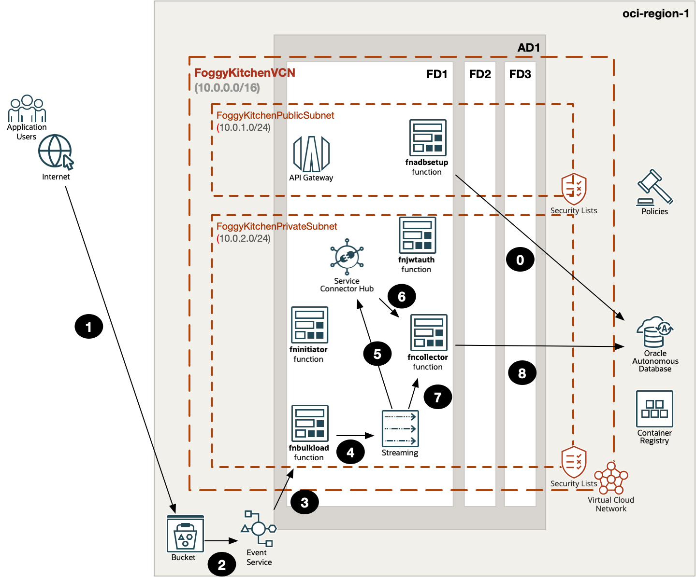
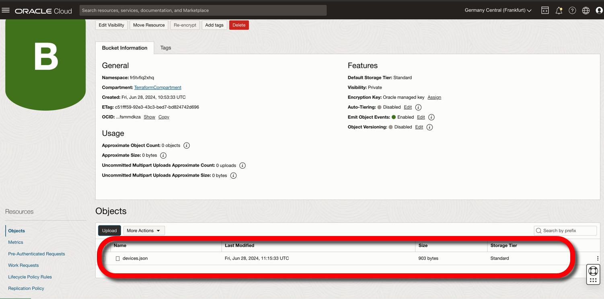
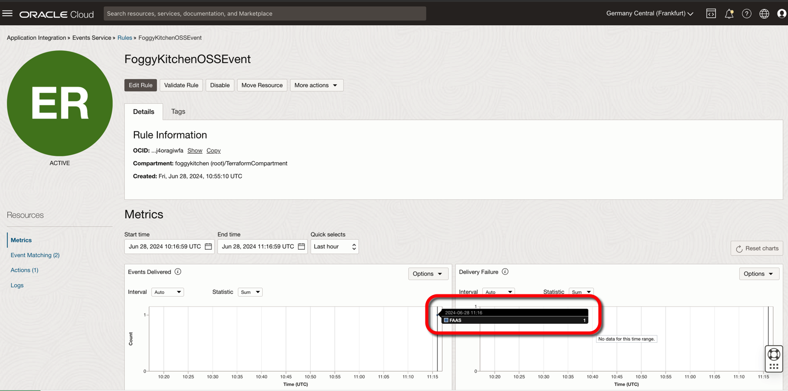
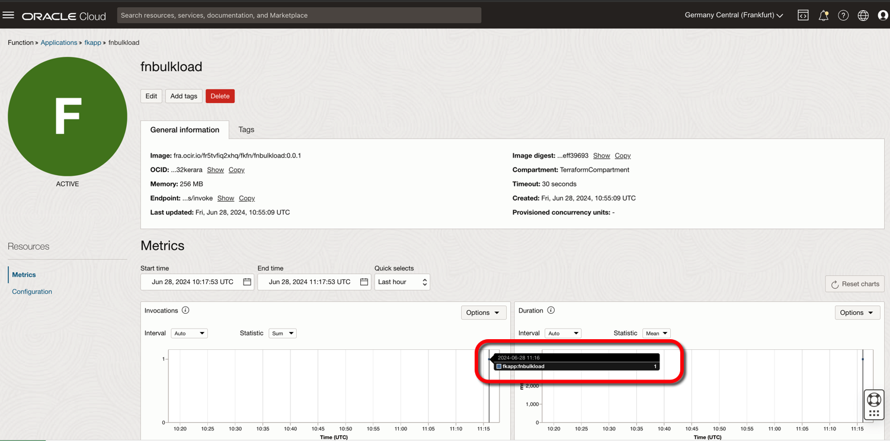
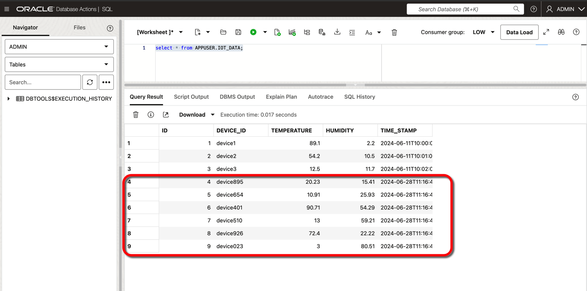

# Lesson 9: Five Functions, API Gateway with JWT Auth, Service Connector Hub, Streaming, ADB, Bucket, and Events

This lesson extends the protected ingestion flow from [Lesson 8](../lesson8_four_functions_api_gateway_jwt_sch_stream_adb/README.md) by adding a second ingestion channel based on **Object Storage** and **OCI Events**.

The first channel remains unchanged:

- API Gateway calls `fnjwtauth`
- authorized requests reach `fninitiator`
- `fninitiator` writes records into **OCI Streaming**
- **Service Connector Hub (SCH)** invokes `fncollector`
- `fncollector` writes the final rows into **Autonomous Database Serverless**

The new second channel is bulk-oriented:

- a JSON file is uploaded into an Object Storage bucket
- **OCI Events** detects the object-create event
- Events invokes `fnbulkload`
- `fnbulkload` reads the uploaded JSON file from the bucket and pushes all records into Streaming
- SCH and `fncollector` handle the downstream insert into ADB in the same way as before

As in Lessons 6-8, `fnadbsetup` is invoked by Terraform during `tofu apply` to prepare the database schema and seed rows before application traffic starts.



**Figure 1.** Architecture overview for the dual-ingestion pattern. API Gateway protects the single-record path with `fnjwtauth`, while Object Storage and OCI Events trigger `fnbulkload` for bulk ingestion. Both channels converge on Streaming, SCH, `fncollector`, and ADB.

---

## What This Lesson Shows

- Five custom OCI Functions under one shared Functions Application
- Public API Gateway route protected by a custom JWT authorization function
- Private Functions Application subnet
- Reusable VCN, API Gateway, Policy, Streaming, SCH, ADB, Object Storage, and Events modules
- Single-record ingestion through API Gateway
- Bulk-record ingestion through `Object Storage -> Events -> fnbulkload`
- Shared downstream processing through Streaming, SCH, and `fncollector`
- Final verification through bucket upload, event trigger, and ADB query results

---

## Architecture Notes

- `terraform-oci-fk-vcn` creates the public API Gateway subnet and private Functions subnet
- `terraform-oci-fk-api-gateway` exposes the public `POST /v1/fninitiator` route and configures custom authentication through `fnjwtauth`
- `terraform-oci-fk-streaming` creates the stream pool and stream used for buffering all device records
- `terraform-oci-fk-sch` creates the Streaming-to-Functions Service Connector that invokes `fncollector`
- `terraform-oci-fk-adb` creates the Autonomous Database
- `terraform-oci-fk-objectstorage` creates the bucket used for bulk JSON uploads
- `terraform-oci-fk-event` creates the `Object Storage -> Functions` Events rule that invokes `fnbulkload`
- `terraform-oci-fk-policy` creates:
  - the tenancy policy that allows API Gateway to invoke Functions
  - the dynamic group and tenancy policies that allow Functions to push to Streaming, read Object Storage, and use ADB
  - the tenancy policy that allows SCH to consume from Streaming and invoke `fncollector`
- `fnadbsetup` is invoked automatically by Terraform and prepares the ADB schema state before application traffic starts

This lesson has two producer paths:

- **Protected API path**: `fnjwtauth -> fninitiator -> Streaming`
- **Bulk file path**: `Object Storage -> OCI Events -> fnbulkload -> Streaming`

Both paths share the same asynchronous sink:

- `Streaming -> SCH -> fncollector -> ADB`

---

## Deploy Using Terraform CLI

### Clone The Repository

```bash
git clone https://github.com/foggykitchen/terraform-oci-fk-function.git
cd terraform-oci-fk-function/training/lesson9_five_functions_api_gateway_jwt_sch_stream_adb_bucket_event
```

### Prepare Variables

```bash
cp terraform.tfvars.example terraform.tfvars
```

Populate at least:

```hcl
tenancy_ocid          = "ocid1.tenancy.oc1..<your_tenancy_ocid>"
compartment_ocid      = "ocid1.compartment.oc1..<your_compartment_ocid>"
user_ocid             = "ocid1.user.oc1..<your_user_ocid>"
fingerprint           = "<your_api_key_fingerprint>"
private_key_path      = "~/.oci/oci_api_key.pem"
region                = "eu-frankfurt-1"
ocir_user_name        = "<user_name>"
ocir_user_password    = "<user_auth_token>"
adb_admin_password    = "<adb_admin_password>"
adb_app_user_password = "<adb_app_user_password>"
fn_jwt_token          = "ABCD1234"
bucket_name           = "FoggyKitchenIOTBucket"
```

### Initialize

```bash
tofu init
```

### Review The Plan

```bash
tofu plan
```

### Apply

```bash
tofu apply
```

During apply, Terraform invokes `fnadbsetup`, so the database is already seeded when both ingestion channels become available.

After apply, the lesson outputs:

- `fninitiator_endpoint`
- `fn_jwt_token`
- `objectstorage_bucket`

---

## Terminal Smoke Test: Protected API Path

Read the route URL and token from outputs:

```bash
export FNINITIATOR_URL="$(tofu output -json | jq -r '.api_gateway_endpoints.value.fninitiator_endpoint')"
export FN_JWT_TOKEN="$(tofu output -json | jq -r '.fn_jwt_token.value')"
```

First confirm that a request without the JWT token is rejected:

```bash
curl -s -X POST \
  "$FNINITIATOR_URL?device_id=device777&temperature=77.01&humidity=33.22"
```

Expected response:

```json
{"code":401,"message":"Unauthorized"}
```

Then call the protected endpoint with the expected token. In this lesson the verified stable path is to pass the payload through query parameters after custom authentication:

```bash
curl -s -X POST \
  "$FNINITIATOR_URL?device_id=device777&temperature=77.01&humidity=33.22" \
  -H "token: $FN_JWT_TOKEN" | jq .
```

Expected healthy response:

```json
{
  "status": 0,
  "fninitiator": "Finished",
  "record_count": 1,
  "device_id": "device777"
}
```

This confirms that the request passed JWT validation and that `fninitiator` pushed the record into Streaming.

---

## Terminal Smoke Test: Bulk Upload Path

Read the bucket details from outputs:

```bash
export BUCKET_NAME="$(tofu output -json | jq -r '.objectstorage_bucket.value.name')"
```

Then upload the sample file under a fresh object name:

```bash
oci os object put \
  --bucket-name "$BUCKET_NAME" \
  --name devices-3.json \
  --file examples/devices.json \
  --force
```

This upload should trigger:

- an Object Storage object-create event
- the OCI Events rule
- `fnbulkload`
- a batch push into Streaming
- six additional rows written into ADB through `SCH -> fncollector`

---

## OCI CLI Validation

You can validate the shared asynchronous pipeline without opening the OCI Console.

Read the SCH OCID:

```bash
export SCH_ID="$(printf 'module.fk_sch.service_connector_id\n' | tofu console | tr -d '"')"
```

Confirm that the connector is active:

```bash
oci sch service-connector get --service-connector-id "$SCH_ID" | jq '.data."lifecycle-state"'
```

Expected result:

```json
"ACTIVE"
```

Read the Autonomous Database OCID:

```bash
export ADB_OCID="$(printf 'module.oci-fk-adb.adb_database.adb_database_id\n' | tofu console | tr -d '"')"
```

Generate a temporary wallet:

```bash
export ADB_WALLET_DIR="$(pwd)/.tmpwallet-lesson9"
rm -rf "$ADB_WALLET_DIR"
mkdir -p "$ADB_WALLET_DIR"

oci db autonomous-database generate-wallet \
  --autonomous-database-id "$ADB_OCID" \
  --password "BEstrO0ng_#11" \
  --file "$ADB_WALLET_DIR/adb_wallet.zip"

unzip -o "$ADB_WALLET_DIR/adb_wallet.zip" -d "$ADB_WALLET_DIR" >/dev/null
```

Then query the final table:

```bash
docker run --rm \
  -v "$ADB_WALLET_DIR":/tmp/adb_wallet \
  -e TNS_ADMIN=/tmp/adb_wallet \
  --entrypoint /usr/bin/python3.11 \
  fra.ocir.io/fr5tvfiq2xhq/fkfn/fncollector:0.0.1 \
  -c "import json, os, oracledb; \
conn=oracledb.connect(user='APPUSER', password='BEstrO0ng_#11', dsn='foggykitchenadb_tp', config_dir='/tmp/adb_wallet', wallet_location='/tmp/adb_wallet', wallet_password='BEstrO0ng_#11'); \
cur=conn.cursor(); \
cur.execute(\"select id, device_id, temperature, humidity from iot_data order by id desc fetch first 20 rows only\"); \
rows=cur.fetchall(); \
cur.close(); \
conn.close(); \
print(json.dumps(rows))"
```

You should see:

- one row inserted from the protected API path, for example `device777`
- additional rows inserted from the uploaded bulk file, for example:
  - `device895`
  - `device654`
  - `device401`
  - `device510`
  - `device926`
  - `device023`

That is the terminal-only proof that both producer channels converged on the same `Streaming -> SCH -> fncollector -> ADB` sink.

---

## Validate In OCI Console



**Figure 2.** Uploading `devices.json` into the Object Storage bucket. This is the start of the bulk-ingestion path.



**Figure 3.** OCI Events confirmation after the object upload. This proves that the bucket event was emitted and matched by the rule.



**Figure 4.** Invocation confirmation for `fnbulkload`. This proves that the event rule successfully triggered the bulk-load function.



**Figure 5.** Final SQL verification in ADB. The inserted rows confirm that `fnbulkload`, Streaming, SCH, and `fncollector` completed the bulk path successfully.

---

## Destroy

```bash
tofu destroy
```

---

## Contributing

Pull requests are welcome. For major changes, open an issue first to discuss what you would like to change.

---

## License

Licensed under the **Universal Permissive License (UPL), Version 1.0**.

© 2026 [FoggyKitchen.com](https://foggykitchen.com) - Cloud. Code. Clarity.
